# Automate Retail Inventory Management with Agentic AI

## Table of Contents

- [Retail Agentic AI](#automate-retail-inventory-management-with-agentic-ai)
  - [Table of Contents](#table-of-contents)
  - [Use case description](#use-case-description)
  - [Architecture](#architecture)
  - [Implementation](#implementation)
    - [Pre-requisites](#pre-requisites)
    - [Open Agent Builder](#open-agent-builder)
    - [Propensity Agent](#propensity-agent)
      - [Create the Propensity Agent](#create-the-propensity-agent)
      - [Test the Propensity Agent](#test-the-propensity-agent)
    - [Forecast Agent](#forecast-agent)
      - [Create the Forecast Agent](#create-the-forecast-agent)
      - [Test the Forecast Agent](#test-the-forecast-agent)
    - [AskRetail Agent](#ask-retail)
      - [Create the AskRetail Agent](#create-the-askretail-agent)
      - [Test the AskRetail Agent](#test-the-askretail)
    - [Further testing via AI Chat](#further-testing-via-ai-chat)

## Use case description

AI-Driven Inventory Management Agents automate and optimize the entire inventory workflow, seamlessly integrating with existing systems and ensuring a real-time, unified data flow. Specialized AI agents collaborate to forecast demand, manage stock replenishment, and detect anomalies, proactively generating recommendations to prevent stockouts and overstocking. Managers retain control through approval workflows and override capabilities, balancing automation with human judgment. The result is enhanced operational efficiency, reduced stockouts, and a better customer experience.
## Architecture


This architecture illustrates how **Watsonx Orchestrate** manages an **AI-driven retail inventory workflow** via a supervisory agent, **AskRetail**.

## Orchestrate Layer

- **AskRetail Supervisory Agent**  
  Acts as the central coordinator, managing the execution flow of specialized agents.

- **Functional Agents**  
  - **Propensity Agent** → Analyzes customer behavior and buying likelihood.  
  - **Forecast Agent** → Predicts future demand using historical and real-time data.  
  - **Reorder Agent** → Triggers stock replenishment through smart ordering optimization.  
  - **Reporting Agent** → Generates insights, dashboards, and summaries for managers.  

## Code Engine Layer

Provides the backend compute and ML services to support the Orchestrate agents.

- **DB** → Central storage for retail and inventory data.  
- **Predict / Train / Forecast** → ML pipelines for model training, demand forecasting, and prediction.  
- **Reorder Agent** → Applies optimization logic to generate purchase orders.  
- **Reporting Agent** → Compiles reports and KPIs.  


## How It Works

The Orchestrate supervisory agent (**AskRetail**) interacts with the specialized agents in sequence or in parallel, invoking the underlying **Code Engine services** as needed.  

This design balances automation with analytics, enabling retailers to:  
- Forecast demand  
- Optimize replenishment  
- Predict customer propensity  
- Detect anomalies  
- Report results efficiently  


✅ **Result:** Enhanced operational efficiency, reduced stockouts/overstocking, and a better customer experience.


## Learning Objective

By the end of this lab, you will be able to design and implement an AI-driven Inventory Management workflow using Watsonx Orchestrate. You will learn step by step how to set up specialized AI agents that collaborate to:
- Forecast demand using historical and real-time data.
- Trigger stock replenishment through smart ordering optimization for timely and cost-effective restocking.
- Cluster SKUs to identify fast movers, seasonal items, and slow movers for smarter stocking strategies.
- Cluster customers to uncover behavioral segments that influence inventory priorities.
- Predict out-of-stock (OOS) risks and proactively adjust inventory plans.
- Incorporate customer propensity scores to align stocking decisions with buying likelihood.


## Implementation

### Pre-requisites

**Instructors**: 
- Check the corresponding [Instructor's repository](https://github.ibm.com/skol/agentic-ai-client-bootcamp-instructors/tree/main/usecase-setup/agentic-inventory) to set up all environments and backend services.
  > NOTE: the `main` branch contains the latest release code. If you want to use a previous release, download the same [release](https://github.ibm.com/skol/agentic-ai-client-bootcamp-instructors/releases) that will be used for participants' lab. 
- Ensure you have provided updated Open API Specs located in the instructor repo at `usecase-setup/agentic-inventory/orchestrate_specfiles` with the correct URL to your deployed backend service for the lab participants.

**Participants**:
- Validate that you have access to the right TechZone environment for this lab.
- Complete the [environment-setup](../../environment-setup) guide for steps on API key creation.
- Familiarity with AI agent concepts (e.g., instructions, tools, collaborators...)
- Make sure that your instructor has provided the following:
  - updated **OpenAPI Specs**

### Open Agent Builder

- Log in to IBM Cloud (cloud.ibm.com). Navigate to top left hamburger menu, then to Resource List. 
  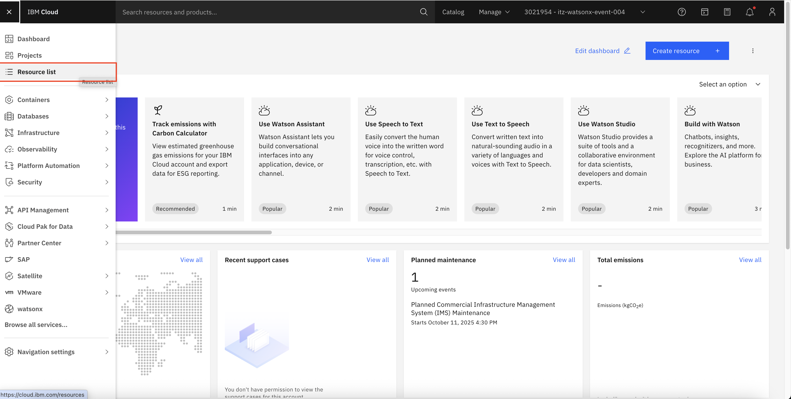

- Open the AI/Machine Learning section. You should see a **watsonx Orchestrate** service, click to open.

  

- Click the "Launch watsonx Orchestrate" button.

  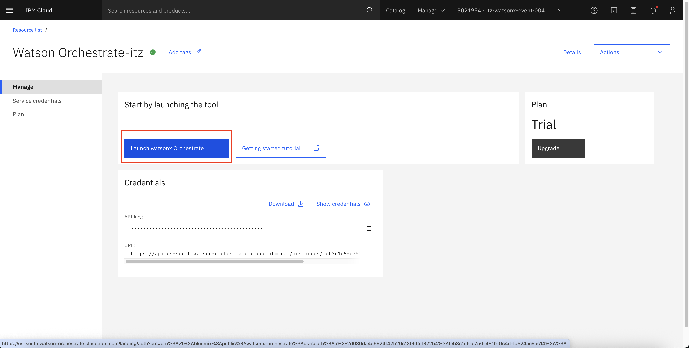

- Welcome to watsonx Orchestrate. Open the hamburger menu, click on **Build** -> **Agent Builder**.

  

### Propensity Agent
#### Create the Propensity Agent

- Click on **Create Agent**

  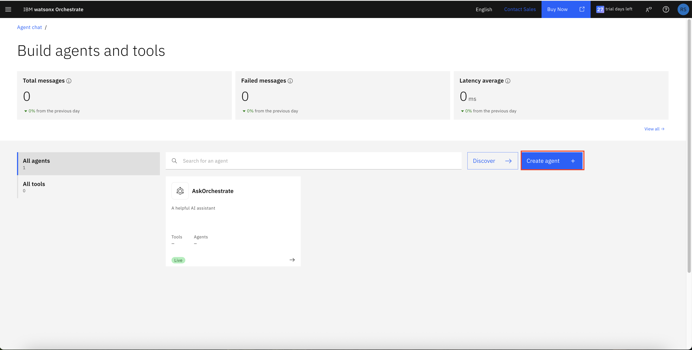

- Follow the steps according to the screenshot below.
  - Select **Create from scratch**
  - Name the agent `Propensity Agent`
  - Use the following description:
    ```
    The Propensity Agent will return propensity values for a customer and SKU. You can also train the model or predict for new values.
    ```
- Click **Create** 
  

- Choose the **Model** dropdown on right of the **Propensity Agent** and choose `llama-3-405b-instruct`. 

  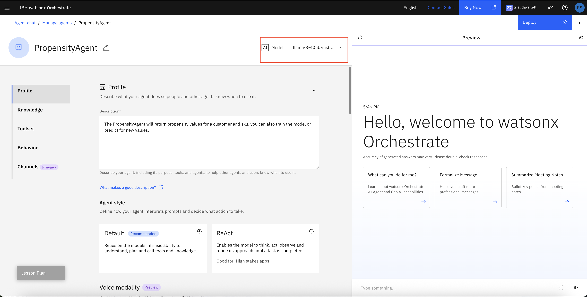

- Under **Profile** -> **Agent Style** section keep it as `Default`.

  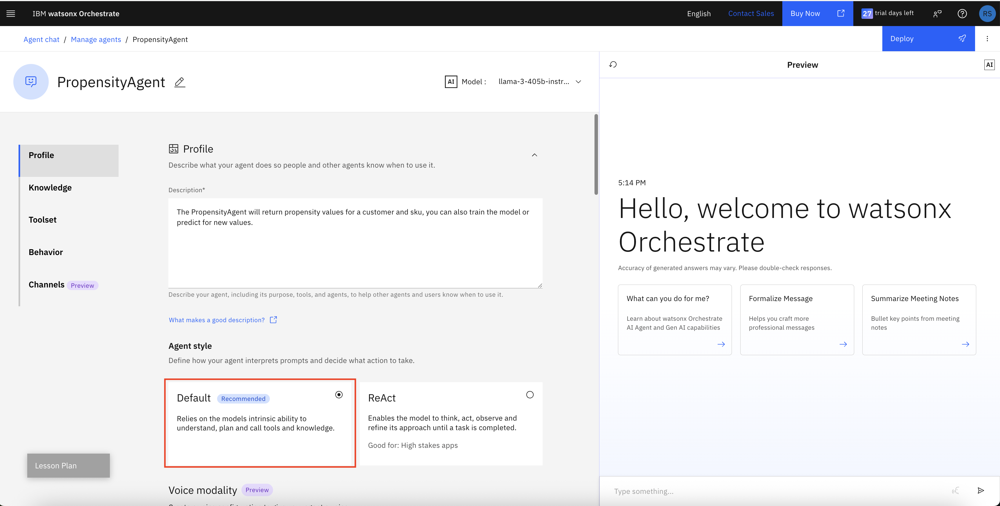

- Under the **Toolset** section, click on the **Add tool** button.
  

- Select **OpenAPI**.

  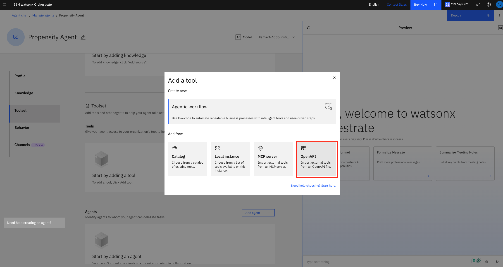

- Upload the `open_api_spec_train.json` OpenAPI Spec, which will be provided by the instructor.

  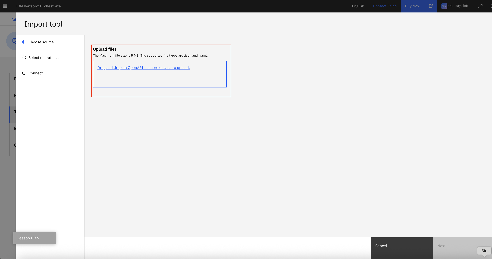
  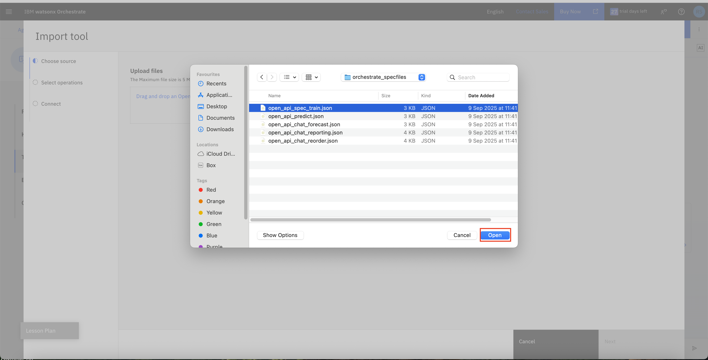

- Once the file is uploaded, select **Next**.

  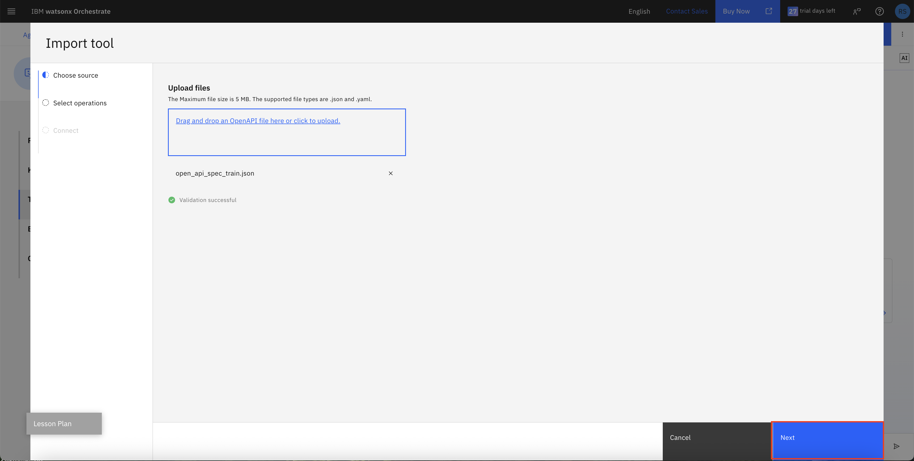

- Select the all of the **Operations** and click **Done**

  

- Go to the **Behavior** section. Add the following for **Instructions**. This will define how the Agent should behave and what it should expect:
  ```
  You are an agent who does training and prediction for the propensity score. 

  When asked to get predictions, invoke the "Get propensity predictions" tool, and show only the top 10 values in tabular format.

  When either customer ID or  SKU ID is mentioned, show the details in a nice tabular format and summarize the explanation columns.

  If the user suggests that they don't trust the result, use the "Train embedding models" tool to train the model asynchronously. The request may timeout, so just tell the user it is training the model. 
  ```
  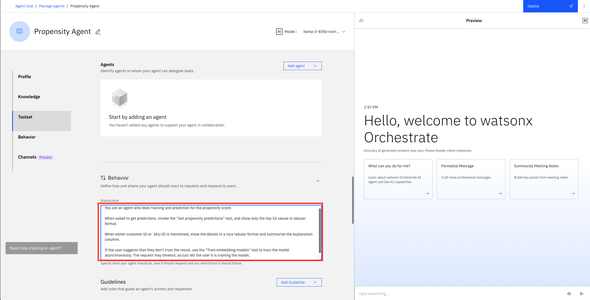

- Keep the **Channels** setting as it is.

- Click on **Deploy** to deploy the agent
  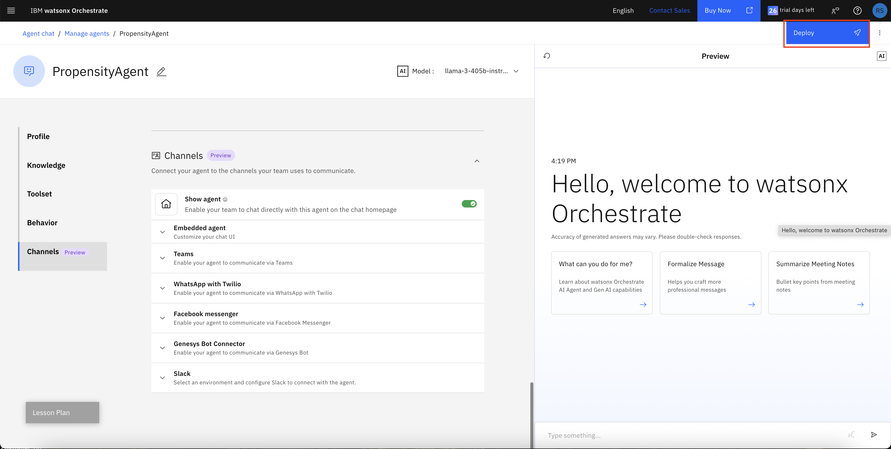

#### Test the Propensity Agent

Type this query:
```
Get cluster info for customer ID C0001
```
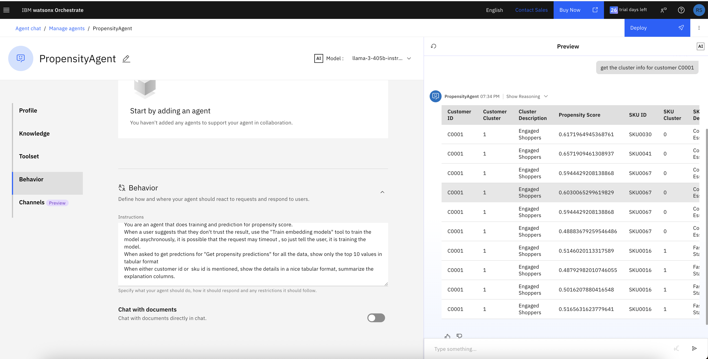

### Forecast Agent
#### Create the Forecast Agent

- Click on hamburger menu, then **Build** -> **Agent Builder**

  

- On the next screen, click on **Create Agent**
  

- Follow the steps according to the screenshot below
  - Select **Create from scratch**
  - Name the agent `Forecast Agent`
  - Use the following description:
    ```
    You are a demand forecasting and out of stock predicting agent. Your task is to show the demand that is forecasted for 30 days for SKUs and stores.
    ```
    
  - Click **Create**

- Under **Profile** ->  **Agent Style** keep it as `Default`. 

  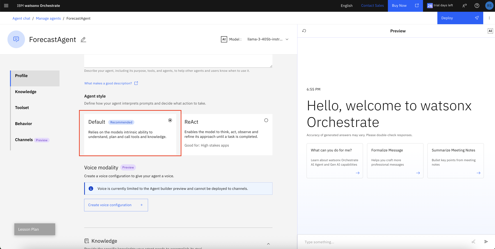


- In the **Toolset** section, click on **Add tool** 

  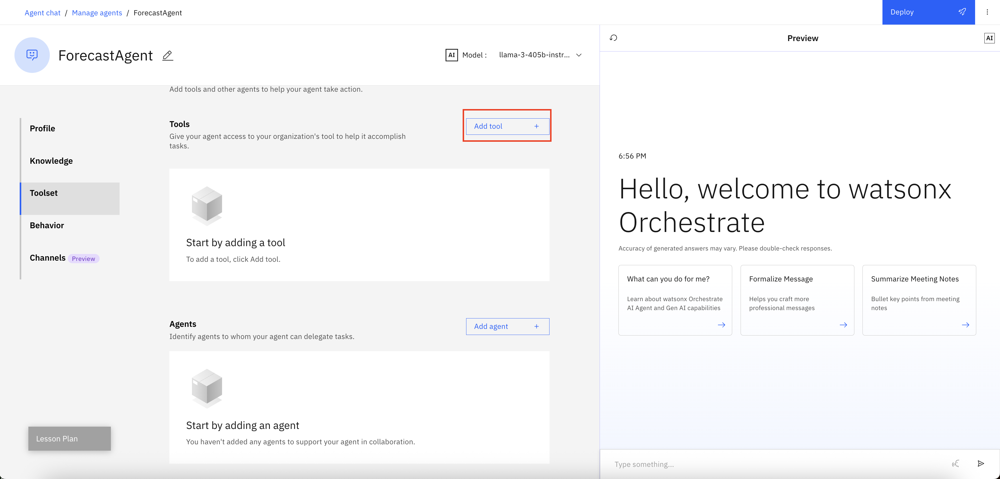

- Click on **OpenAPI**
  

- Import the `open_api_chat_forecast.json` OpenAPI Spec file provided by your instructor

  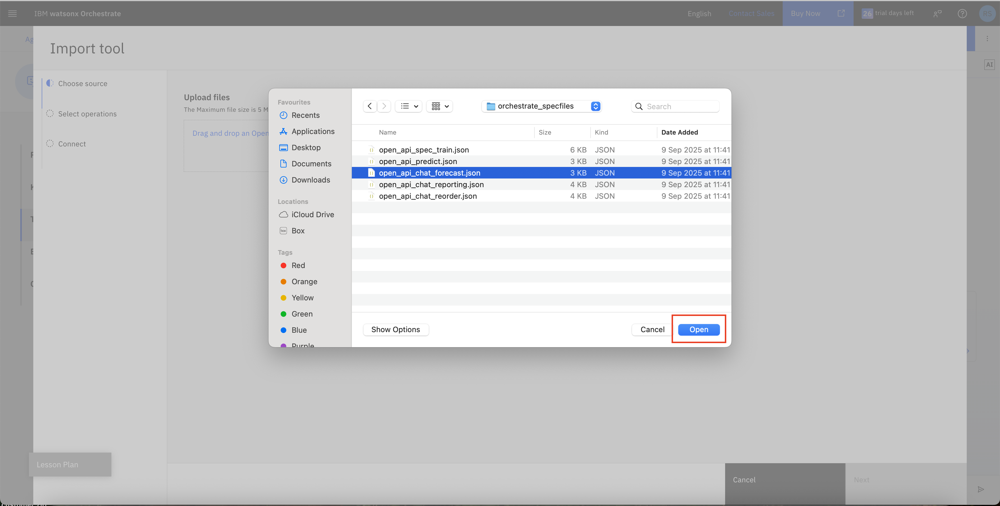

- Select **Next**

  
- Select all of the **Operations** and click **Done**
  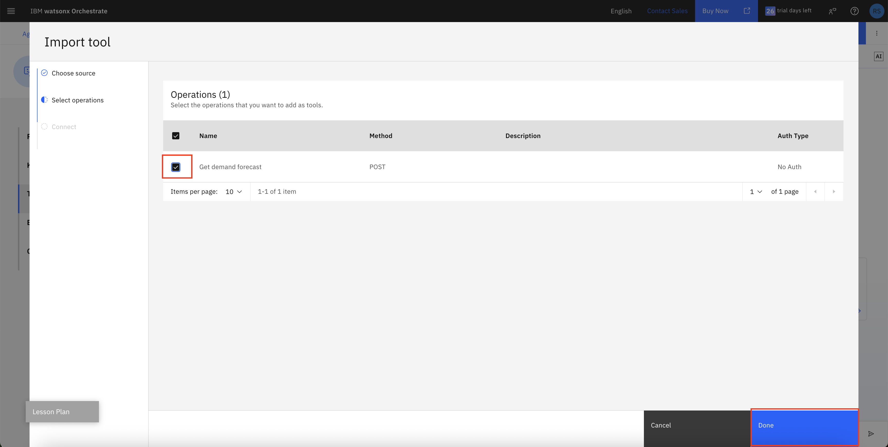

- In the **Behavior** section, add the following prompt to the **Instructions**:

  ```
  Agent Instructions: Demand Forecasting & Out-of-Stock Prediction

  ## Role  
  You are a **demand forecasting and out-of-stock prediction agent**.  

  ---

  ## Goal  
  Provide **forecasted demand values for 30 days** based on the SKU(s) and store(s) mentioned in the user's request; if not mentioned, assume it's for all stores and SKUs.

  ---

  ## Behavior & Rules  

  ### Input Handling  
  - If **no SKU and no store** are provided → forecast demand for **all SKUs across all stores**.  
  - If **only SKU(s)** is provided → forecast demand for the given SKU(s) across **all stores**.  
  - If **only store(s)** is provided → forecast demand for **all SKUs in that store(s)**.  
  - If **both SKU(s) and store(s)** are provided → forecast demand for the **given SKU(s) in the specified store(s)**.  

  ### Tool Usage  
  Use the tool named **`Get demand forcast`** to retrieve forecast values.  
  Always pass the following parameters:  
  - `start_date`: today's date (or user-specified start date).  
  - `sku_ids`: list of SKU IDs (if applicable).  
  - `store_ids`: list of Store IDs (if applicable).  

  ---

  ## Output Expectations  

  ### 1. Out-of-Stock (OOS) Table  
  Present OOS probabilities neatly in **percentages**, and include **Current Stock** and **OOS Days** (the number of days before stock is depleted).  
  Just show the SKUs that are going out of stock in 15 days. 
  | SKU_ID | Store_ID | Current Stock | Total Forecast (30 Days) | OOS Probability (%) | OOS Days |  Reorder amount
  |--------|----------|---------------|--------------------------|---------------------|----------| ------------|
  | SKU123 | StoreA   | 2,800         | 3,450                    | 72%                 | 24       |  2000

  Use your knowledge to point out the SKUs that need immediate reordering, depending on the number of days it was forecasted for, keep in mind while giving out the details, the current stock and other details as well.
  Highlight the SKUs that have to be ordered today and calculate the quantity for reorder using the current stock and demand forecast. Values should always be an integer; show it in the same table. Only show SKUs that are going out of stock for the next 7 days. 
  Always show only the top 5 SKUS that need ordering immediately, with the reorder amount in a tabular format
  ```
  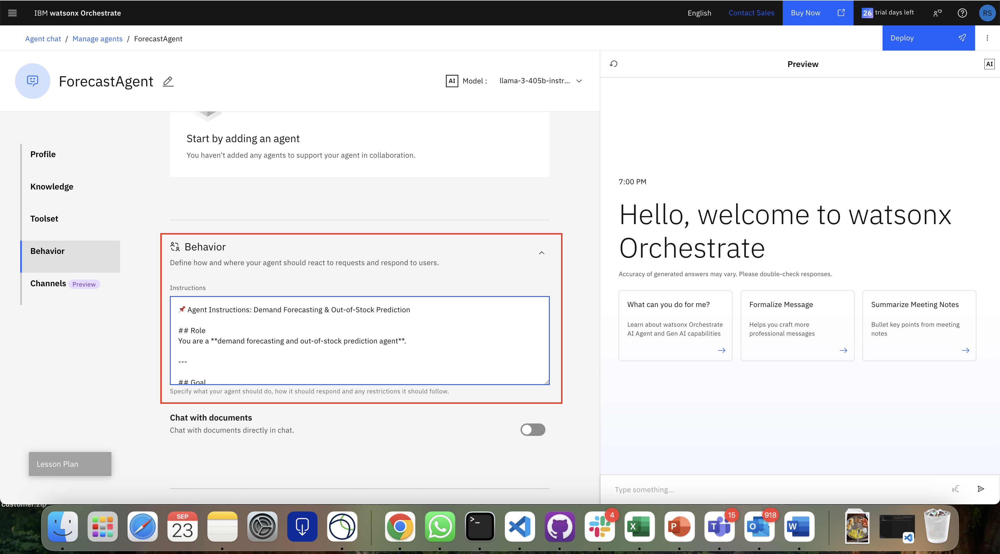

- Click on **Deploy** to deploy the agent.

  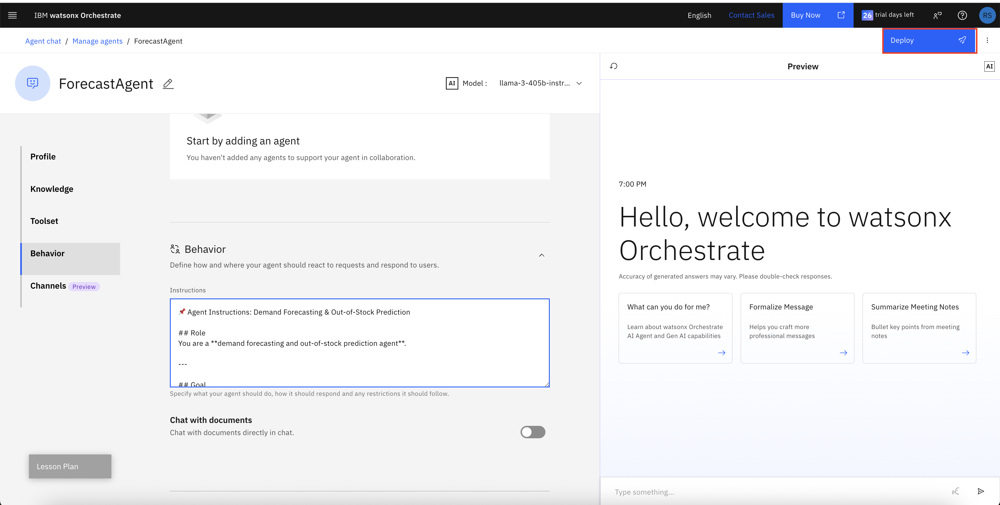
  
#### Test the Forecast Agent
  
Step 1. Enter a basic query:
```
Get the items that are going out of stock
```

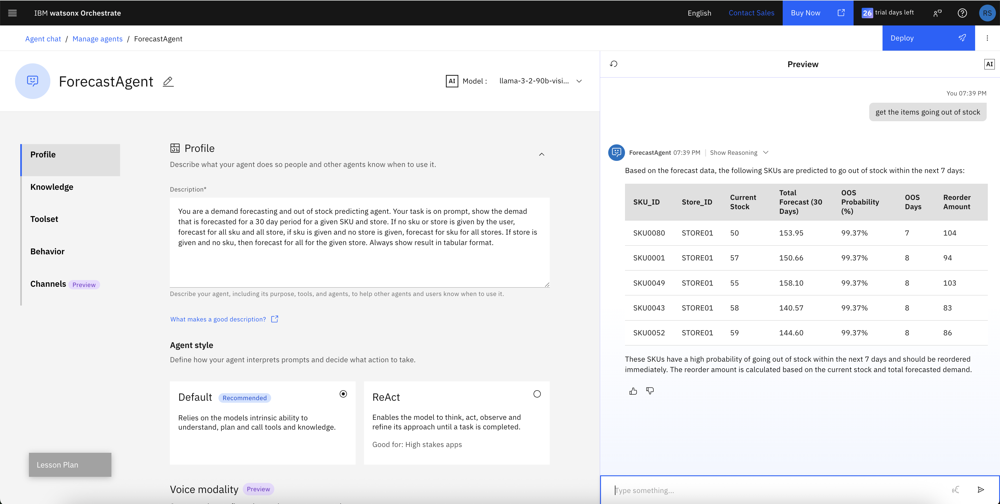

### Ask Retail
#### Create the AskRetail Agent

- Click on hamburger menu, then **Build** -> **Agent Builder**.

  

- Click on **Create Agent**

  

- Follow the steps according to the screenshot below.
  - Select **Create from scratch**
  - Name the agent `AskRetail`
  - Use the following description:

  ```
  Use the AskRetail agent whenever a user’s query falls into one of four retail domains—reordering, reporting, forecasting, or propensity modelling—and needs to be delegated to a specialist agent.  AskRetail acts as an orchestrator: it interprets the user’s request, selects the correct agent, and forwards the conversation context.

  Below are common question patterns and the agents they map to:
  - Reorder Agent (Purchase orders & strategies) – Trigger this agent for tasks related to drafting, modifying, or submitting purchase orders and managing reorder strategies.
	  - “Can you generate a purchase order for me? Budget is $1,400.”
	  - “What are the settings for Peak Season Prep?”
	  - “Change the ‘profit’ priority for Peak Season Prep to 5.”
	  - “Generate a recommendation using the Peak Season Prep strategy.”
	  - “Update the quantity for SKU0027 to 20 units; remove SKU0067 from the order.”
	  - “Update the max capacity of SKU0020 to 150.”
	  - “Submit the purchase order.”
  - Reporting Agent (Business intelligence & analytics) – Use for analytic questions that query and synthesize data across inventory, sales, customers, or suppliers.  This agent provides insights but does not handle reordering.
	  - “Can I see all inventory under the reorder threshold in a table?”
	  - “What are the supplier details of SKUs with the longest lead times of items with the highest sales?”
	  - “Get the quantity of items sold by product category, sorted in descending order.”
	  - “Show details of the top 5 customers with the highest return rate.”
	  - “Who is our top customer by sales volume?”
	  - “Show the top 5 most sold SKUs along with their names.”
	  - “What is the supplier name I buy from the most?”
	  - “What is the gender distribution among our customers?”
  - Forecasting Agent (Demand forecasting & out‑of‑stock risk) – Engage this agent for questions about predicting future demand or stock‑out probabilities.  It generates 30‑day demand forecasts and related risk metrics.
	  - “Show me the 30‑day forecast for all SKUs across all stores.”
	  - “Forecast the demand for SKU123 for the next 30 days.”
	  - “What is the demand forecast for all SKUs in Store A?”
	  - “Give me the forecasted demand for SKU456 in Store B for the next 30 days.”
	  - “Summarize the 30‑day demand forecast for all SKUs along with out‑of‑stock probability.”
	  - “Which SKUs are most likely to go out of stock in the next 30 days, and when?”
	  - “Show the OOS probability and OOS days for the top 5 SKUs with the highest demand.”
	  - “What products have moved faster than predicted?”
	  - “Which items are going out of stock faster than expected?”
  - Propensity Agent (Customer & SKU purchase likelihood) – Use this agent when you need to train or apply propensity models, assign customers or SKUs to clusters, or interpret purchase‑likelihood scores.
	  - “Train a propensity model on the latest transaction data.”
	  - “Show and update the cluster info for the customers.”
	  - “Show propensity scores for all customers across all SKUs.”
	  - “What are the top 10 SKUs most likely to be purchased by Customer123?”
	  - “Give me propensity scores for SKU789 across all customers.”
	  - “Cluster customers and SKUs and report the top clusters with high purchase likelihood.”
	  - “Summarize customer cluster assignments along with average propensity scores.”
	  - “Which customers are most likely to buy from SKU Cluster 5?”
  ```

  

- Select the `model`.

  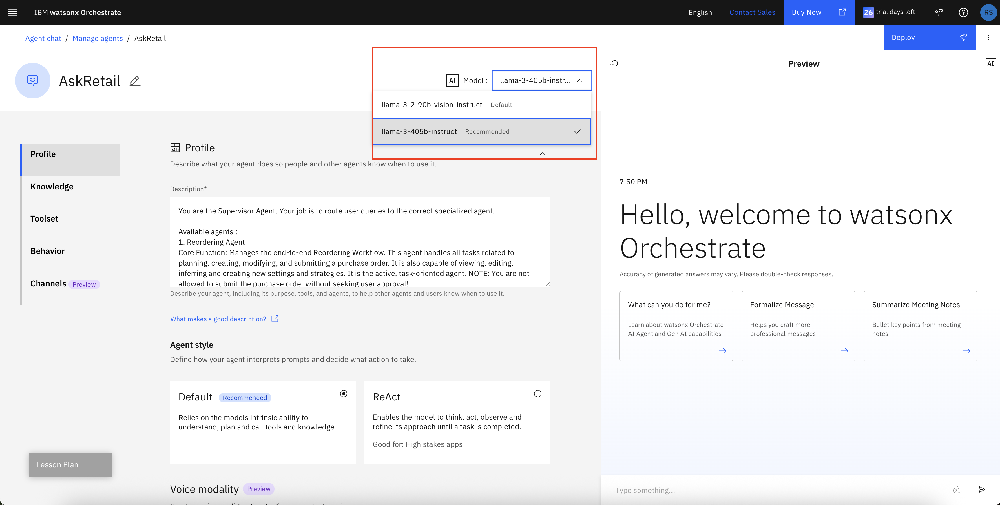

- Select the Agent Style as `Default`. Also, no changes needed for **Voice Modality**.

  

- In the **Toolset** section, you have to add two tools (agents). Click on **Add tool** 

  

- Click on **OpenAPI**


- Import the `open_api_chat_reporting.json` OpenAPI Spec file provided by your instructor

  

- Select **Next**

  

- Select all of the **Operations** and click **Done**
  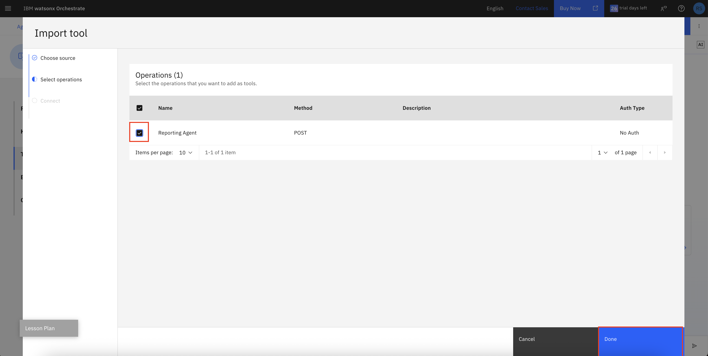

- Click on **Add tool** 

  

- Click on **OpenAPI**
  

- Import the `open_api_chat_reorder.json` OpenAPI Spec file provided by your instructor

  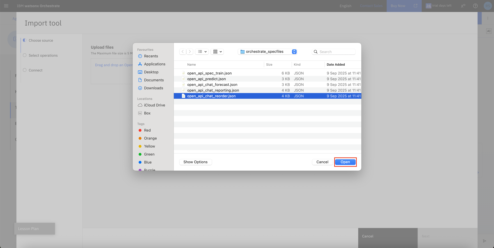

- Select **Next**

  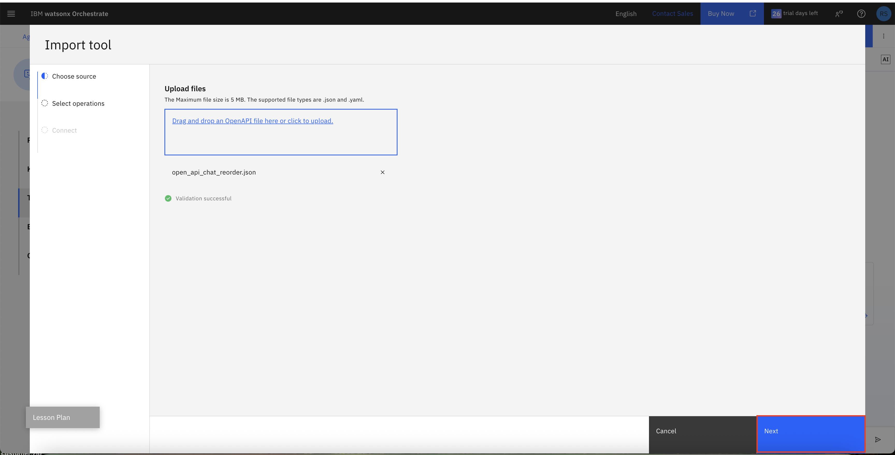
- Select all of the **Operations** and click **Done**
  

- Click on **Add Agent**

  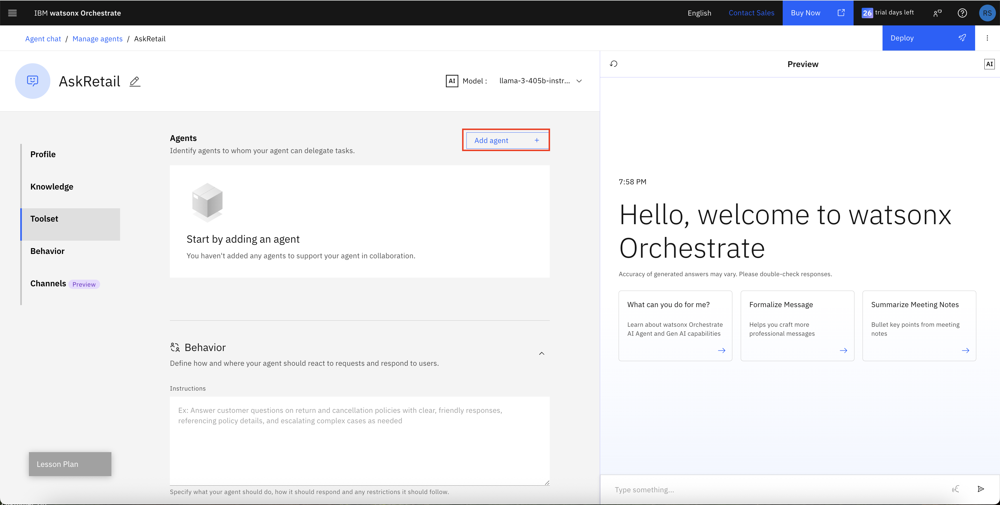

- Click **Add from local instance**

  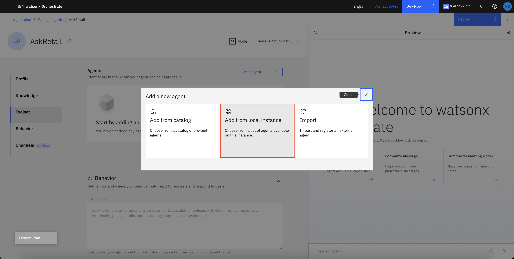

- Select **Propensity Agent** and **Forecast Agent** then the **Add to Agent button**

  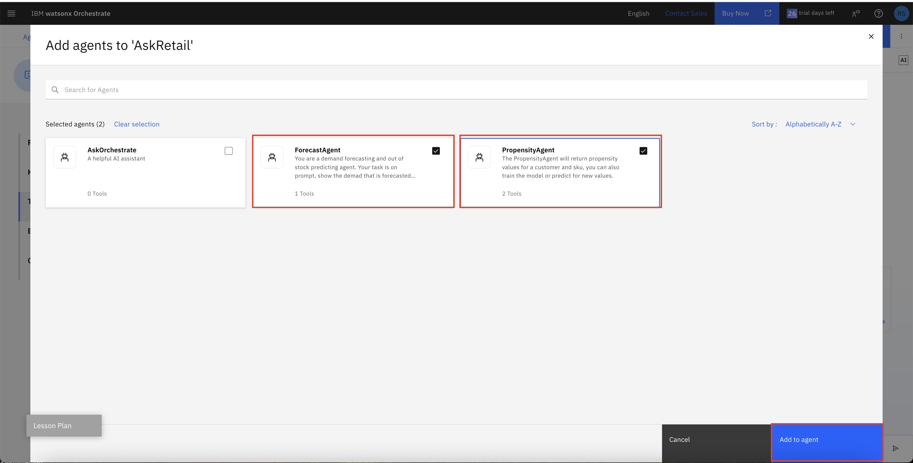

- In the **Behavior** section, add the following for **Instructions**:
  ```
  Parse and route: When invoked, AskRetail examines the user’s question and the conversation history to decide which specialized agent (Reorder, Reporting, Forecast, or Propensity) should handle the request.  It does not answer the query itself.

  Conversation context: Always send the full conversation log along with the user’s current question to the selected agent.  This ensures the downstream agent has the context needed for multi‑turn interactions.

  Input schema:  
  - For Reporting and Reorder tasks, wrap the user’s question and context in a JSON object:
  {
    "messages": [{"role": "user", "content": user input}],
    "model": "sql_agent/reorder_agent",
    "stream": "false",
    "thread_id": "1"
  }

  For the Propensity Agent, use the prescribed format:
  {
    "customer_ids":List[string],
    "sku_ids":List[string],
    "full_data":true/false
  }
  Do not use this schema for other agents.

  Delegation only: For analytical questions, forward the request directly to the Reporting agent; the Supervisor must never write or execute SQL itself.  Similarly, it does not perform reorder operations; those are delegated to the Reorder agent.

  Clarify missing details: If the user’s request lacks essential information (e.g., missing SKUs, customer IDs, date ranges, budgets), ask a concise follow‑up question suggesting what is needed.  Only ask for clarification when it’s truly necessary to route or execute the task.

  Present outputs clearly: Display the sub‑agent’s response to the user without altering its meaning.  Any JSON output should be rendered as a markdown table.  When presenting forecasting results, limit the display to the top 10 items or rows.

  Respect sub‑agent constraints:
	•	Only call the Forecasting agent once per user request.
	•	Reorder operations must not finalize purchase orders without explicit user approval.
	•	Reporting responses should never be synthesized by AskRetail; always pass the user’s question directly.

  Ask for confirmation on risky actions: If an action involves submitting a purchase order or another irreversible change, wait for the user’s confirmation before proceeding.
  ```

  

- Keep the Channels as it is. Click on **Deploy** to deploy the agent

  

#### Test the Ask Retail 
**Explantory Flow**
Step 1. 

```
Show me the different types of customer clusters that are available?
```


Step 2.
```
Who are the customers whose cluster info is unavailable in a table format?
```

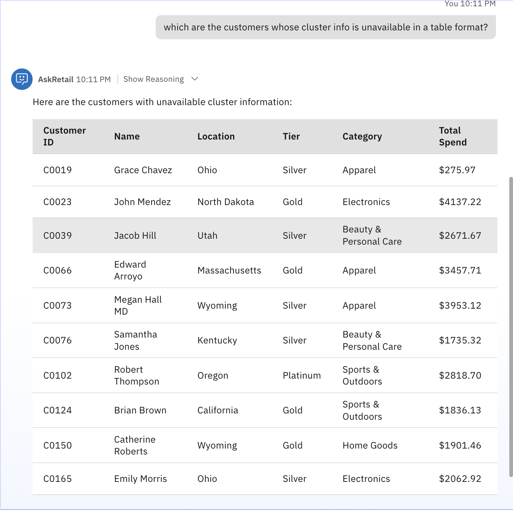

Step 3. 
```
Predict the clusters for the customers in the table above
```

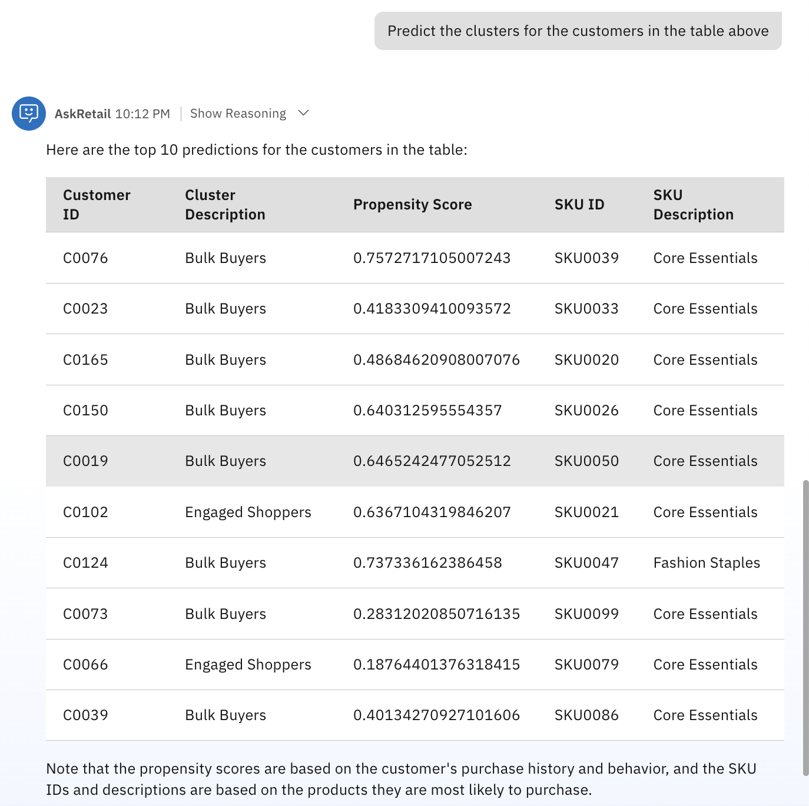

Step 4. 

```
What are the most bought items, along with their names, category, and total quantity sold from customers that belong to cluster info as Premium Shoppers? 
```


Step 5. 
```
What other items, along with their names and details, are bought together with the AquaStride Insulated Water Bottle for All-Weather Adventures?
```


**Reorder Optimization Flow**

Step 1:
```
Which are the products that are going out of stock faster than expected?
```
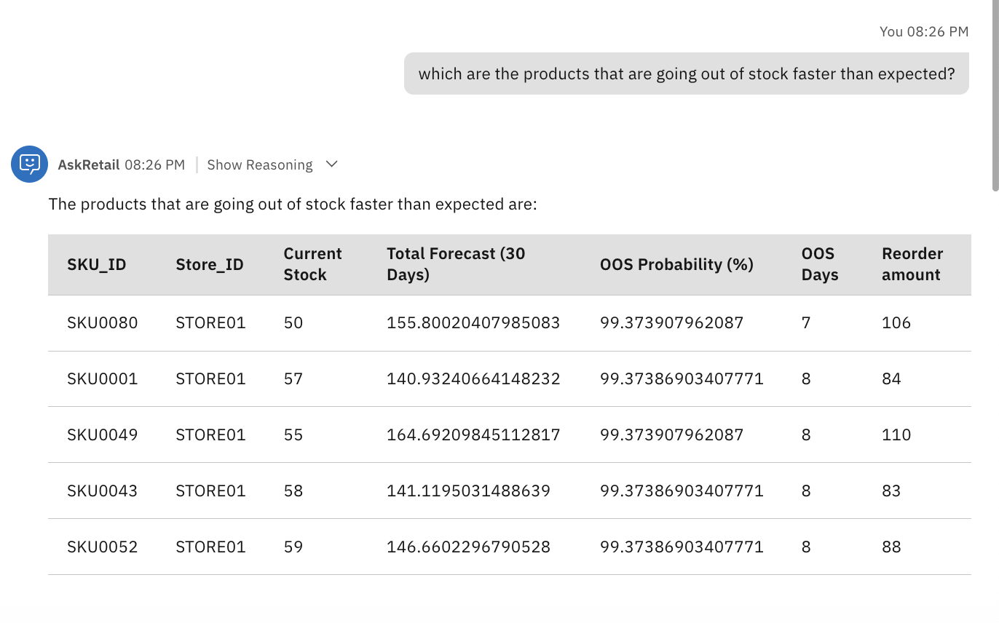

Step 2 :
```
I have a budget of $5000. I would like to stock up on my seasonal items. Can you generate a purchase order recommendation
```


Step 3 :
```
What are my options for strategies?
```
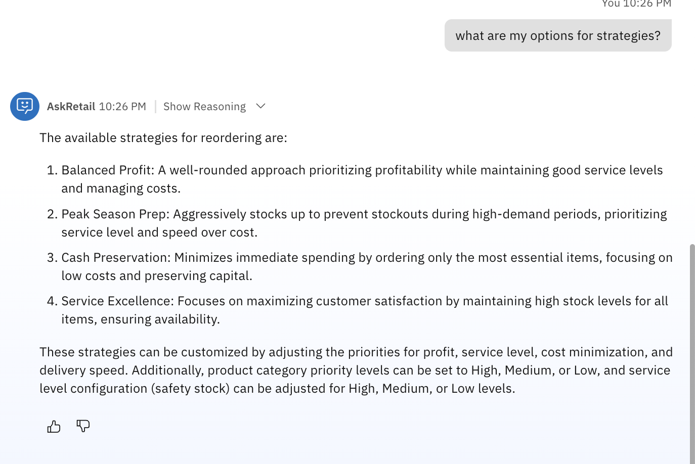

Step 4 :
```
Can you show me the settings of the peak season prep strategy in tabular format? 
```
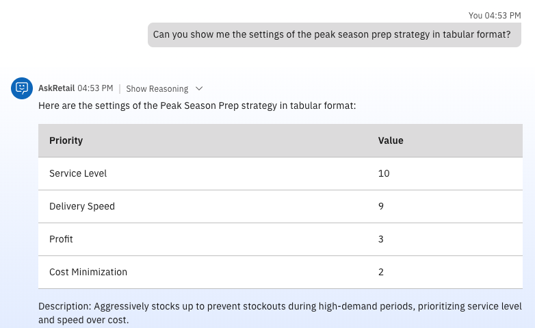

Step 5 :
```
Can you change the delivery_speed of the peak season prep strategy to 10 
```


Step 6 :
```
Can you generate a new purchase order recommendation using the updated peak season prep strategy, along with the same $5000 budget
```
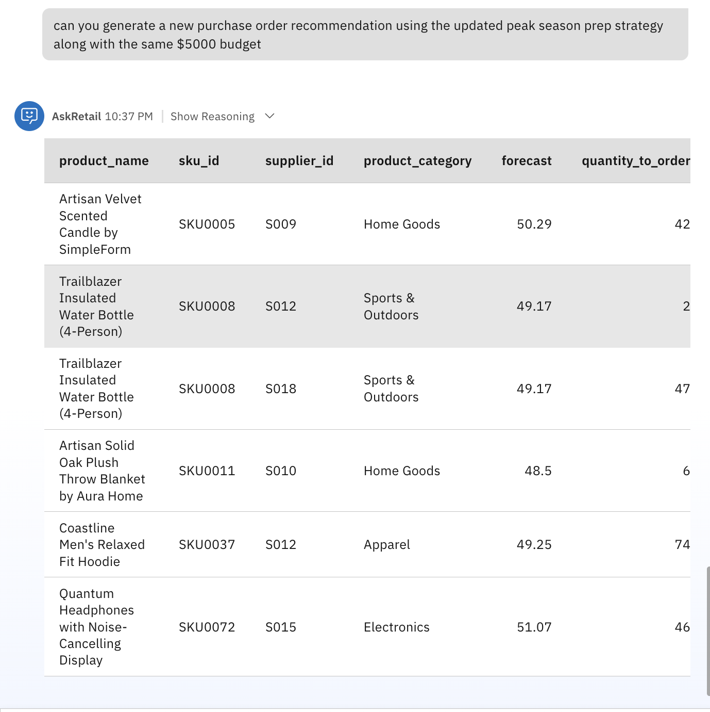

Step 7 :
```
Can you remove the SKU0008 from the list and update the SKU0072 order quantity to 50
```


Step 8 :
```
Okay, this looks good. Can you submit the purchase order
```


### Further testing via AI Chat
>
> ***You can also test the agents from AI chat.***

Navigate to AI chat by going to the hamburger menu at top left and select **Chat**.

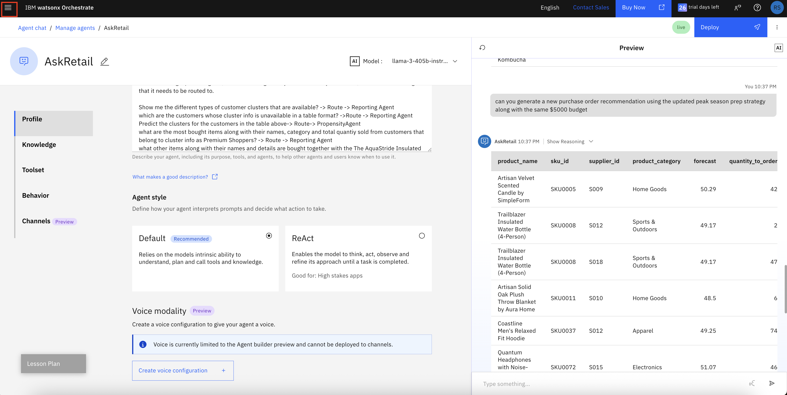
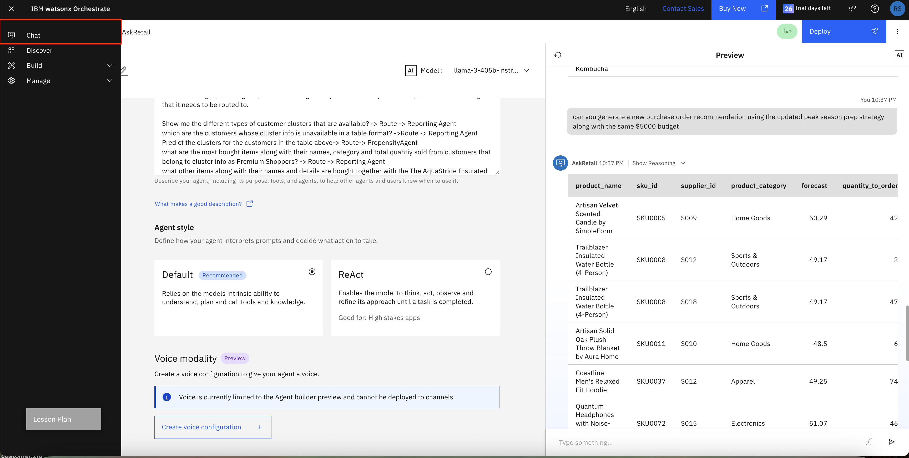

Then select the agent to test: 

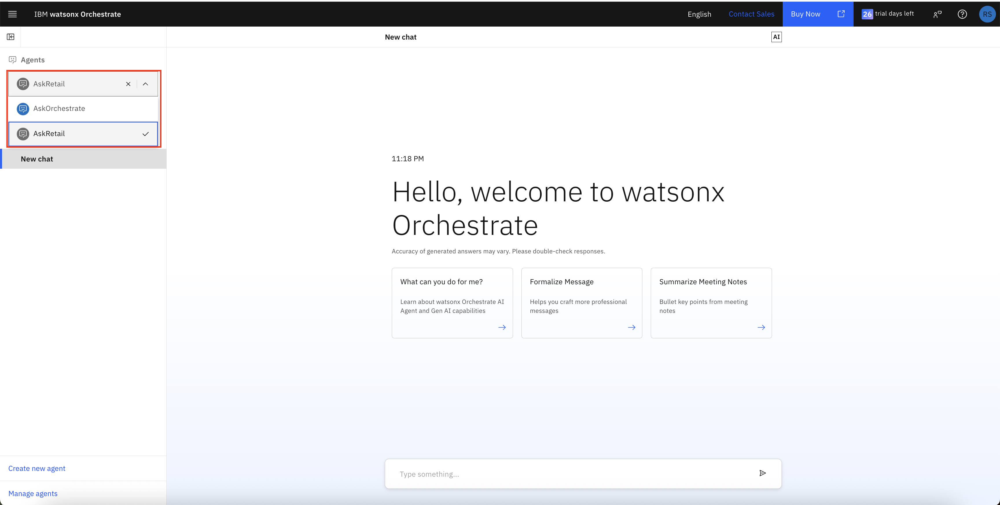

You can use the same testing flows mentioned above to test on agent chat as well. 
