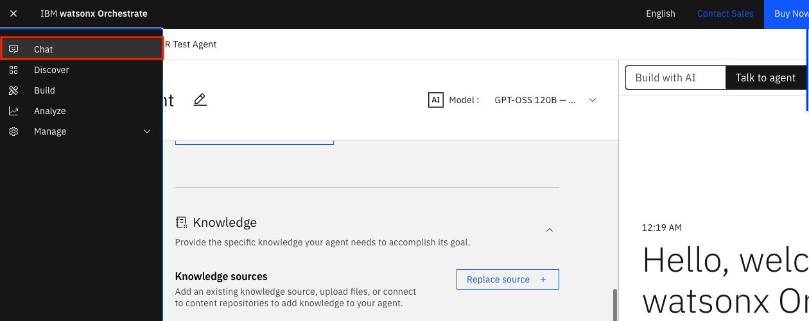
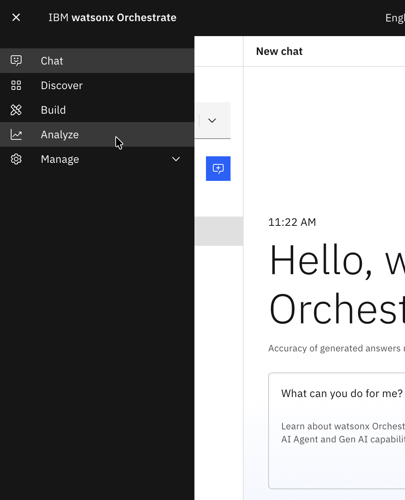
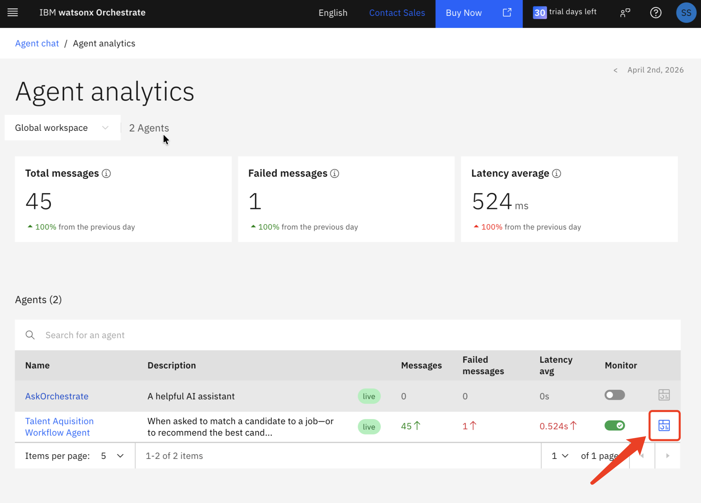
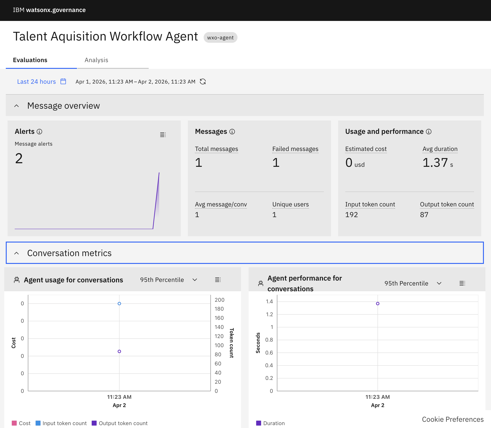
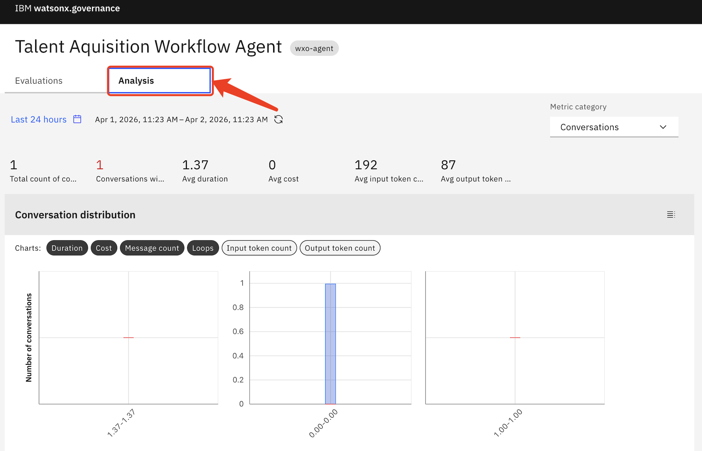

# Agent Monitoring

This lab focuses on monitoring an AI Agent deployed through watsonx Orchestrate. The goal is to evaluate chat interactions, and measure answer relevance, faithfulness, and tool usage. Monitoring also enables root cause analysis. Once an agent is deployed, you can observe its behavior and usage patterns.

In this lab, we will walk through monitoring an agent.

## Monitor Agent

### Deploy and set up monitoring

1. Deploy the agent using the button in the top right corner of the screen. Then click on **Deploy** again in the next screen.

   

1. You will be prompted to **Activate agent monitoring**. Click the blue button. This may take a while, so be patient. Note: You can also activate agent monitoring from the Analyze tab at any point after deployment.

   

### Test your agent in the Chat window

From the hamburger menu at the top left, select **Agent chat**, choose your desired agent, and make some queries. 

   

### Check your agent's monitoring results

1. It may take several minutes for the monitoring of these queries to be available, so go get a coffee.

1. Now, select **Analyze** from the top-left hamburger menu. 

   

1. You will be taken to the **Agent Analytics** page. You can see your agent listed and the **Monitor** toggle enabled.  Click the icon to the right of the toggle to access the **IBM watsonx.governance** dashboard.

   

1. You will see an evaluation dashboard. Feel free to explore **Message Overview/Conversations Metrics/Message Metrics/Tool Metrics**.

   

1. Select the **Analysis** tab. Feel free to explore **Conversation Analysis Panel**.

   

