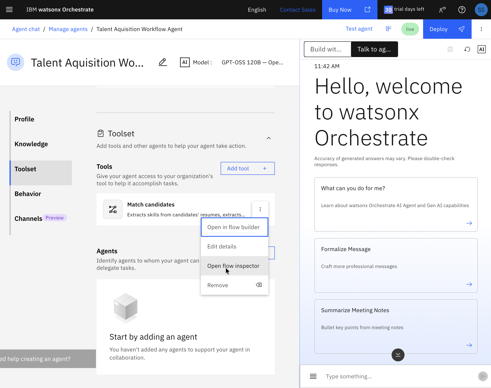
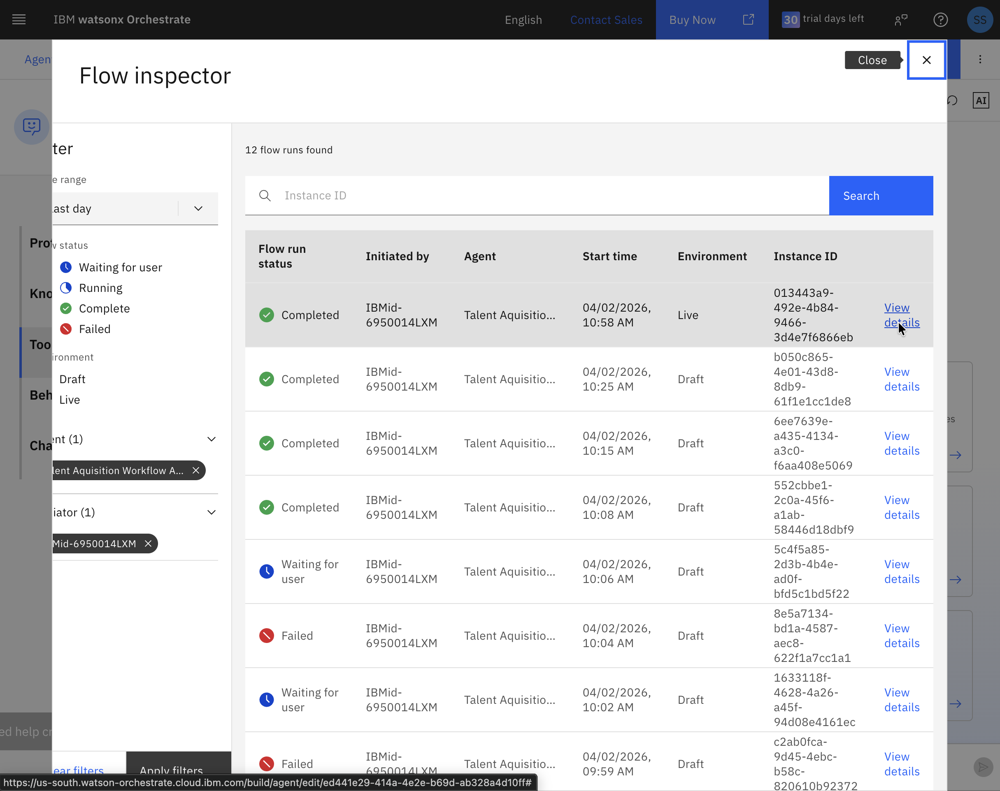
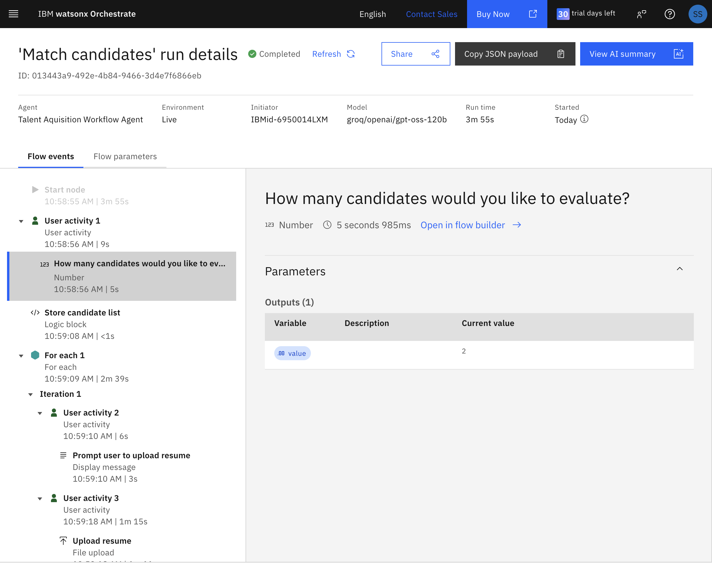
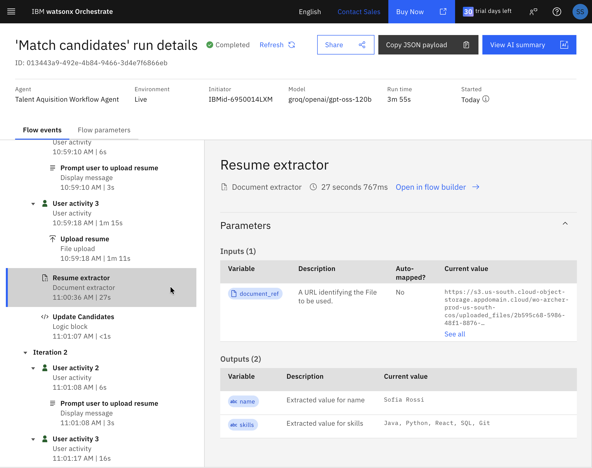

# Agentic Flow Inspector

The agentic flow inspector is a powerful diagnostic tool that provides visibility into how your workflows execute in real-time. Understanding your agent's behavior is critical for both development and production deployment.

## Why Use the Flow Inspector?

During **development**, the flow inspector helps you:
- **Debug issues** by tracing exactly where failures or unexpected behavior occur
- **Validate logic** by confirming that data flows correctly between nodes
- **Optimize performance** by identifying bottlenecks or redundant steps
- **Test edge cases** by examining how your workflow handles different inputs

In **production**, it enables you to:
- **Monitor execution** across multiple user sessions and identify patterns
- **Troubleshoot user issues** by reviewing specific workflow instances
- **Ensure quality** by verifying that document extractors and prompts perform as expected
- **Audit compliance** by maintaining a record of decisions and data processing

This lab demonstrates how to use the flow inspector to analyze the HR Talent agent you built, giving you hands-on experience with these capabilities.

## Opening the Flow Inspector

1. Find your agentic flow, click the three dots to the right, and select **Open flow inspector**.

2. Browse the execution traces to understand each instance of usage. Click **View details** to explore specific runs.

## Analyzing Flow Execution

The flow inspector displays a visual representation of your workflow components. Click any section in the left-side menu to examine inputs, outputs, and user interactions.

**Example: User Input**
In this flow, the user entered "2" as the desired number of candidates to analyze:

**Example: Document Extraction**
The **Resume extractor** received one **document_ref** from the user and successfully extracted both the **name** and **skills** for the candidate:

## Debugging and Optimization

Use the flow inspector to debug and refine your workflow. This granular view shows exactly what the agent decided and executed at each step, helping you optimize performance and troubleshoot issues.