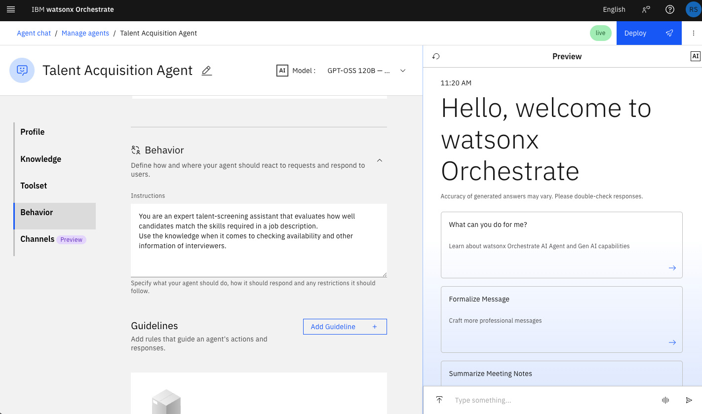
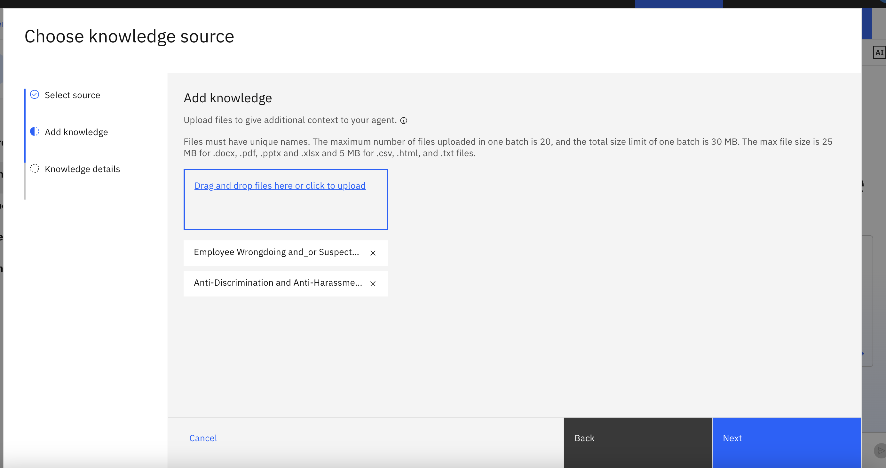
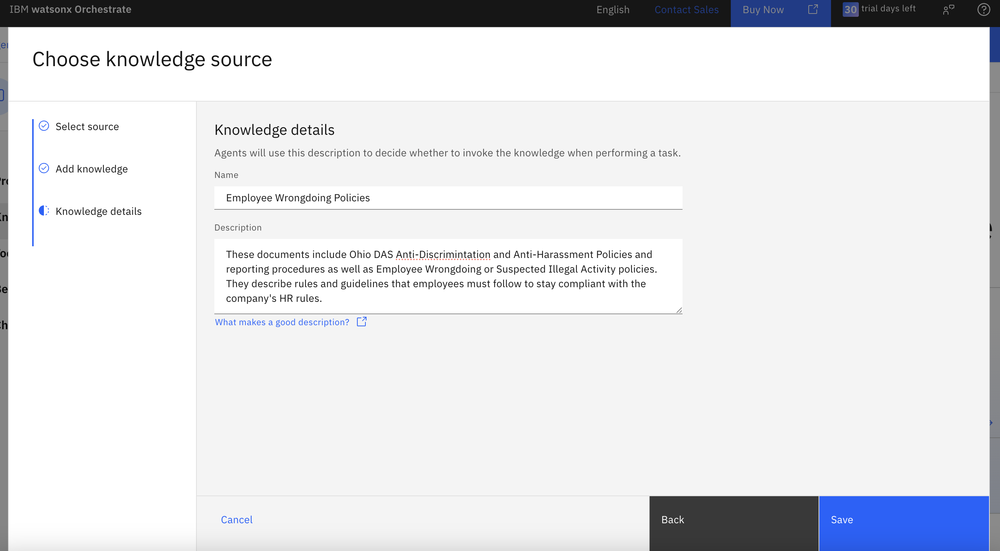
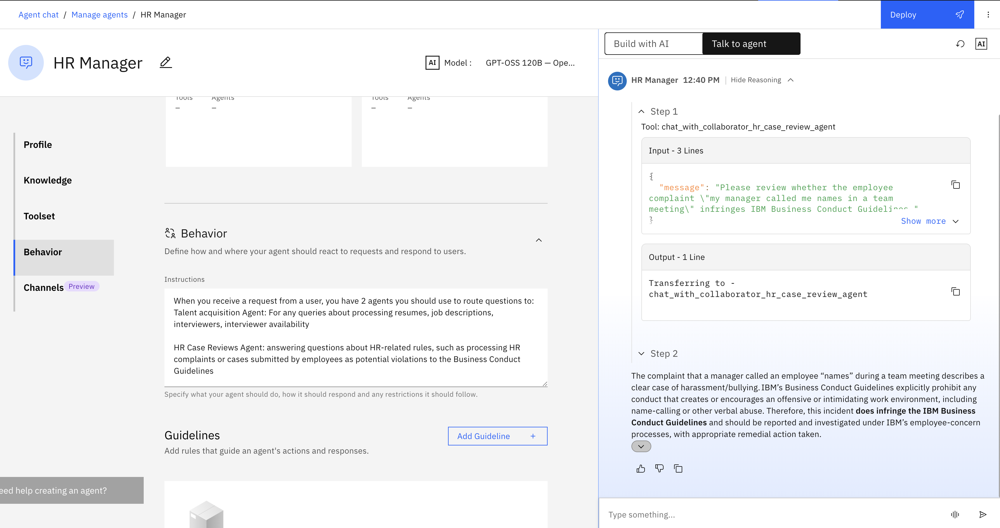

## 🥇 Talent acquisition agent

This first agent will help with the recruiting process. Follow these steps to build your Talent Acquisition AI Agent:

1. Open watsonx Orchestrate. You will see the screen below. Then, click on **Create an Agent** at the bottom left:


2. Enter the following into the name and description, then click **Create**:
Name:
```
Talent Acquisition Agent
```

Description:
```
You are an expert talent-screening assistant that evaluates how well candidates match the skills required in a job description. 
You analyze resume PDFs uploaded, extracting relevant skills, experience, tools, and qualifications. You compare these attributes to the job description to determine alignment, highlight strengths and gaps, and rank candidates when multiple resumes are provided. 
Your responses should be objective, evidence-based, and formatted in clear bullet points or concise summaries that hiring managers can easily use. Only reference details explicitly found in the resumes or job description. Use the knowledge when it comes to checking availability and other information of interviewers.
```


3. We will use the **GPT-OSS 120B** model for this agent. If it is not already selected, choose the model from the drop down.


4. Scroll down and enable the **Chat with Documents** toggle:


5. Now let's simmulate what the HR manager would do to automatically process résumés. First, download the résumés and job description files provided by your instructor.

You should have access to the following files before proceeding:
- [Candidate 1's Résumé](../data/Candidate%201.pdf)
- [Candidate 2's Résumé](../data/Candidate%202.pdf)
- [Candidate 3's Résumé](../data/Candidate%203.pdf)
- [Candidate 4's Résumé](../data/Candidate%204.pdf)
- [Candidate 5's Résumé](../data/Candidate%205.pdf)
- [Job Description](../data/Job%20Description.pdf)

6. You will see a confirmation of the files being uploaded as follows:


7. Add the following to the **Behavior Section**:
```
You are an expert talent-screening assistant that evaluates how well candidates match the skills required in a job description. 
Use the knowledge when it comes to checking availability and other information of interviewers.
```


8. Now let's try a few different prompts to process the résumés and match them with the job description. First, let's summarize the skills and requirements in the job description:

```
Above, I have uploaded 5 documents with candidate resumes and one document with job description. Can you give me a short one-paragraph summary of the job description?
```


9. Now let's check that the résumés were uploaded correctly by querying the names of the candidates:

```
give me the names of all the candidates
```


10. Now let's generate a table matching the required skills with each candidate:
```
make a table where each row is a candidate and each column is a skill in the job description. Have the check emoji if the candidate does have the corresponding skill.
```


At a glance we might decide that Emma has the strongest match of skillset to our job description. 
However, the HR manager still needs to go and review Emma's profile and résumé before proceeding. 
It is important to keep a human in the loop, especially when making decisions affecting people. 

The goal of Agentic AI is to automate the tedious tasks rather than replacing the job of the HR manager.

<!--11. Now let's ask for drafting an email to schedule an interview:
```
Draft an email asking Emma for three potential times for next week to interview.
```


-->

11. Now let's work on scheduling the interviews. 
    
    First, let's add interviewers data. In real life, this will come from a database or data lakehouse querying multiple systems in the organization. For simplicity, let's assume we have a PDF file with the availability of interviewers and their skills. We can use watsonx Orchestrate to add interviewers **Knowledge** to the agent. 
    
12. Scroll down to the **Knowledge** section and click on **Add Source Knowledge**:


13. Choose **New Knowledge**


14. Select **Upload Files** at the bottom, click **Next**:


15. Drag and Drop or upload the file:
[Interviewer availability dataset](../data/Interviewer%20availability.docx). 
Click **Next**:


Now you need to set a **name** and **description**. This will be used to determine when to invoke the knowledge in the file. Add the following under **Name** and **Description** and click **Save**.  

Name:
```
Interview Availability
```
Description:
```
This knowledge contains the has the availability and skills of different interviewers needed to schedule interviews and match candidates with the best fit interviewer
```


16. Now let's run some additional queries for the interviews. First, let's check if the interviewer data was loaded properly.
*Note it might take a minute for the knowledge to fully upload. Once you see the confirmation you may proceed with the following input.*

```
Show me the availability of interviewers
```


15. Now let's help Luisa select the most adequate interviewers for the given job description:

```
Who's the most proficient interviewer for the job description? Show me the skills they have
```


16. Finally, let's pick an interviewer and draft an email to one of the candidates with the interviewers' availability:
 
```
Draft an email to Emma to invite her for an interview with Aisha. Use Aisha's availability in the email draft
```


## 📝 HR Case Review Agent

1. Create another agent as you did earlier. This time, add the following name and description:

Name:
```
HR Case Review Agent
```
Description:
```
This agent reviews HR cases from employee complaints of potential business conduct guidelines violations. Use your knowledge to assist in answering user requests.
```
Then click **Create**


2. Once again we will use the **GPT-OSS 120B** model.


3. Our HR case review agent will need to know of the policies it is enforcing. To enable this lets add some knowledge. Scroll down to the **Knowledge** section and click on **Choose Knowledge**


4. Select **New Knowledge**


5. Then, Select **Upload Files**


6. . Now you will upload the [Ohio DAS Anti-Discrimination and Anti-Harassment Policy](../data/Anti-DiscriminationandAnti-HarassmentPolicyandReportingProcedures(HR-14)_DepartmentofAdministrativeServices.pdf) and the [Ohio DAS Employee Wrongdoing and/or Suspected Illegal Activity Policy](../data/EmployeeWrongdoingand_orSuspectedIllegalActivity_DepartmentofAdministrativeServices.pdf). You can also experiment with your company's other policies [Link to More Policies](https://das.ohio.gov/employee-relations/policies). Enter a description. It could be something like this:



Then, add the name and description:

Name:
```
Employee Wrongdoing Policies
```
Description:
```
These documents include Ohio DAS Anti-Discrimintation and Anti-Harassment Policies and reporting procedures as well as Employee Wrongdoing or Suspected Illegal Activity policies. They describe rules and guidelines that employees must follow to stay compliant with the company's HR rules.
```




7. Next, scroll down until you reach the *Behavior* section. Here we will provide more explicit instructions for the agent describing how we want it to behave. You can think of this as the core of our prompt to the agent.

Copy the following description:
```
Always use the Employee Wrongdoing Policies provided in your knowledge to answer user questions regarding the guidelines. Source all of your answers in the Employee Wrongdoing Policies.
```


5. You're now ready to test some queries. First try asking the following:

```
What protections do I have if I report harassment?
```


Let's try something a little more specific:
```
Help me understand if the following complaint from an employee infringes the Ohio DAS policies: "my manager raised his voice and called me names and made fun of me and told me really nasty things every day for the past month"
```

Now let's try something very general and not explicitly covered in our policy documents to see how our agent handles it:
```
My manager gave me a $100 gift card for Christmas. Is this allowed?
```

Feel free to test out your own questions about the policies uploaded as well!

6. Responses to questions about reporting harassment or suspected wrongdoing may sometimes be unclear about how quickly someone should act. Our agent is also likely to hallucinate due to broad questions. To improve consistency and make responses more actionable, we can use the Guidelines feature. 

Drop down the menu next to **Behavior**

Scroll down to the **Guidelines** section and click on **New Guideline**:


Add the following details:

Name:
```
Gifts for employees
```
Condition:
```
user request is related to gifts for employees
```
Action:
```
If the gift is likely >$15 it is a violation, otherwise it is okay
```

Then click **Save**


7. Save it, refresh, and try the same query one more time in the chat:
```
My manager gave me a $100 gift card for Christmas. Is this allowed?
```

Our agent will now come back to us with an answer following the new guideline, without hallucinating.
*Be sure to note the improved clarity of the response*

## 🎯 HR Manager Agent (Orchestrator)

We have seen how you can create two separate agents to address different business needs, namely (1) Talent Acquisition and (2) HR Case Reviews. But wouldn't it be cool to have a single interface to address both kinds of queries from the user? To do som let's create an HR Manager Agent able to route queries accordingly.

1. First, create a new agent using the same steps as before.  

Name this agent:
```
HR Mangager
```

Utlize the following description to provide some basic routing directions:

```
This agent routes user requests to it's 2 agents and returns their output:

1. Talent acquisition: processing resumes, job descriptions, interviewers, interviewer availability, routing to the talent acquisition agent

2. HR Case Reviewer: processing HR complaints or cases submitted by employees as potential violations to the Employee Wrongdoing Policies
```


<br>
<br>

2. Once more we will use the GPT-OSS model.


<br>
<br>

3. Scroll down to the Agents section.


<br>
<br>

4. Select Add from Local Instance


<br>
<br>

5. Search for the two agents you just created and add them both.


<br>
<br>

Now your Talent Acquisition Agent and HR Case Review Agents will show up as subagents for the HR Manager Agent


<br>
<br>

6. Add the following to the behavior section:
```
When you receive a request from a user, you have 2 agents you should use to route questions to:
Talent acquisition Agent: For any queries about processing resumes, job descriptions, interviewers, interviewer availability

HR Case Reviews Agent: answering questions about HR-related rules, such as processing HR complaints or cases submitted by employees as potential violations to the Employee Wrongdoing Policies
```

This will define when the Manager agent should utilize each available sub-agent.


7. Now lets test our top level HR Manager Agent. You can try the sample queries below, re-ask some of our test queries from before, or ask your own questions.


```
Show me software engineer interviewers and their availabilities
```

```
Help me understand if the following complaint from an employee infringes the Ohio DAS policies: "my manager called me names in a team meeting"
```

```
Can I report wrongdoing directly to law enforcement?
```

```
Is there a deadline to file a discrimination complaint?
```
  

**When testing your agent make sure to note the agent's reasoning. This allows us to see what tools, sub-agents, or knowledge was used to get our answer.**


## Conclusion
This concludes Part I of our Lab. 
 **Please *[click here](./hands-on-lab-overview.md)* to return to the Lab Overview.**
