# Product Scout Agent

In this exercise, you will build and interact with a Product Scout Agent, designed to help consumers make safer and more informed decisions when shopping for food products online. We will use a fictitious grocery chain named FreshLane Markets as the company developing this agentic solution.


**Scenario**: Imagine a customer browsing an online grocery store. They want to know more about a product before adding it to their cart—specifically whether it contains any ingredients that might trigger allergic reactions, and whether there are any open recalls on the product. To support this, the grocery store provides an AI agent that automates the information search on behalf of the customer. Instead of manually checking multiple websites, the customer can rely on the agent to quickly surface critical details about nutrition content, allergens, and safety issues.

**Business Context**: For a retailer, offering this kind of agentic AI–powered assistance reduces customer risk, improves trust, and enhances the overall shopping experience. It can also reduce the burden on customer support teams, who otherwise spend significant time addressing product-safety questions. Ideally, the store would integrate its own product library into such an agent. For this hands-on exercise, however, we will simulate the same functionality by using an Open Food Foundation (OFF) query to retrieve product information.

**Solution Architecture**


## The Open Food Foundation Agent
**Context:** The first agent we will create is called the "Open Food Foundation Agent." The Open Food Foundation is a non-profit organization that helps farmers, producers and communities to sell food online, and it also offers an open API that allows searching for food products and retrieving details about those products. Our agent will leverage this API, and offer a natural language interface that allows finding details about food products.

**Step-by-step instructions:** Open the watsonx Orchestrate homepage in your browser. Click on 'Create new agent', as shown below:
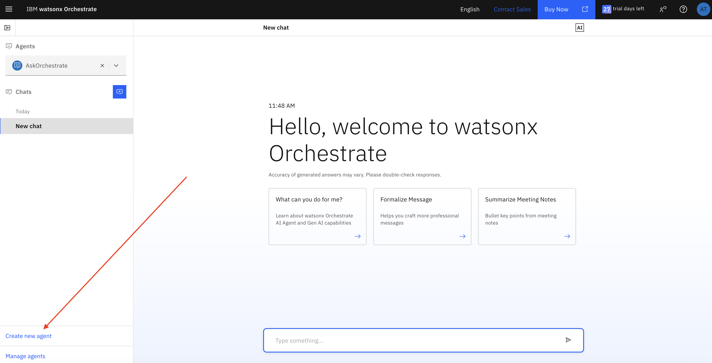

Keep the 'Create from scratch' option selected. Name the new agent "Open Food Foundation Agent." For the description, enter the following:
```
An agent that finds product details about food products from the Open Food Foundation.
```
Click on "Create".
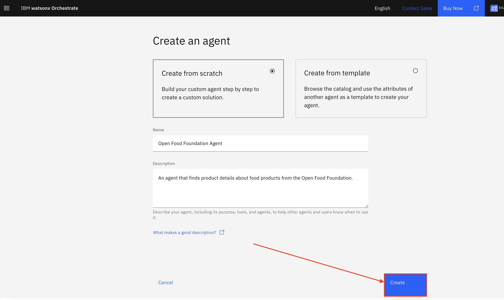

On the agent details page, we can define the details for the new agent. Users can select which Large Language Model this agent is going to use. For this, select the 'llama-3-405b-instruct' model.

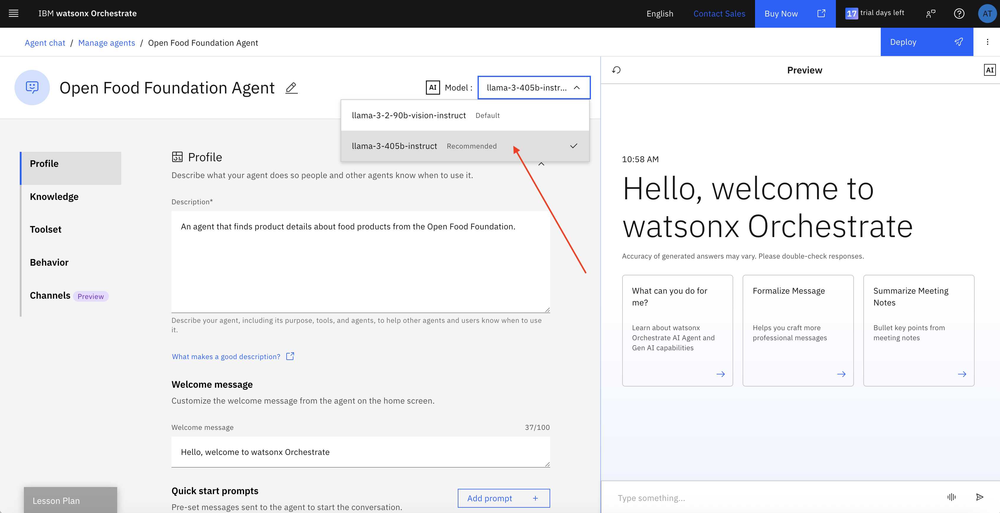

To connect the agent to the tools that allow it to use the Open Food Foundation APIs, scroll down to the 'Toolset' section (or select the 'Toolset' link on the menu on the left of the page). Click on 'Add tool.'

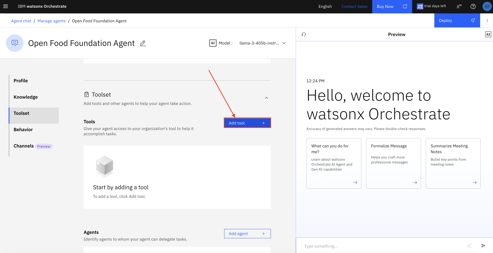

In the following dialog, select 'Add from local instance.' The tools we use have already been loaded into the environment.

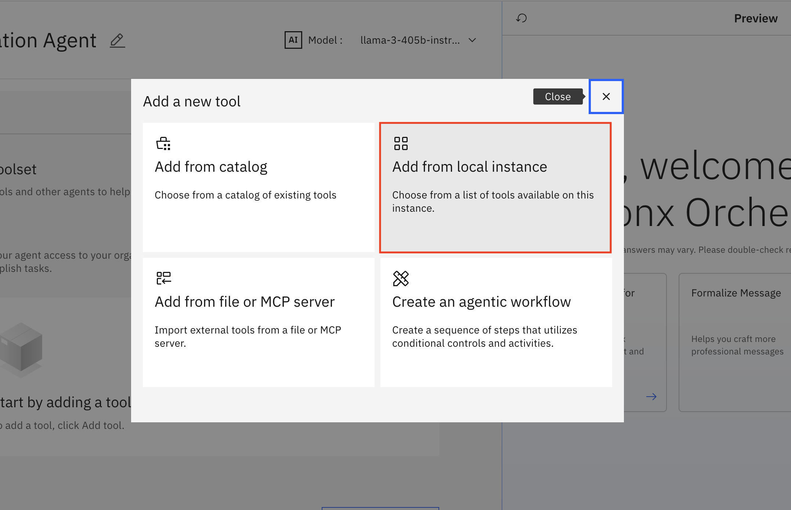

Select the tools named 'off_product_tool' and 'off_search_tool' and click on 'Add to agent'. (Note that your instance may have more tools listed than shown on the screenshot below.)


The off_search_tool tool conducts a search based on the name of a product and returns the associated 'barcode' for each. 
The off_product_tool tool retrieves details about the product, based on barcode. 
Both tools work in conjunction with each other. 
The agent will pick the right tool for a given task based on the tool description. 
To provide additional guidance to the agent about this. Scroll down to the 'Behavior' section of the agent configuration, and add the following to the 'Instructions' section:
```
Use the off_search_tool to find products' bar codes matching the search string, then always use the off_product_tool to retrieve details about the product that matches the ask best.
If parameters are missing, use default values.
```

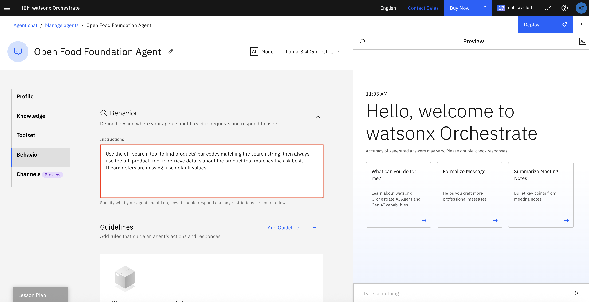

We are now ready to test the new agent. Note that you can interact with the agent at any point in time via the 'Preview' window. Changes you make to the agent's configuration are immediately applied.

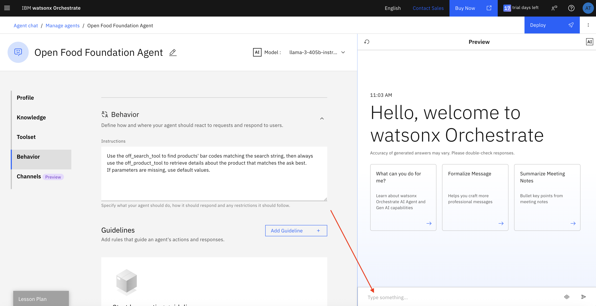

Type a question for the agent into the Preview window, for example:
```
Please give me detailed product information about Pringles original.
```


How did the agent arrive at this answer? Find out by expanding the 'Show reasoning' section in the Preview window.

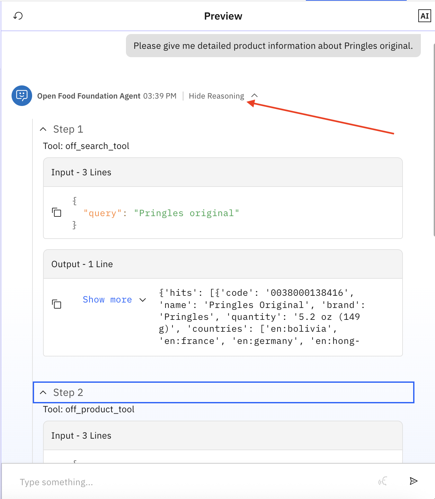

It shows that the answer was built in two steps: 
1. The agent used the off_search_tool tool to find a suitable barcode for the product. Note that the search term 'Pringles original' led to multiple individual products being returned. The agent picks the most suitable one.
2. The agent passes the associated barcode into the second tool, off_product_tool. The agent then uses the data returned from this step and formulates an answer for the user.
Feel free to ask questions about other products, for example 'Campbell’s tomato soup', or 'Lay’s classic potato chips'.

## The FDA Recalls Agent

Let's now build the second agentthat provides information on FDA recalls for a given product. It utilizes a tool that calls a public API offered by the Food and Drug Administration.

To get back to the main agents dashboard page, click on 'Manage agents' at the top left of the page.

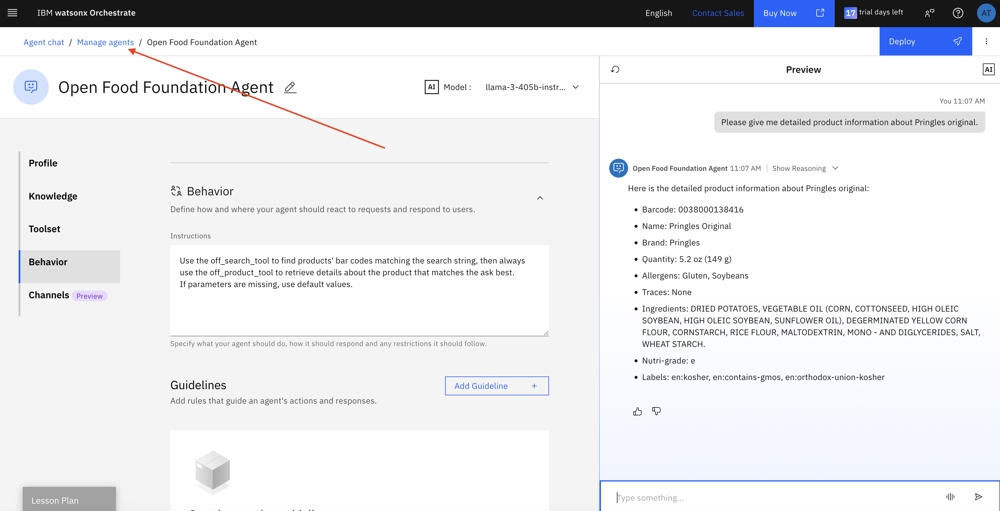

Click on the 'Create agent +' link on the right of the page.

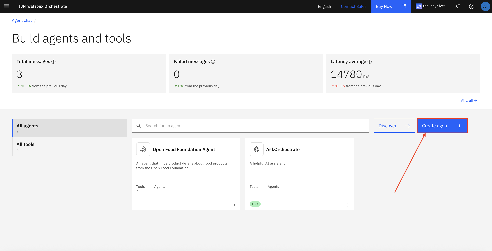

Keep the 'Create from scratch' option selected. Enter 'FDA Recalls Agent' as the name for the new agent and give it this description:
``` 
An agent that finds FDA recalls for a given product.
```

Then click on 'Create'.

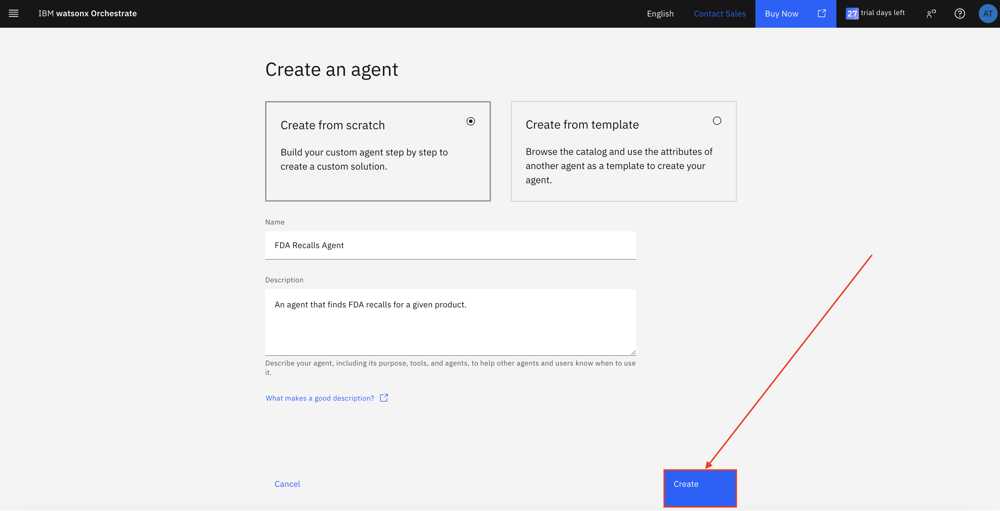

Scroll down to the 'Toolset' section and click on 'Add tool', as shown below:

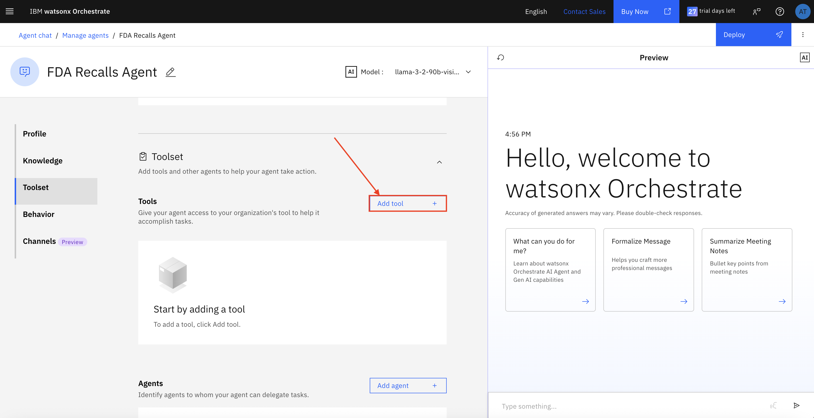

Click on the box saying 'Add from local instance', and in the shown list of tools, select the 'fda_recalls'tool' tool and click on 'Add to agent'.

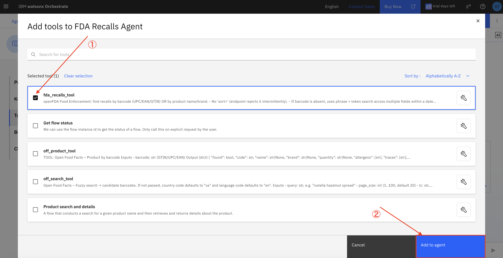

The agent should be able to select this tool simply based on its own description, but we can also add a brief instruction to the agent's Behavior section. Scroll down to the Behavior section and add the following to the Instructions:
```
Use the fda_recalls_tool to find recalls for a given product name.
```

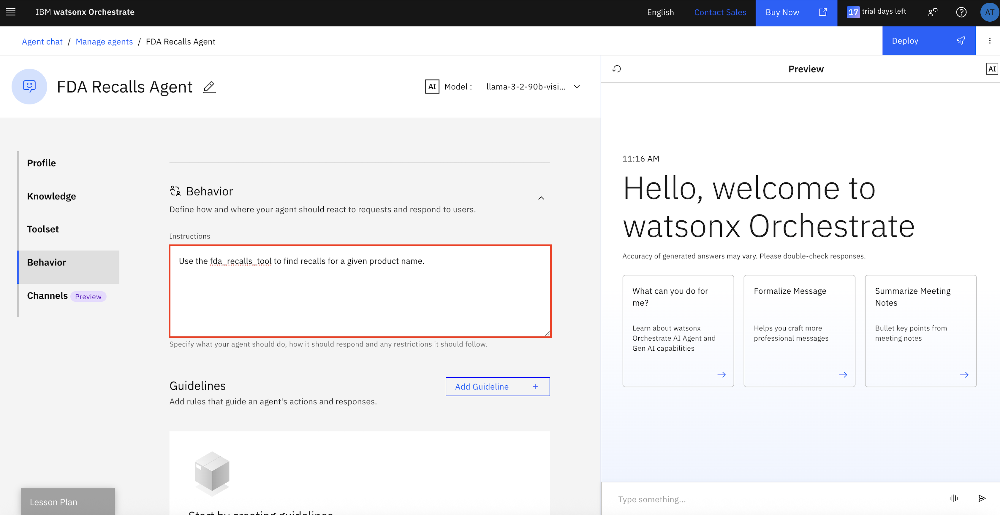

We are now ready to test this agent. Enter the following message into the Preview input field:
```
Tell me if there are ongoing recalls for the Barilla spaghetti brand.
```
The agent should come back with a message saying that there are no ongoing recalls. Ask a follow-up question:
```
and how about Gelson's Tzatziki?
```
At the time of this writing, there is an active FDA recall for this product and the agent should return a message confirming that. Use the 'Show Reasoning' drop-down to verify that the tool was called as expected.

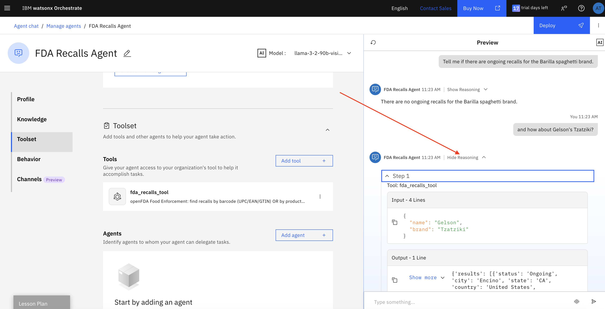

You have now created two agents, one that provides detailed product information and one that delivers information about any ongoing FDA recalls. Next we are going to create a third one that handles nutrition scores and dietary guidelines.

## The Nutrition Agent

This agent will contribute nutritional information to our solution. To create it, go back to the main agent builder dashboard by clicking on the 'Manage agents' link at the top left of the window.

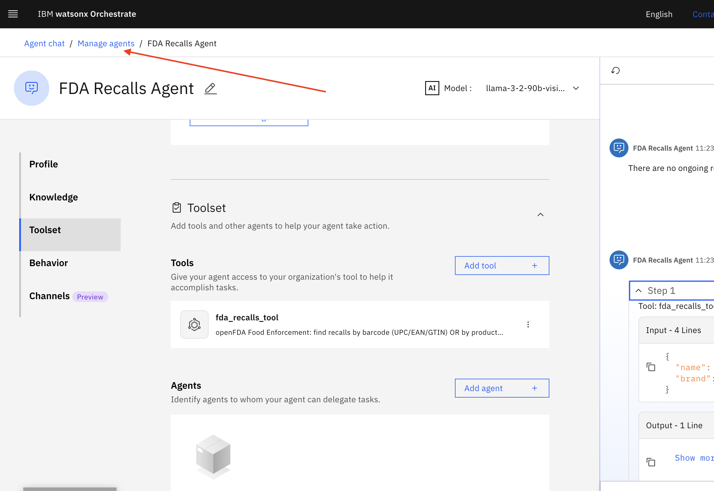

Click on 'Create agent +', and leave the 'Create from scratch' option selected. Enter 'Nutrition Agent' as the name of the new agent and give it the following description.
```
This agent provides explanations of nutrition scores/grades as well as overall dietary guidelines.
```
Then click on 'Create'.

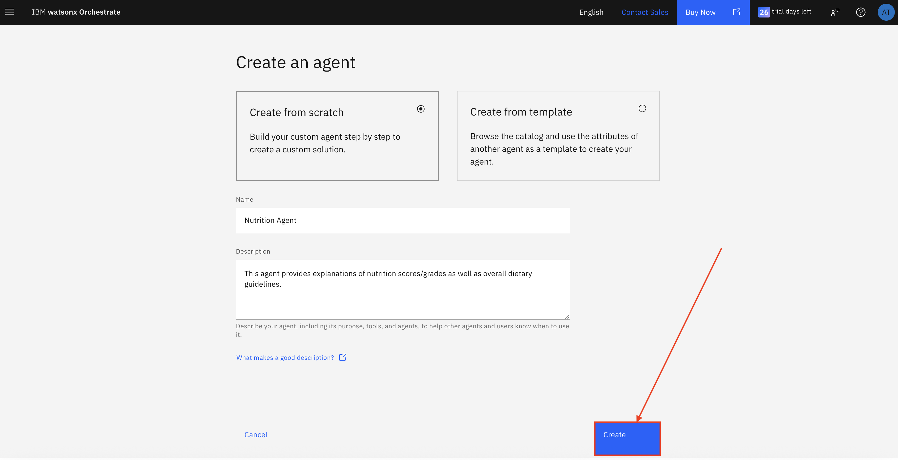

Unlike in the previous examples, where we used tools with the agent to serve requests, here we will use a 'knowledge base.' The information we need, about nutrition scores and dietary guidelines, is available in plain files, one a text file and the other a PDF. We will upload them to watsonx Orchestrate and make them available to the agent to run searches against.

Scroll down to the Knowledge section of the agent configuration. Click on 'Choose knowledge +'.

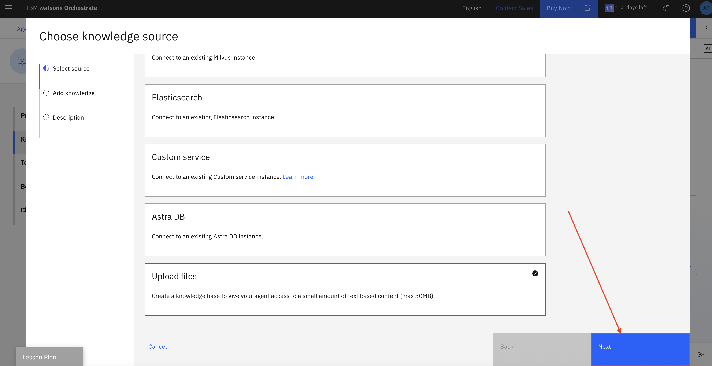

See how there are various methods to add knowledge to the knowledge base, including connecting to existing datastores. Here, we will simply upload the files directly. Select 'Upload files' and click on 'Next.'

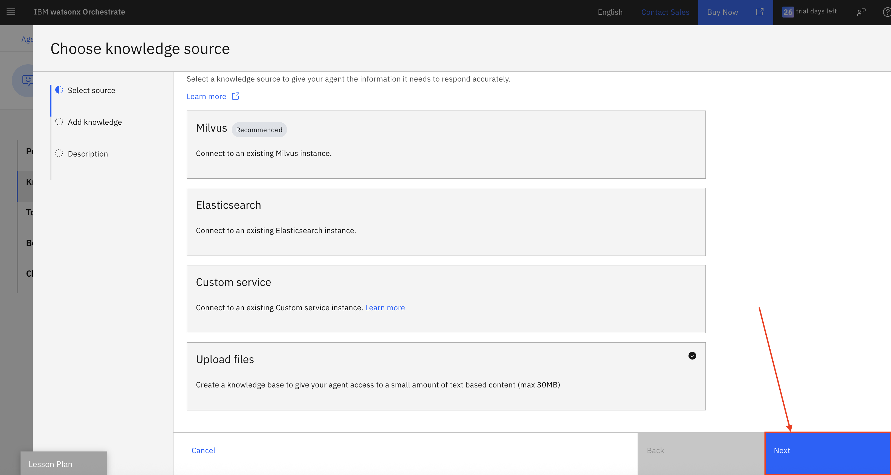

Click on 'Drag and drop files here or click to upload' and select two files for upload:
- [Dietary_Guidelines_forAmericans.pdf](./knowledge/Dietary_Guidelines_for_Americans.pdf)
- [NutriScore_thresholds.txt](./knowledge/NutriScore_thresholds.txt)

Then click on 'Next'.


In the next part of the dialog, give the knowledge a name and enter the following as the description of the knowledge base:
```
This knowledge contains details about nutri scores (nutrition grades) and dietary guidelines.
```

These descriptions are important, because the agent uses this knowledge when serving a request. Click on 'Save.'

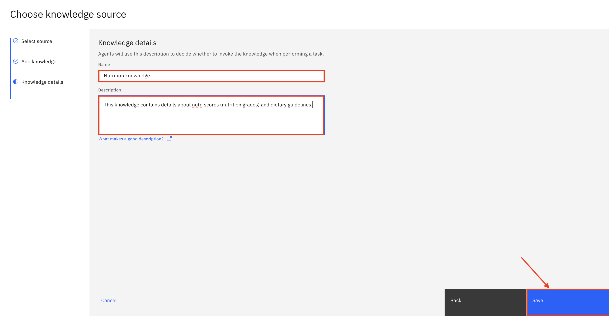

The upload and processing may take a while. When complete, you will see the following in the Knowledge section for the agent. 

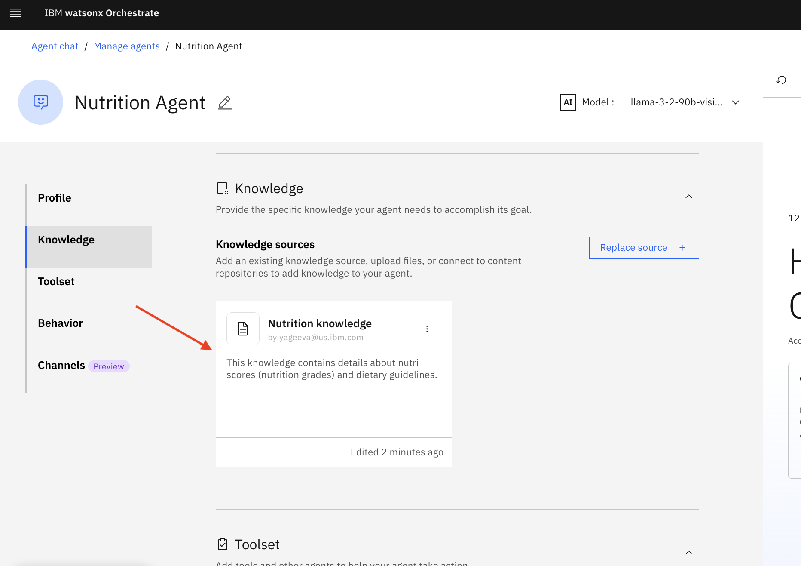

Let's test the new agent. Enter the following into the Preview input field:
```
What is nutrition score ‘d’ and what are related dietary guidelines?
```
If you expand the 'Show Reasoning' section next to the agent's response, you should see that it went to its internal knowledge base to find the answer.


You can also see in the knowledge base where the answer was derived from. At the end of the response message is a drop-down icon. When you click on it, it will show you the sources it found. In our case, it shows that 5 relevant sources in the knowledge base were identified, and it lets you scroll through each of them.

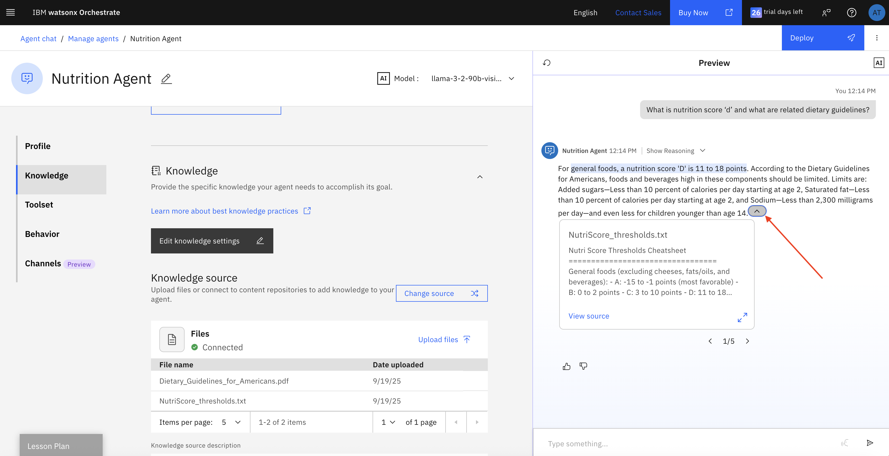

Click on 'View source' to see what was extracted from the source file - in this case the PDF file with dietary guidelines is the second source that was used - that the search returned.


## The FreshLaneMarket Product Scout Agent

The last step to complete the solution is to create a 'supervisory agent.' That is, an agent that uses the other agents and tools, and orchestrates them to address a given request. It is also the point of contact to the end user in our case.

Click on the 'Manage agents' link at the top left of the window.

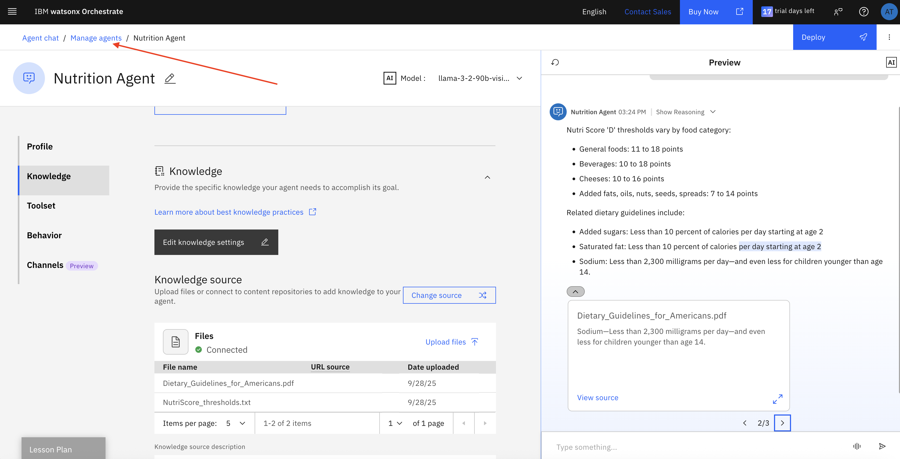

Click on the 'Create agent +' link as before. The name of the supervisory agent is 'FreshLaneMarket Product Scout.' Enter this as the description and click 'Create':
```
An agent that finds product details about food products.
```

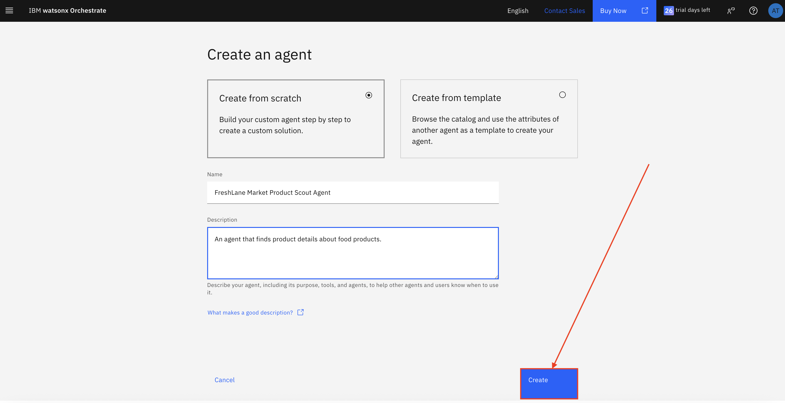

Scroll down to the 'Toolset' section and click on 'Add agent +'.

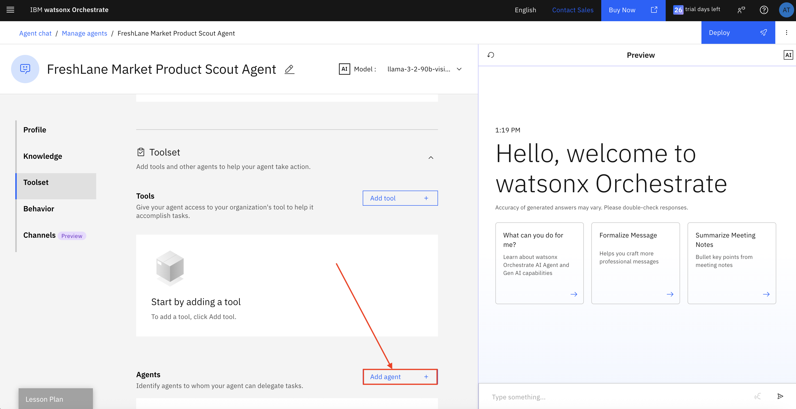

Use the 'Add from local instance' option.

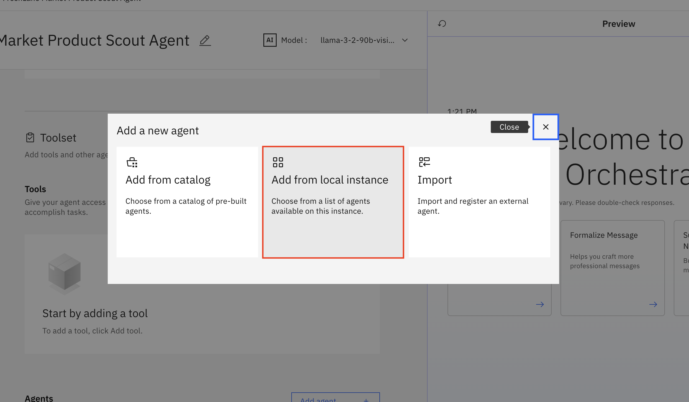

Make sure you select all three agents that we have created, i.e. the 'FDA Recalls Agent', the 'Nutrition Agent' and the 'Open Food Foundation Agent.' Then click on 'Add to agent.'

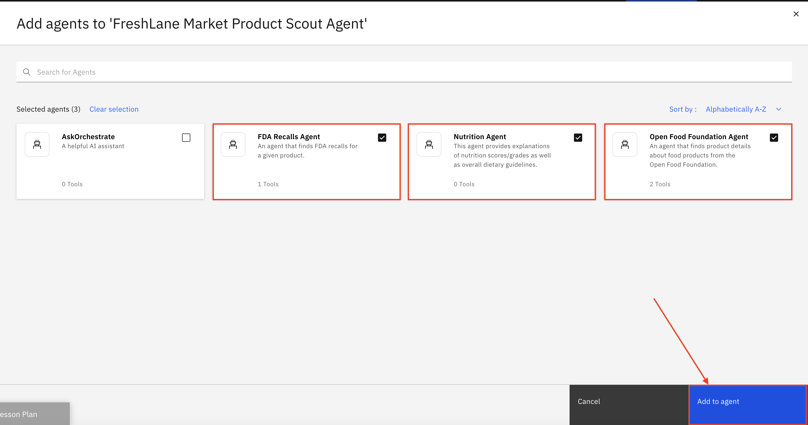

Now scroll down to the 'Behavior' section and enter the following into the 'Instructions' field.
```
Use the OpenFoodFoundation agent to retrieve information about products. You can use the same agent to retrieve an explanation of the nutrition grade of a given product.
Use the NutritionAndGuidelines agent for find explanations for a specific nutrition grade or score. Use the NutritionAndGuidelines agent also for dietary guidelines.
Use the FDARecalls agent to find out of there are any recalls for a given product name or barcode.
```
Just like we did for tools earlier, here we tell the supervisory agent when to use a collaborator agent.

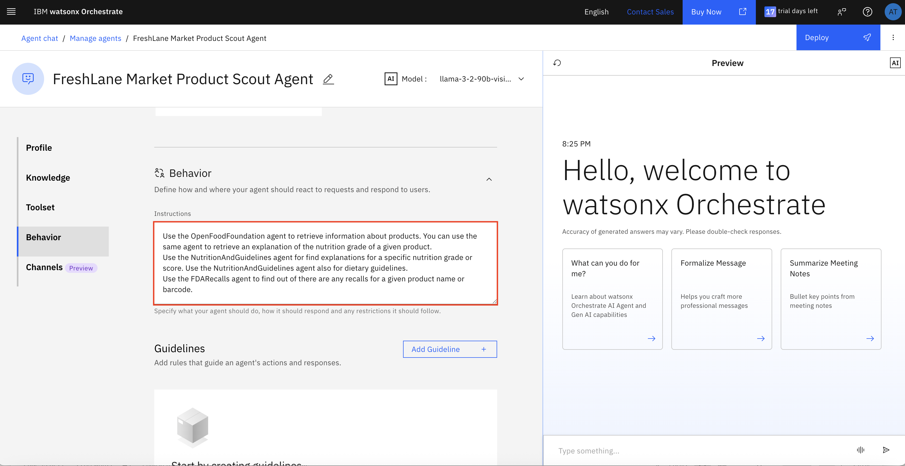

That's it, we are ready to test! Enter the following into the 'Preview' input field:
```
Can you give me product information about Gatorade lemon lime including allergens and nutrition value, as well as potential FDA recalls? Please also give me a short explanation of its nutrition grade.
```

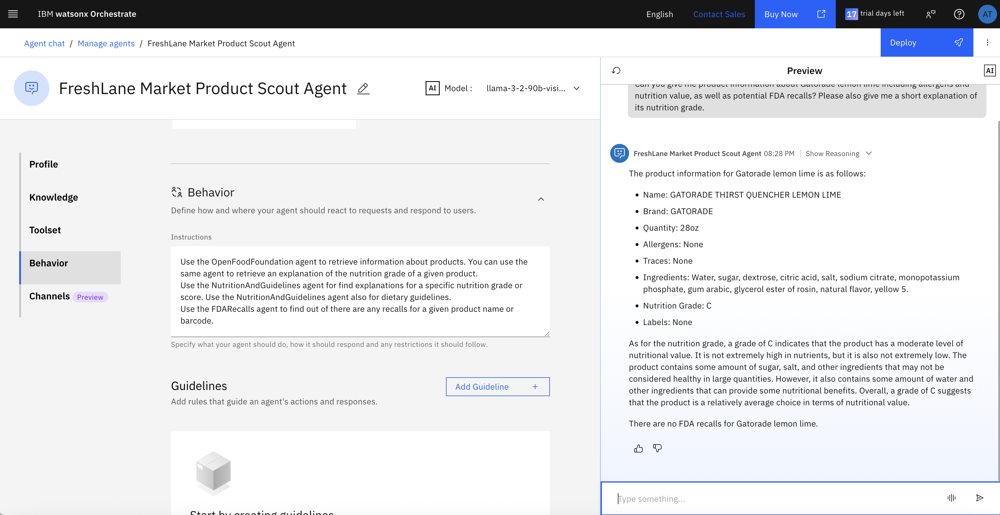

If you expand on the reasoning that took place, you will note that a number of steps were taken to answer the request. The supervisory agent routed the request to the collaborator agents (in this case, all three of them), the collaborator agents in turn used their respective tools, and finally the supervisory agent formulated the final answer.

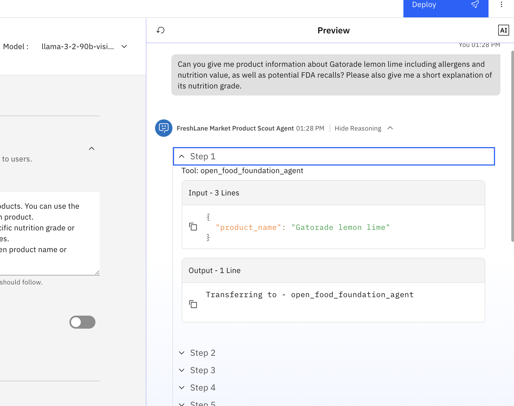

Everything is working as intended.

### Embedded chat

Let's assume we want to offer this agent for chatting as embedded into FreshLane Market's website. To do so, we need to capture the script that displays the chat frontend. Go to the 'Channels' section. Expand the 'Embedded agent' option and copy the generated script to the clipboard, as shown below.

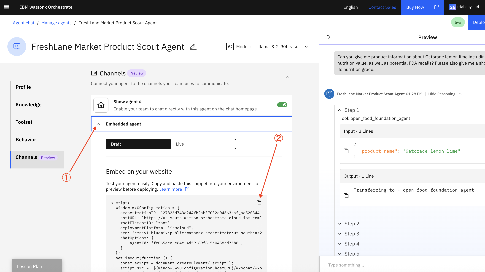

In this exercise, we will simulate FreshLane Market's website with a simple HTML file. The script we just copied to the clipboard needs to be added to that file. So let's open the [index.html](./index.html) file into an editor. 
> You may have to right-click on the file to open it into an editor. By default, it would be loaded into your browser, but before we do that, we need to edit it.

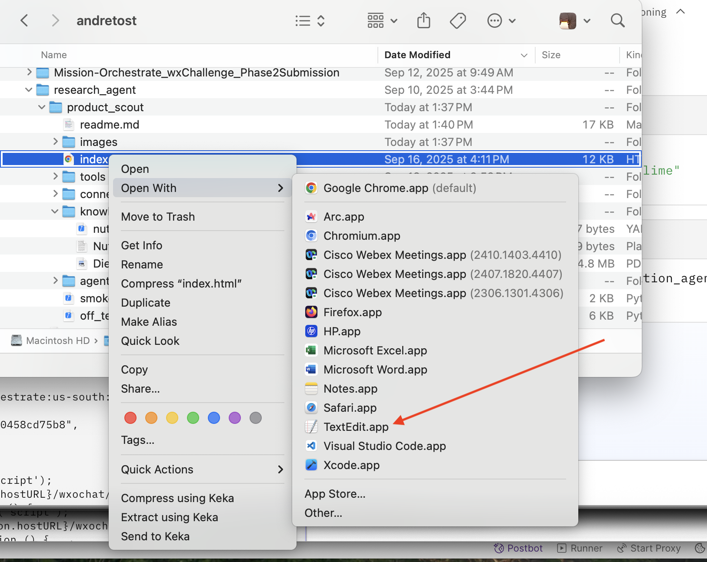

Scroll down to the end of the file and paste the content of the clipboard right after the line that says `<!-- 🔌 Paste your chat widget <script> here.  -->`. (Make sure it is before the `</body>` element!)


Once you have pasted the code, save the file. Now youcan simply drag and drop it into an empty browser tab, or using the 'File -> Open' option of your browser.
Once loaded, you should a small blue circle in the bottom right corner of the page.


Clicking on that circle opens the chat window, which will look like the Preview window we had in the agent builder. Now lets validate it by entering a request, for example:
```
Can I get more information about Eggland's Best large eggs?
```

Note that you can ask follow-up questions, for example:
```
How about Chiquita bananas?
```

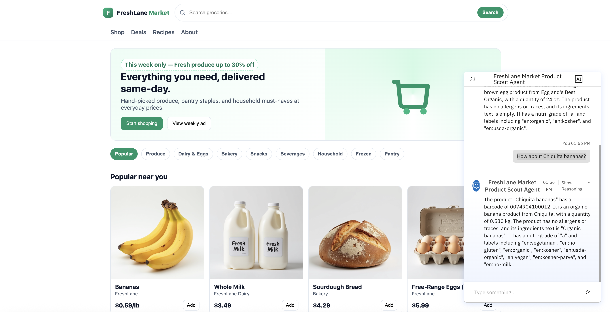

**Congratulations!** 
You have built a complete agentic AI solution that allows asking questions about food products by utilizing several agents and tools to retrieve the needed information in one simple interface for your customer on your website.
