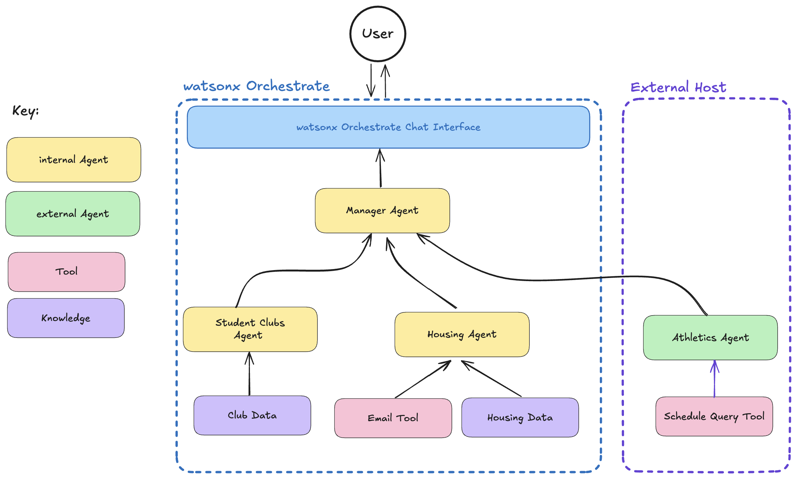

# Student Assistant Use Case

### 🤔 The Problem

<!--  -->

Students at Bluemont University encounter challenges when it comes to fully exploring and engaging with the many opportunities available to them, such as clubs, off-campus housing options, and athletic events. These experiences are a meaningful part of a student's college journey, and improving accessibility to them could greatly enhance their overall university experience.

**Opportunities for Improved Club Discovery**

The current system for discovering clubs and events can feel overwhelming, with students often needing to sift through lengthy lists of options. Many turn to platforms like Instagram or rely on word-of-mouth from friends to stay informed about events, indicating a desire for a more streamlined way to connect with opportunities on campus.

**Navigating Housing Choices with Greater Support**

Finding off-campus housing can sometimes feel like an independent and time-intensive process for students. Without clear guidance, it's easy to overlook options that might be a better fit or require more effort to find. A more supportive approach could simplify this process and help students feel more confident in their housing choices.

**Enhancing Athletic Engagement**

With Bluemont University's strong athletic culture and passionate student support, there's an opportunity to present events and activities in a more cohesive and engaging way. A unified approach could enrich the overall sports experience for students, making it easier to participate and celebrate the university's athletic spirit.

### 🎯 Objective

The goal is to design and implement an Agentic AI-enabled student engagement system at Bluemont University. This system would utilize artificial intelligence to streamline the process of discovering, exploring, and interacting with various aspects of the student experience. It would provide an intuitive, natural language interface for students to inquire about clubs, housing options, and athletic events all from a single point of interaction.

### 🗺 Exploring the Agents

**Student Clubs Agent**:
The *Student Clubs Agent* will help students connect with organizations run by their peers by both providing detailed information about them and suggesting clubs based on student interests and activities. This will help  eliminate redundant club listings and improve the user experience.

**Housing Agent**:
The *Housing Agent* will assist students in finding off-campus housing. It will gather comprehensive information about available apartments and facilitate direct communication with properties.

**Athletics Agent**:
The *Athletics Agent* will help students connect with the university's athletics department. It will provide students with an easy way to browse the latest events, providing visibility and encouraging participation.

### 📈 Business Value

The implementation of an Agentic AI-enabled student engagement system would yield significant benefits for Bluemont. By automating the process of discovering and interacting with clubs, housing, and athletics, the system would save students time and effort, allowing them to focus more on their academic and extracurricular pursuits. Moreover, the personalized recommendations would enhance students' overall satisfaction and engagement with university life.

### 🏛️ Architecture

### 📄 Step-by-step Hands-on Instructions
You can find the step-by-step instructions in [this document](./student-assistant-instructions.md). It shows how you can implement the use case using watsonx.ai and watsonx Orchestrate.