# Agent Monitoring

This guide focuses on monitoring the Student Assistant agents deployed through watsonx Orchestrate. The goal is to evaluate chat interactions, measure answer relevance, faithfulness, and tool usage. Monitoring also enables root cause analysis and continuous improvement of the system.

## Why Monitor Your Student Assistant?

Monitoring is essential for:

1. **Quality Assurance** - Ensure students receive accurate, helpful responses
2. **Performance Tracking** - Identify which agents are most/least used
3. **Issue Detection** - Quickly identify and resolve problems
4. **Continuous Improvement** - Use data to refine agent behavior and routing
5. **Trust Validation** - Verify that trust principles are maintained in practice
6. **Compliance** - Maintain audit trails for institutional requirements

## Prerequisites

- Completed [Part I](./hands-on-lab-part-I.md) of the Student Assistant lab
- All agents deployed with monitoring activated
- Some test queries executed through the chat interface

---

## Activating Agent Monitoring

If you haven't already activated monitoring during deployment, you can do so at any time:


### Step 1: Enable Monitoring


1. If the agent is already deployed, click on the **Analyze** tab:

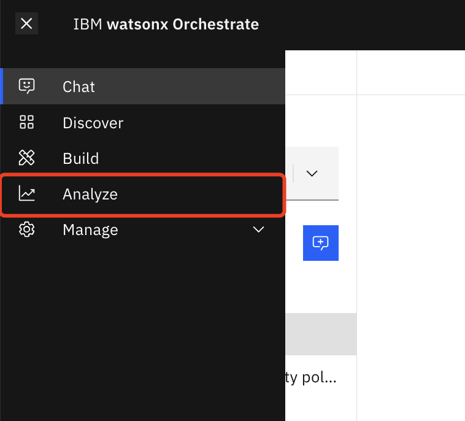

2. Toggle the **Monitor** switch to enable monitoring:

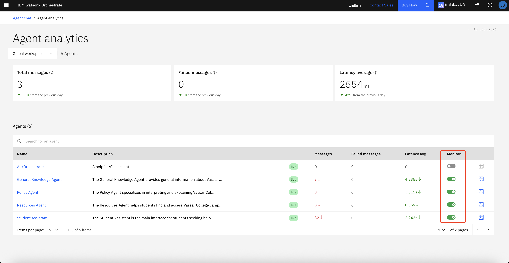

3. Confirm activation when prompted. This may take a few moments:

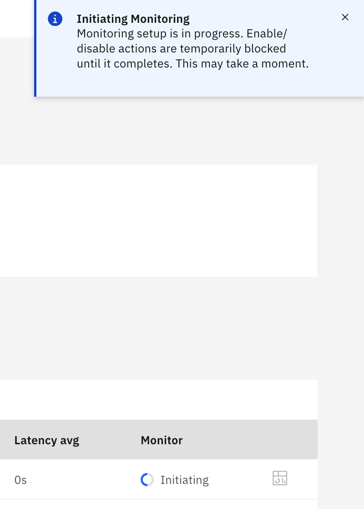

> **Note:** Monitoring must be enabled for each agent individually. For the Student Assistant system, you should enable monitoring for all four agents (Student Assistant, Policy Agent, Resources Agent, and General Knowledge Agent).

---

## Testing Your Agents

Before reviewing monitoring data, generate some test interactions:

### Step 1: Access the Chat Interface

1. From the hamburger menu at the top left, select **Chat**:

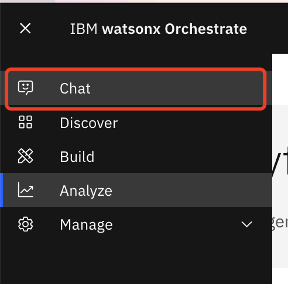

2. Select the **Student Assistant** from the dropdown:

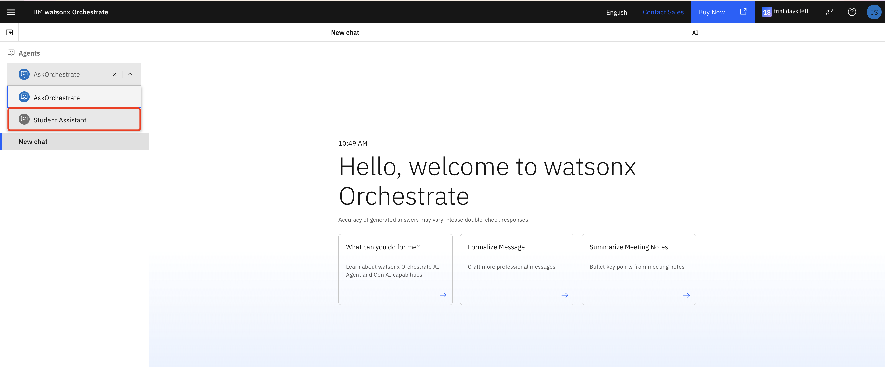

### Step 2: Execute Test Queries

Run a variety of queries to generate monitoring data:

**Policy Questions:**
```
What is Vassar's academic integrity policy?
```
```
Can I take a course pass/fail?
```
```
What happens if I miss an exam?
```

**Resource Questions:**
```
How do I access the VPN?
```
```
Where can I find campus jobs?
```
```
How do I check CIS service status?
```

**General Questions:**
```
What dining options are available?
```
```
When is spring break?
```
```
What are the library hours?
```


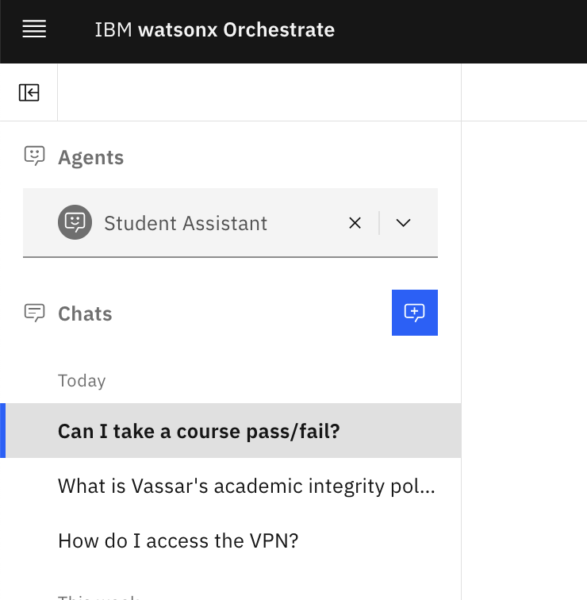

### Step 3: Wait for Data Processing

Monitoring data may take some time to appear in the dashboard. This is normal - go get a coffee! ☕

---

## Accessing the Monitoring Dashboard

### Step 1: Navigate to Analytics

1. From the hamburger menu, select **Analyze**:


2. You'll see the **Agent Analytics** page with all your agents listed:

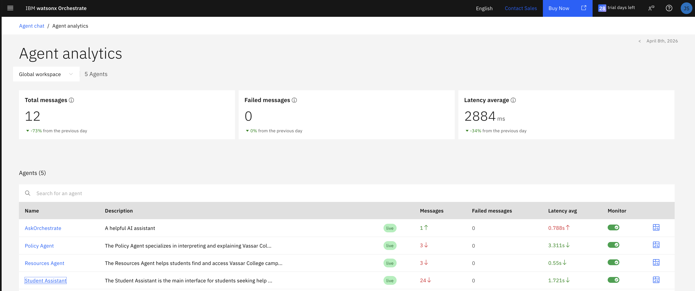


### Step 2: Understanding trace details

Before opening the governance dashboard, it helps to understand what trace details represent. A trace captures the execution path for an individual interaction, including the user's prompt, the agent or workflow selected, any tool or knowledge calls made, and the final response returned.

1. In **Agent Analytics**, select the **Student Assistant** so you are reviewing traces for the correct agent.
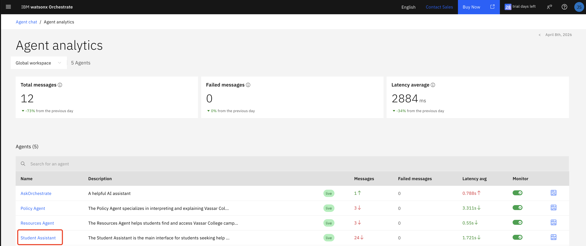

2. Review the trace details for a recent interaction to understand how the Student Assistant handled the request.

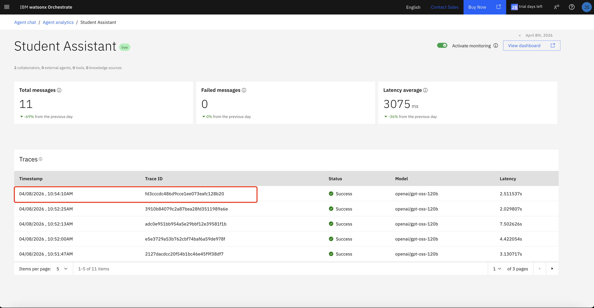

3. Pay attention to the following elements in the trace:
   - **User prompt** - The original question submitted by the student
   - **Routing decision** - Which agent or path was selected to answer the question
   - **Tool and knowledge activity** - Any retrieval, tool calls, or supporting actions used during execution
   - **Final response** - The answer delivered back to the user

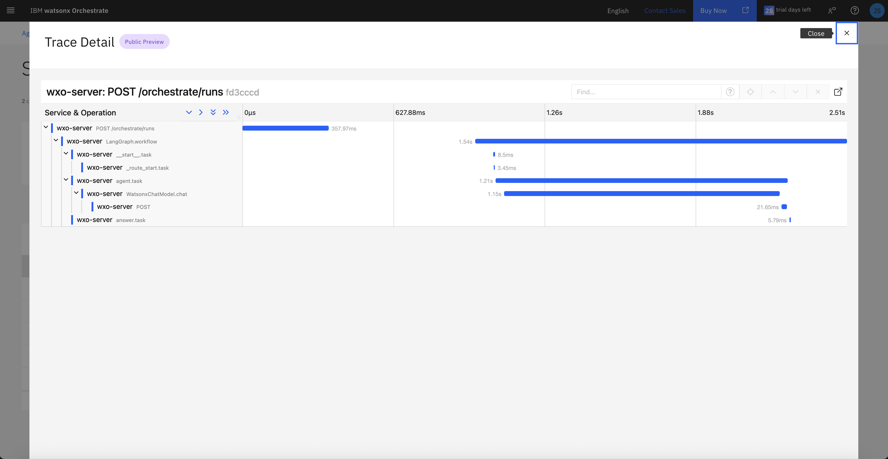
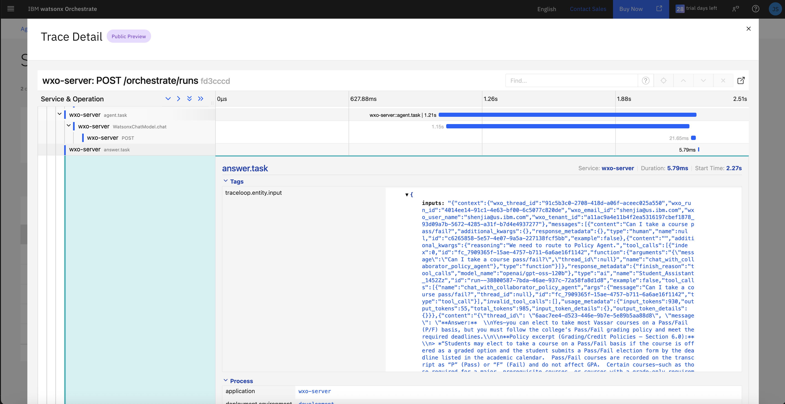

> **Why this matters:** Understanding trace details makes it easier to interpret governance metrics later, especially when investigating low relevance, faithfulness issues, or unexpected tool behavior.

### Step 3: Open the Governance Dashboard

1. Click the dashboard icon to the right of the Monitor toggle for the Student Assistant:

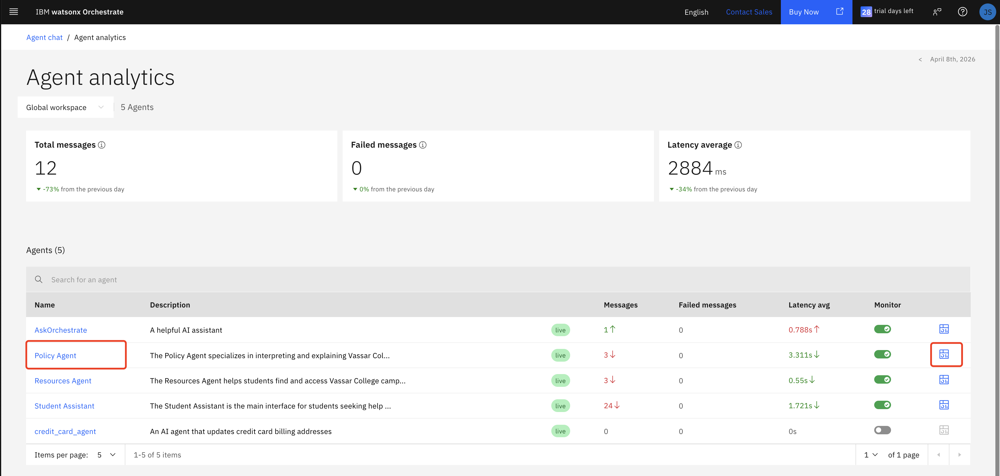

2. This opens the **IBM watsonx.governance** dashboard in a new tab:

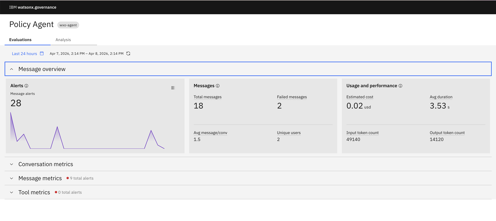

3. In the governance dashboard, review both the **Evaluation** and **Analysis** tabs.

4. Start with the **Evaluation** tab and examine these sections:

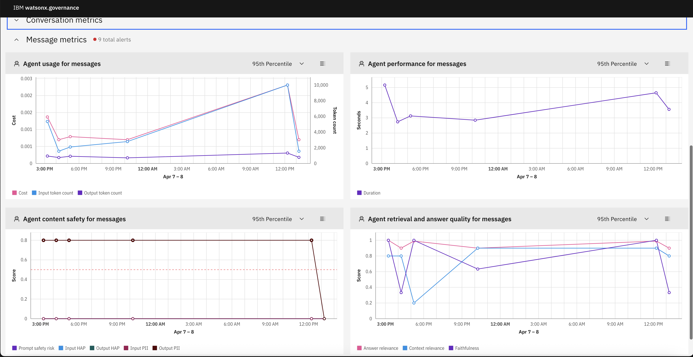

   
   - **Message Overview** - Summarizes overall message metrics, you can quickly assess operational health.
   - **Conversation Metrics** - Shows agent interaction to help you understand how students are engaging with the assistant.
   - **Message Metrics** - Measures answer usage, performance, content safty and retrieval and answer quality for messages.
   - **Tool Metrics** - Tracks tool call quality so you can evaluate whether tools sources are behaving reliably.

5. Then review the **Analysis** tab to inspect individual conversations and message-level details so you can diagnose why a specific interaction succeeded or failed.

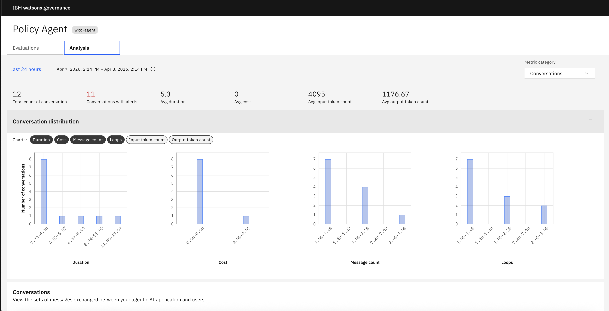

 Select the **Analysis** tab, and go to the bottom where the conversations will be listed. Click the 3 dot menu next to the conversation you just had and click the **View Details** menu item.  

   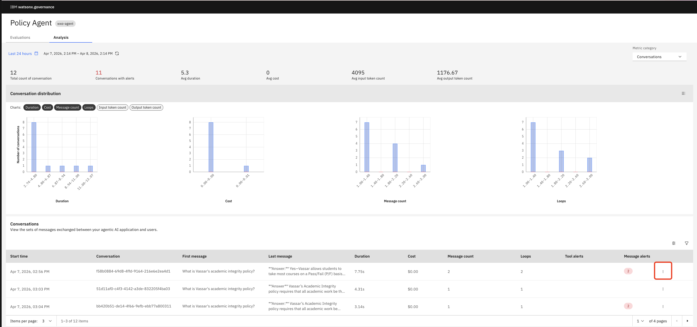

1. This will show you details for all of the messages in the conversation.  You can expand the blue **+ # metrics** link to see all of the metrics for each message.

   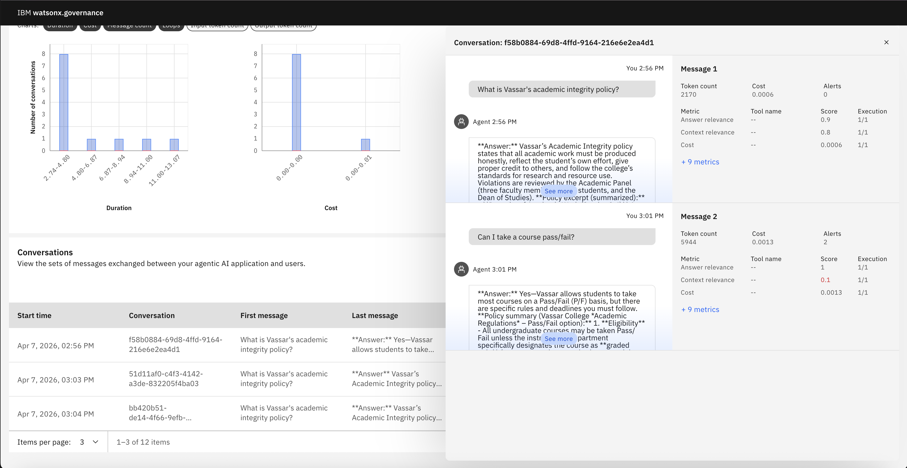
   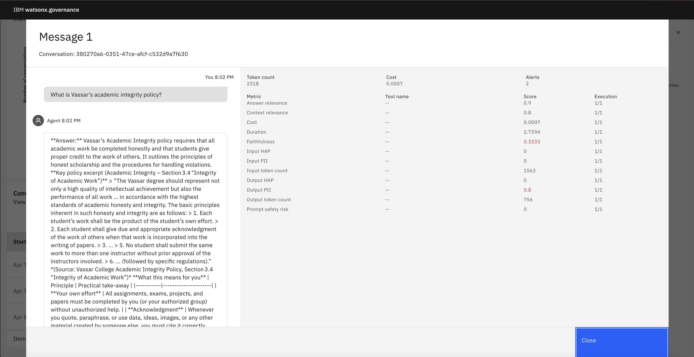

1. Exit out of the message details and select **Messages** from the top right drop-down menu on the Analysis page.

   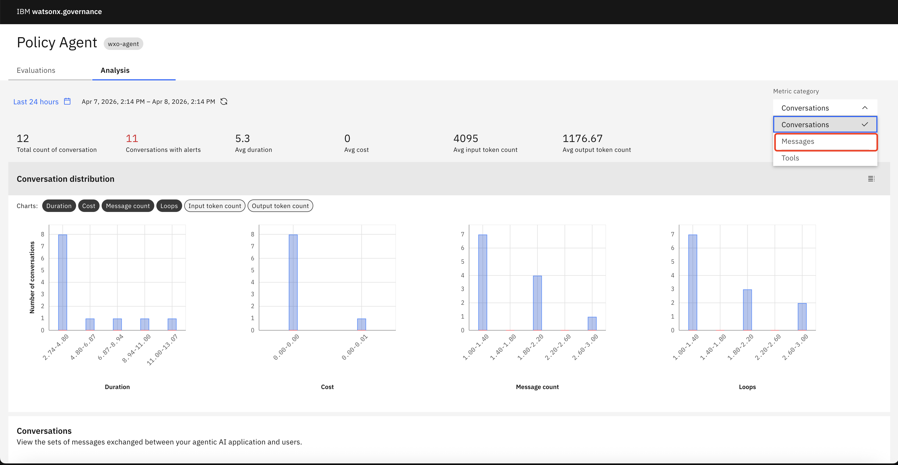

1. Go down to the bottom of the page to see a table of all of the monitored messages. Select the customize icon at the top right of the message table to customize the metrics to display. For example, Choose **Answer relevance** and **Prompt Safty Risk**, and **faithfulness**, then **Apply**. You will now see the added columns to the table.

   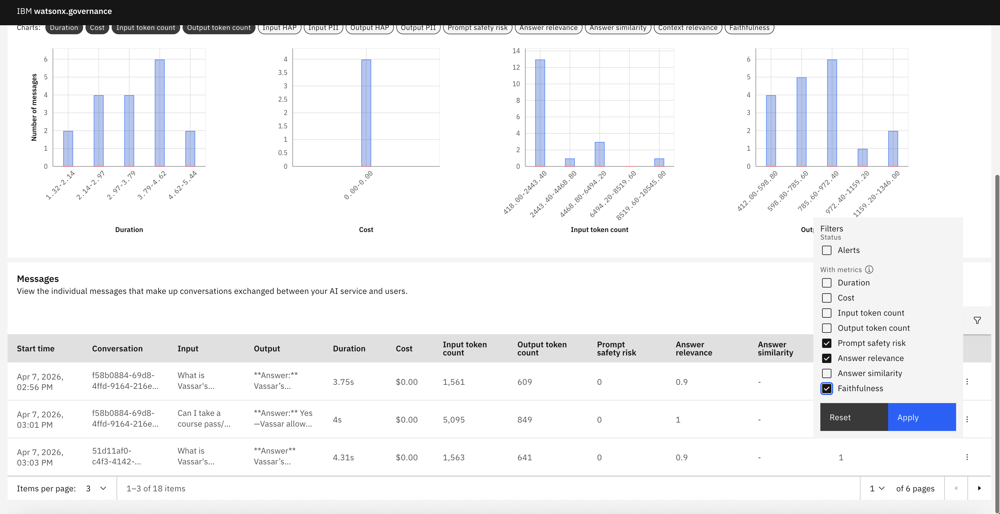

1. Here are some sample metrics for the questions we asked so far:

   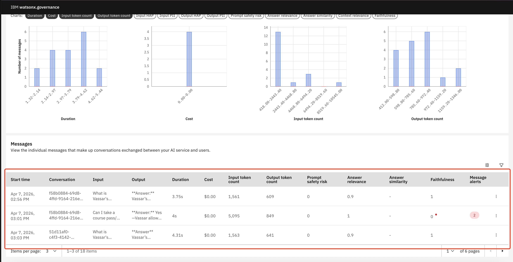


> **Why this matters for agent governance:** The Evaluation tab helps you govern the agent at a system level by monitoring quality, reliability, usage, and tool behavior over time. The Analysis tab supports governance at the interaction level by giving you the evidence needed to investigate failures, validate routing decisions, and improve the assistant responsibly. Together, these views help you monitor performance, maintain trust, and make informed improvement decisions.

---

## Tips Using Monitoring Data for Improvement

### 1. Refine Routing Logic

If you notice queries being routed to the wrong agent:

1. Review the Student Assistant's routing instructions
2. Add more specific keywords or patterns
3. Test with the problematic queries
4. Redeploy and monitor improvement

### 2. Improve Knowledge Sources

If faithfulness scores are low:

1. Review the source documents
2. Ensure they're comprehensive and up-to-date
3. Add missing information
4. Remove outdated content
5. Re-upload to knowledge base

### 3. Enhance Agent Instructions

If relevance scores are low:

1. Review agent behavior instructions
2. Add more specific guidance
3. Include examples of good responses
4. Test with problematic queries
5. Iterate until scores improve

### 4. Optimize Performance

If response times are high:

1. Review knowledge base size and structure
2. Consider splitting large documents
3. Optimize search parameters
4. Check for external tool performance issues

---


## Summary

Monitoring is essential for maintaining a high-quality, trustworthy Student Assistant system. Key takeaways:

✅ **Enable monitoring** for all agents from the start

✅ **Review metrics regularly** to catch issues early

✅ **Use conversation analysis** to understand specific problems

✅ **Iterate continuously** based on monitoring insights

✅ **Validate trust principles** through quantitative metrics

✅ **Maintain audit trails** for accountability

By following these monitoring practices, you ensure your Student Assistant continues to provide accurate, helpful, and trustworthy support to students.

---
