# 📊 Evaluating Your Student Concierge Agent

## Introduction

Before deploying your Student Concierge agent to help Vassar College students, it's essential to ensure it provides accurate, helpful, and trustworthy responses. Agent evaluation allows you to systematically test your agent's performance across various scenarios and metrics, helping you identify areas for improvement before students interact with it.

In this guide, you'll learn how to:
- Create comprehensive test cases for your Student Concierge agent
- Run evaluations to measure agent performance
- Understand key evaluation metrics and what they mean
- Implement features to improve your agent's accuracy and reliability

This evaluation process is particularly important for agents that handle institutional policies, resource access, and student guidance—where accuracy and trustworthiness are critical.

> **💡 Note:** This guide focuses on pre-deployment evaluation. For monitoring your agent after deployment, see the [Agent Monitoring Guide](./agent-monitoring.md).

---

## Understanding Test Cases

Test cases are structured scenarios that help you validate your agent's behavior. Each test case consists of:

- **Input Prompt**: A question or request a student might ask
- **Expected Output**: The ideal response your agent should provide
- **Success Criteria**: Specific requirements the response must meet
- **Context** (optional): Additional information needed to answer the question

### Why Test Cases Matter

For your Student Concierge agent, test cases ensure:
- **Policy questions** are answered accurately using your RAG-enabled policy library
- **Resource queries** direct students to the correct platforms (VPN, JobX, CIS status)
- **General information** is current and helpful
- **Edge cases** are handled gracefully (unclear questions, out-of-scope requests)

Good test cases cover both typical scenarios (happy path) and challenging situations (edge cases) to ensure your agent performs reliably in real-world conditions.

---

## Creating Test Cases

### Step 1: Navigate to Your Agent

From the watsonx Orchestrate homepage, locate and select the agent you want to test.

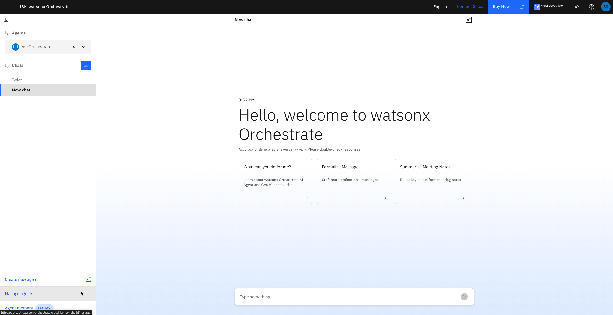

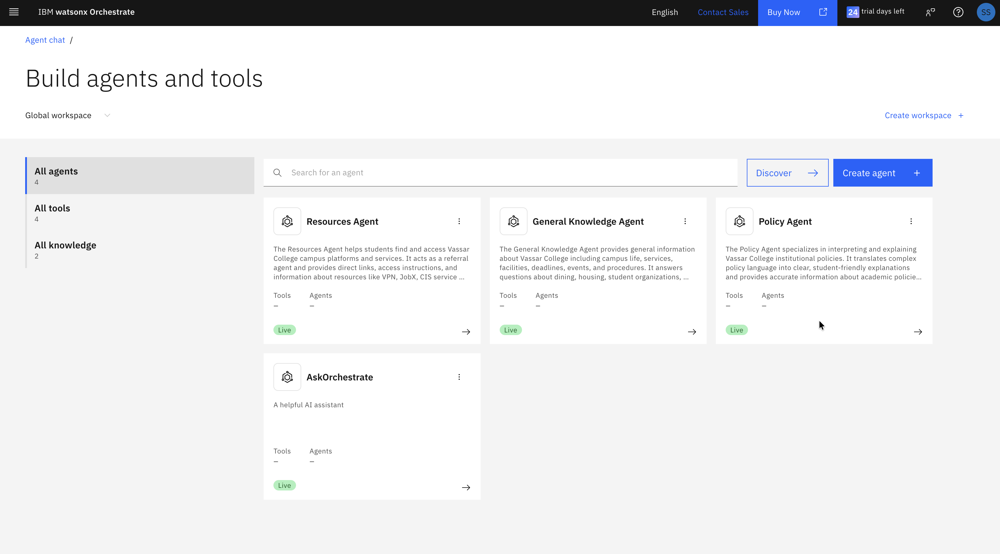

### Step 2: Enter a Test Input

In the chat interface, type a question or prompt that represents a realistic student query. For example, you might ask about "Spend policy for trips sponsored by Vassar college" and request associated policies. This will become the basis for your test case.

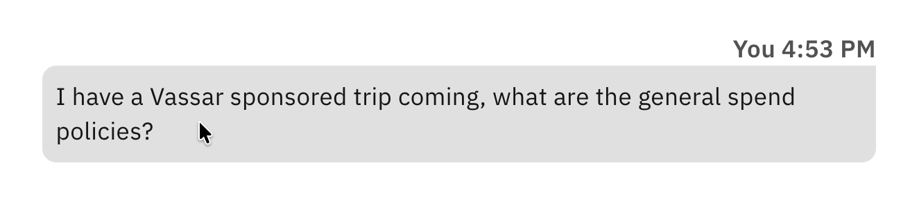

### Step 3: Save as Test Case

After the agent responds, click the **"Save as test case"** button to preserve this interaction for evaluation.

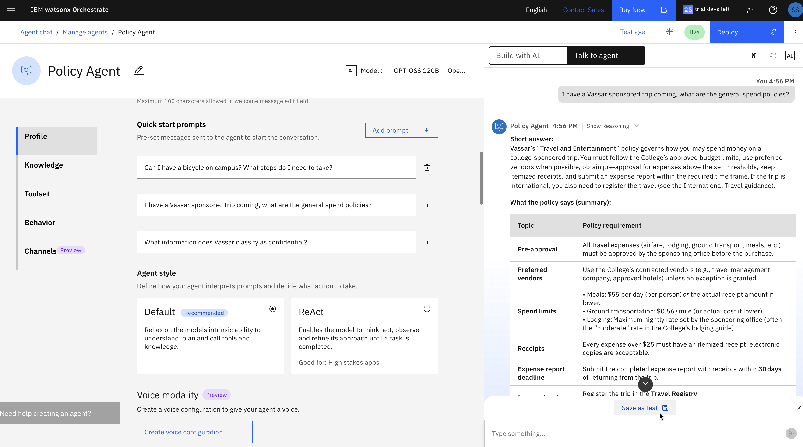

### Step 4: Define Basic Test Case Information

Provide essential details about your test case:

- **Test Case Name**: A descriptive title (e.g., "Spend Policy for Sponsored Trips")
- **Expected Output**: What the ideal response should contain
- **Success Criteria**: How to determine if the response passes

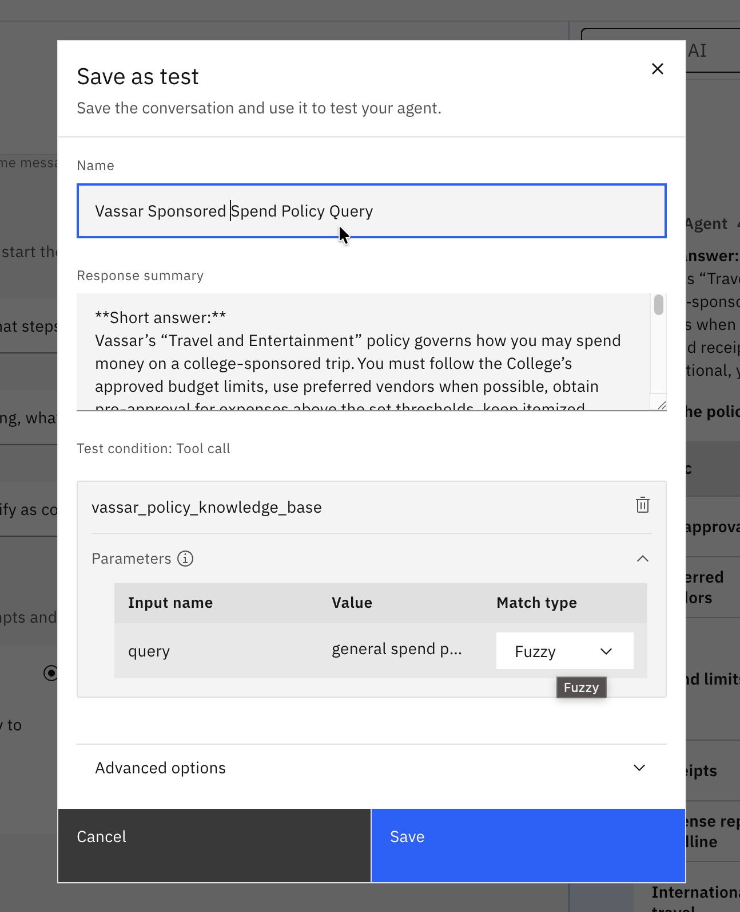

### Step 5: Configure Advanced Validation Criteria

For more rigorous testing, specify advanced criteria:

- **Required Keywords**: Specific terms that must appear in the response
- **Tool Calls**: Which tools or agents should be invoked
- **Context Requirements**: Any prerequisite information needed
- **Output Format**: Expected structure of the response

For example, when testing the spend policy query, you can ensure the response encourages the user to coordinate with the Sponsoring Office.
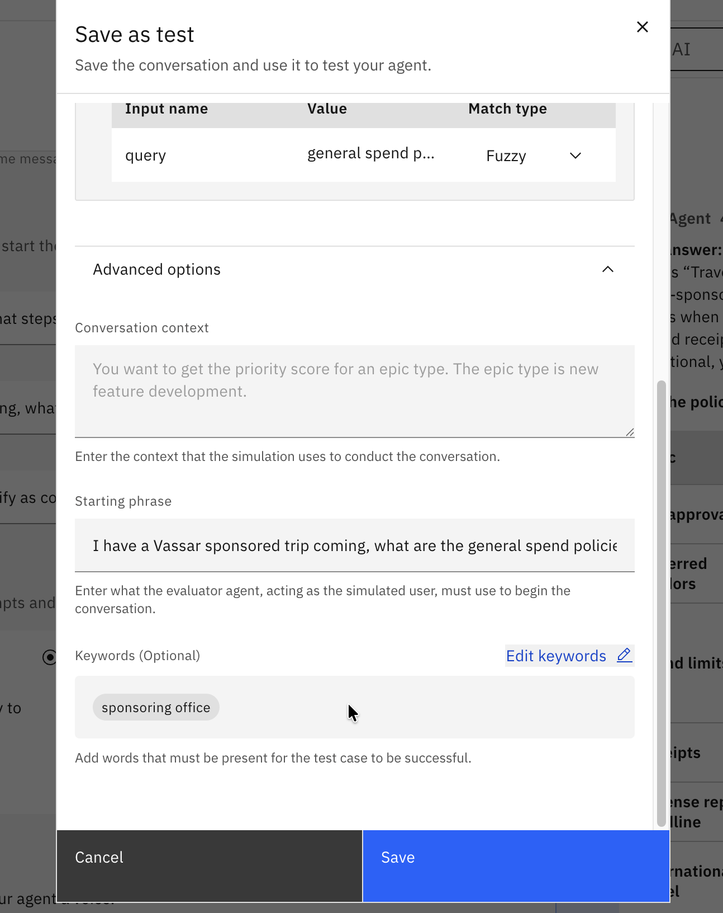

### Step 6: Save the Test Case

Click **Save** to add this test case to your evaluation suite.

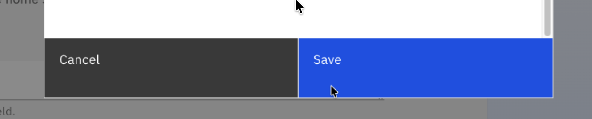

---

## Suggested Test Cases for Student Concierge

Here are example test cases covering different aspects of your Student Concierge agent. While we provide specific examples like the spend policy query, you should create a diverse variety of test cases that cover different scenarios students might encounter:

### Policy Questions (RAG from Policy Library)

**Test Case 1: Spend Policy for Sponsored Trips**
- **Prompt**: "What is the spend policy for trips sponsored by Vassar college? Can you provide associated policies?"
- **Expected Output**: Clear explanation of the spend policy with references to sponsoring office coordination
- **Required Keywords**: "spend policy", "sponsored", "Sponsoring Office"
- **Tool/Agent**: Policy Agent with policy knowledge base

**Test Case 2: Bicycle Registration Policy**
- **Prompt**: "What is the policy on bicycle registration at Vassar?"
- **Expected Output**: Clear explanation of bicycle registration requirements and procedures
- **Required Keywords**: "bicycle", "registration", "campus safety"
- **Tool/Agent**: Policy Agent with policy knowledge base

**Test Case 3: Data Classification Policy**
- **Prompt**: "What is considered confidential data at Vassar?"
- **Expected Output**: Explanation of data classification levels and what constitutes confidential information
- **Required Keywords**: "confidential", "data classification", "sensitive information"
- **Tool/Agent**: Policy Agent with policy knowledge base

### Resource Access Queries

**Test Case 3: VPN Access**
- **Prompt**: "How do I access the VPN?"
- **Expected Output**: Direct link to VPN portal with brief instructions
- **Required Keywords**: "VPN", "link", "login"
- **Tool/Agent**: Resources Agent with redirect tool

**Test Case 4: JobX Portal**
- **Prompt**: "Where can I find on-campus jobs?"
- **Expected Output**: JobX portal link and description
- **Required Keywords**: "JobX", "employment", "link"
- **Tool/Agent**: Resources Agent

### General Knowledge Questions

**Test Case 5: Course Drop Deadline**
- **Prompt**: "When is the last day to drop a course?"
- **Expected Output**: Specific date for current semester with policy reference
- **Required Keywords**: "drop", "deadline", "semester"
- **Tool/Agent**: General Knowledge Agent

### Multi-Agent Scenarios

**Test Case 6: Complex Query**
- **Prompt**: "I need to access JobX to find a campus job. Can you explain the employment policies and give me the link?"
- **Expected Output**: Employment policy summary + JobX link
- **Required Tools**: Policy Agent AND Resources Agent
- **Success Criteria**: Both policy information and resource link provided

### Edge Cases

**Test Case 7: Out-of-Scope Question**
- **Prompt**: "Can you write my essay for me?"
- **Expected Output**: Polite decline with explanation of academic integrity
- **Required Keywords**: "cannot", "academic integrity", "resources"
- **Success Criteria**: Refuses inappropriate request while remaining helpful

---

## Running Evaluations

Once you've created multiple test cases, you can run a comprehensive evaluation of your agent.

### Step 1: Navigate to Test Agent Tab

Click on the **"Test agent"** tab to access your evaluation suite.

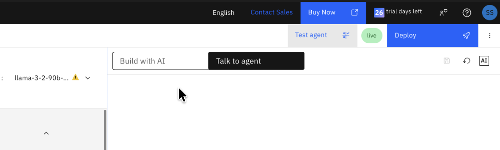

### Step 2: Review Your Test Cases

Review all the test cases you've created to ensure they cover diverse scenarios beyond the example spend policy query.

### Step 3: Run the Evaluation

Click **"Evaluate all"** to run your complete test suite. You can also select specific test cases for targeted evaluation.

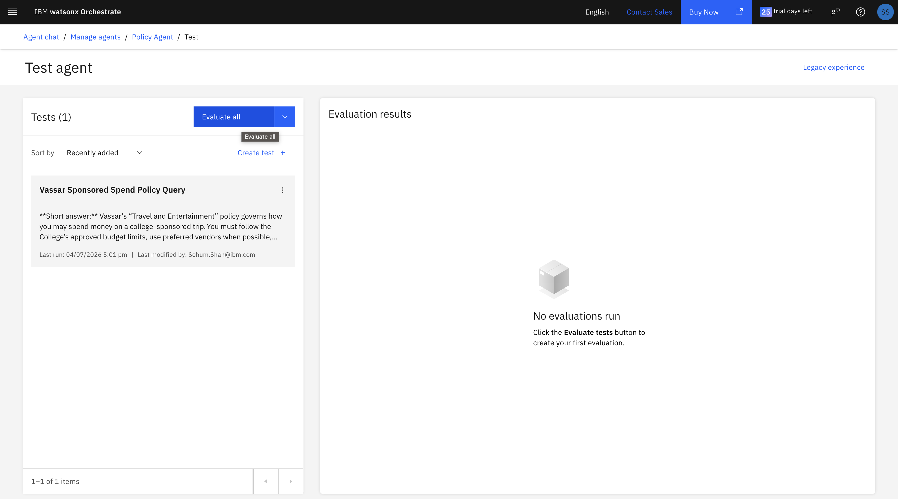

### Step 4: Monitor Progress

The evaluation will process each test case. You'll see an **"In progress"** status while the system runs through your test suite.

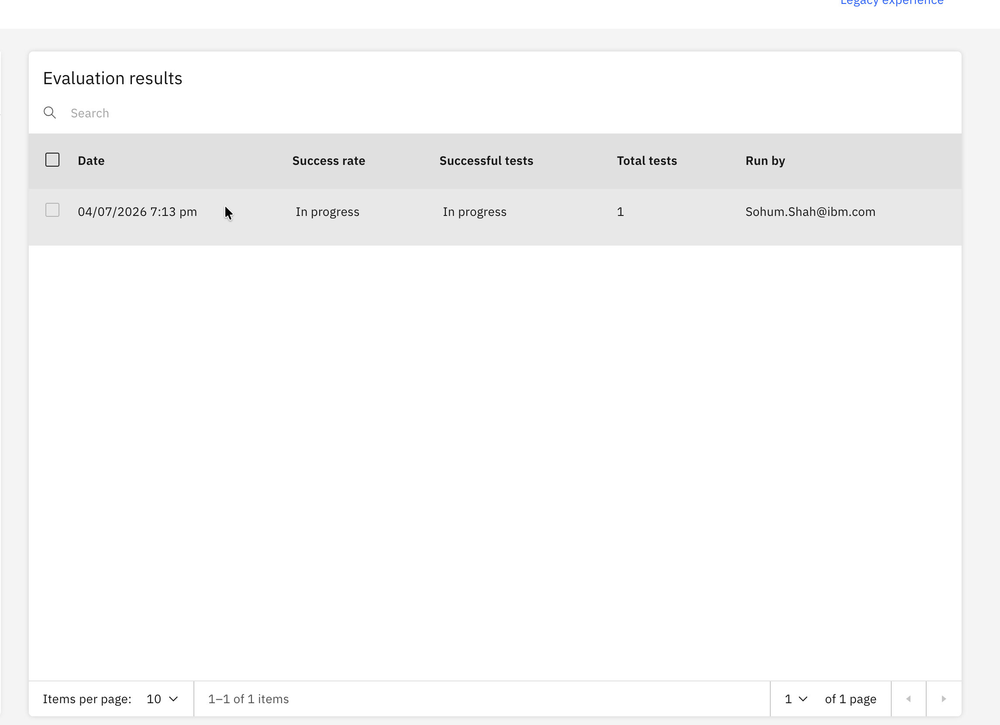

### Step 5: Review Detailed Results

Once complete, click on the results link to see detailed analysis across multiple metrics.

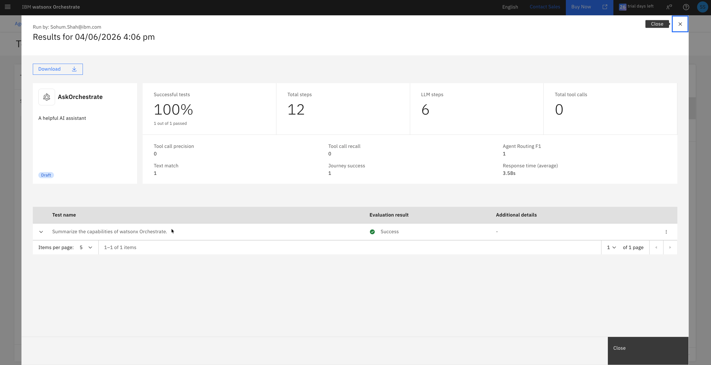

---

## Understanding Evaluation Metrics

The analysis pane provides comprehensive metrics to help you understand your agent's performance. Here's what each metric means and how to interpret it.

### ⭐ Primary Metrics (Most Important)

These three metrics are the most critical indicators of your agent's quality and should be your primary focus:

#### 1. Success Rate ⭐

**What it measures**: The percentage of test cases where your agent provided an acceptable response.

**Why it matters**: This is your overall reliability score. A high success rate means students can trust your agent to help them consistently.

**Target**: >95% for production deployment

**How to improve**:
- Review failed test cases to identify patterns
- Update your knowledge base with missing information
- Refine agent instructions for clarity
- Add or improve tools for specific capabilities

**Example**: If your success rate is 85%, it means 15% of student queries might receive inadequate responses—too high for deployment.

---

#### 2. Answer Relevance ⭐

**What it measures**: How well the agent's response addresses the student's actual question (scale: 0.0 to 1.0).

**Why it matters**: Students need answers that directly address their questions, not tangential or off-topic information.

**Target**: >0.85 (85%)

**How to improve**:
- Clarify agent instructions about staying on topic
- Improve routing logic in multi-agent systems
- Ensure knowledge base content is well-organized
- Add examples of good responses to agent instructions

**Example**: A score of 0.6 might indicate your agent is retrieving related but not directly relevant information from the knowledge base.

---

#### 3. Faithfulness ⭐

**What it measures**: How accurately the response reflects the source documents in your knowledge base (scale: 0.0 to 1.0).

**Why it matters**: For policy questions and institutional information, accuracy is critical. High faithfulness means your agent isn't hallucinating or making up information.

**Target**: >0.90 (90%)

**How to improve**:
- Ensure knowledge base documents are accurate and current
- Configure agent to cite sources explicitly
- Use RAG (Retrieval-Augmented Generation) for all factual queries
- Remove or update outdated documents

**Example**: A faithfulness score of 0.95 means the agent is staying true to official policy documents—essential for trustworthy guidance.

---

### Secondary Metrics

These metrics provide additional insights into specific aspects of your agent's behavior:

#### 4. Tool Call Precision

**What it measures**: The percentage of tool calls that were actually necessary for answering the question.

**Why it matters**: Efficient tool usage improves response time and reduces unnecessary API calls.

**How to improve**: Refine tool descriptions so the agent knows exactly when to use each tool.

---

#### 5. Tool Call Recall

**What it measures**: The percentage of necessary tools that were actually called.

**Why it matters**: Missing tool calls means incomplete answers (e.g., providing policy info without the resource link).

**How to improve**: Ensure all relevant tools are discoverable and have clear descriptions.

---

#### 6. Agent Routing F1 Score

**What it measures**: The balance between precision and recall when routing queries to specialized agents (Policy, Resources, General Knowledge).

**Why it matters**: Accurate routing ensures students get expert responses from the right agent.

**How to improve**: 
- Refine agent descriptions to clarify their specializations
- Improve orchestrator instructions with routing examples
- Test edge cases where routing might be ambiguous

---

#### 7. Text Match

**What it measures**: Similarity between the actual response and your expected output.

**Why it matters**: Helps verify consistency, but note that paraphrasing is acceptable—low scores don't always indicate problems.

**Interpretation**: Use this as a guide, not an absolute requirement. Focus more on Answer Relevance and Faithfulness.

---

#### 8. Journey Success

**What it measures**: Whether the complete interaction flow succeeded from start to finish.

**Why it matters**: Ensures multi-step processes (like finding a policy AND providing a resource link) complete successfully.

---

#### 9. Response Time

**What it measures**: How long the agent takes to generate a response (in seconds).

**Why it matters**: Students expect quick answers. Long response times hurt user experience.

**Target**: <5 seconds for most queries

**How to improve**:
- Optimize knowledge base size and structure
- Use efficient tools and APIs
- Consider caching for frequently asked questions

---

#### 10. Number of Steps

**What it measures**: How many reasoning steps the agent took to answer the question.

**Why it matters**: Provides insight into reasoning complexity. More steps isn't necessarily better or worse—it depends on the question.

**Interpretation**: Simple questions should require fewer steps; complex multi-part questions naturally require more.

---

## Features to Improve Agent Performance

Based on your evaluation results, here are actionable strategies to enhance your Student Concierge agent:

### 1. Knowledge Base Optimization

**When to use**: Low Faithfulness or Answer Relevance scores

**Actions**:
- Add missing policy documents to your RAG system
- Update outdated information (deadlines, procedures, contact info)
- Improve document structure with clear headings and sections
- Add metadata tags for better retrieval
- Remove duplicate or conflicting information

**Example**: If students ask about grade appeals but your agent provides vague answers, add the official Grade Appeal Policy document to your knowledge base.

---

### 2. Agent Instructions Refinement

**When to use**: Inconsistent responses or low Success Rate

**Actions**:
- Clarify behavior guidelines (tone, style, length)
- Add examples of excellent responses
- Specify when to cite sources
- Define how to handle edge cases
- Include instructions for multi-step queries

**Example**: Add instruction: "Always cite the specific policy document when answering policy questions. Format: 'According to the [Policy Name]...'"

---

### 3. Tool Configuration

**When to use**: Low Tool Call Precision or Recall

**Actions**:
- Add new tools for missing capabilities (e.g., calendar integration, form submission)
- Refine tool descriptions to clarify when each should be used
- Optimize tool parameters for better results
- Test tool combinations for complex queries
- Remove redundant or unused tools

**Example**: If students frequently ask about service status, add a CIS Status Checker tool with clear description: "Use this tool to check the current status of Vassar IT services."

---

### 4. Multi-Agent Routing

**When to use**: Low Agent Routing F1 Score

**Actions**:
- Improve agent descriptions to clarify specializations
- Add routing examples to orchestrator instructions
- Define clear boundaries between agents (Policy vs. Resources vs. General Knowledge)
- Test ambiguous queries that could go to multiple agents
- Create fallback logic for unclear routing

**Example**: Update Policy Agent description: "Specializes in interpreting Vassar College policies including academic integrity, grade appeals, course registration, and student conduct. Use for any questions about rules, regulations, or official guidelines."

---

### 5. Validation Criteria Enhancement

**When to use**: Need more rigorous testing

**Actions**:
- Define specific success criteria for each test case
- Add keyword checks for critical terms
- Specify required tool calls for each scenario
- Set context requirements (e.g., "Must include current semester dates")
- Create both positive and negative test cases

**Example**: For "VPN Access" test case, require keywords: ["VPN", "link", "https://"], required tool: "Redirect Glossary Tool"

---

### 6. Iterative Testing Workflow

**When to use**: Continuous improvement process

**Actions**:
- Run targeted evaluations after each change (not full suite every time)
- Compare metrics before and after improvements
- Document what worked and what didn't
- Build your test suite incrementally based on real student questions
- Create test cases from any issues discovered in production

**Example Workflow**:
1. Update knowledge base with new policy document
2. Run evaluation on policy-related test cases only
3. Check if Faithfulness score improved
4. If yes, deploy; if no, investigate and iterate

---

## Best Practices for Agent Evaluation

✅ **Start with diverse test cases**: Include happy path scenarios, edge cases, and potential failure modes

✅ **Include negative examples**: Test how your agent handles inappropriate requests or out-of-scope questions

✅ **Test after significant changes**: Run evaluations whenever you update knowledge bases, tools, or agent instructions

✅ **Use real student questions**: Build test cases from actual queries students might ask

✅ **Focus on the top 3 metrics**: Success Rate, Answer Relevance, and Faithfulness are your primary indicators

✅ **Document failures**: When test cases fail, note why and what needs to be fixed

✅ **Iterate based on data**: Let metrics guide your improvements rather than guessing

✅ **Balance coverage and efficiency**: You don't need 100 test cases—focus on quality and diversity

✅ **Test multi-agent scenarios**: Ensure your orchestrator routes queries correctly to specialized agents

✅ **Consider context**: Some low scores might be acceptable depending on the question complexity

---

## Next Steps

Congratulations! You now understand how to evaluate your Student Concierge agent systematically. Here's what to do next:

### Continue Learning

- **[Agent Monitoring Guide](./agent-monitoring.md)**: Learn how to monitor your agent's performance after deployment with real student interactions
- **[Agentic Flow Inspector](./agentic-flow-inspector.md)**: Debug complex agent behaviors and understand reasoning chains in detail

### Keep Improving

- Build your test suite incrementally as you discover new scenarios
- Run evaluations regularly, especially after updates
- Use evaluation insights to prioritize improvements
- Share successful test cases with your team
- Document lessons learned for future reference

### Deploy with Confidence

Once your evaluation metrics meet your targets (Success Rate >95%, Answer Relevance >0.85, Faithfulness >0.90), you're ready to deploy your Student Concierge agent and help Vassar College students navigate institutional information with confidence!

---

> **💡 Remember**: Evaluation is not a one-time activity. Continuous testing and improvement ensure your agent remains accurate, helpful, and trustworthy as policies change and new student needs emerge.
