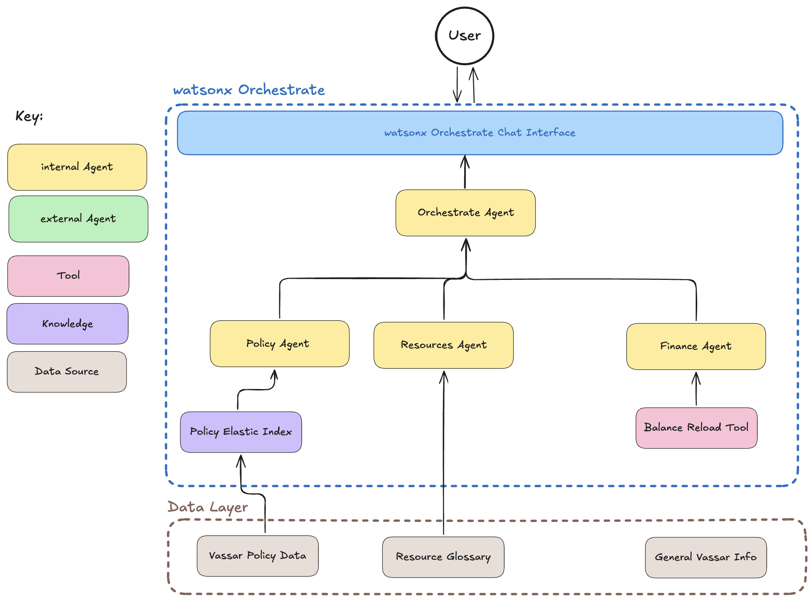

# 🎓 Student Assistant 

## Table of Contents

**Introduction**
- [💡 Use case description](#-use-case-description)

**Part I: Building Specialized Agents**

**Part II: Governance**

## 💡 Use Case Description

**Sarah** is a sophomore college student who needs help navigating various aspects of campus life. Like many students, she faces several challenges:

1. **Understanding Policies** - Sarah needs to understand the academic integrity policy for a group project, but the official policy document uses complex legal language
2. **Accessing Resources** - She wants to access all that Vassar has to offer but currently feels unable to locate resources
3. **Getting General Information** - Sarah has questions about campus services, deadlines, and procedures but doesn't know who to ask

Currently, Sarah must:
- Search through multiple websites and policy documents
- Email different administrative offices and wait for responses
- Navigate complex institutional language without guidance
- Remember or bookmark numerous platform URLs
- Wait for office hours to get answers to simple questions

This process is time-consuming, frustrating, and often leads to confusion or missed opportunities.

**The Solution: Student Assistant**

The Student Assistant is an AI-powered agent that aims to provide:
- **Instant policy clarification** in student-friendly language
- **Direct links** to campus resources and platforms
- **24/7 availability** for common questions
- **Accurate information** grounded in official institutional sources
- **Transparent reasoning** showing how answers were derived

> **💡 Trust Checkpoint**: Throughout the lab, you'll see callout boxes like this one highlighting how specific design choices support the concepts of trustworthy AI.

## Architecture Overview

Our Student Assistant uses a **multi-agent architecture** where specialized agents handle different types of queries:

**How it works:**

1. **Student** asks a question through the chat interface
2. **Orchestrate Agent** (router) analyzes the query and determines which specialized agent should handle it
3. **Specialized Agents** processe the query using and provide answers utilizing connected knowledge sources and tools
4. **Response** is returned to the student with transparent reasoning about how the answer was derived

This architecture ensures:
- **Specialization** - Each agent is expert in its domain
- **Scalability** - New agents can be added without disrupting existing ones
- **Maintainability** - Knowledge sources can be updated independently
- **Reliability** - If one agent fails, others continue to function

# Part I: Building a Multi-Agent System

In this section, you will create three specialized agents that form the foundation of the Student Assistant system as well as an orchestrator agent that provides a unified access point for our system. Each agent is designed to handle specific types of student queries with expertise in its domain.

**Please *[click here](./hands-on-lab-part-I.md)* to proceed to the instructions for Part I**

# Part II: Governance

In this section, you will dive deeper into testing the agentic system created in Part I and learn how to apply various governance techniques to ensure trustworthy agent performance.

**Please *[click here](./hands-on-lab-part-II.md)* to proceed to the instructions for Part II**

# Part III: Explore

In this section, you will utilize the learnings from Part I and Part II to build new agents and edit exisiting ones. This section is less structured and encourages creative exploration.

---