# Part I: Building a Multi-Agent System

In this section, you will create three specialized agents that form the foundation of the Student Assistant system as well as an orchestrator agent that provides a unified access point for our system. Each agent is designed to handle specific types of student queries with expertise in its domain.

## Table of Contents
- [📚 Policy Agent](#-policy-agent)
- [🔗 Resources Agent](#-resources-agent)
- [📋 Finance Agent](#-finance-agent)
- [🎯 Student Assistant Agent (Orchestrator)](#-student-assistant-agent-orchestrator)

---

## 📚 Policy Agent

The Policy Agent specializes in interpreting and explaining institutional policies. It translates complex policy language into student-friendly explanations and provides accurate information about academic policies, student conduct guidelines, and administrative procedures.

### Step 1: Create the Policy Agent

1. Open watsonx Orchestrate. You will see the main screen. Click on **Create an Agent** at the bottom left:

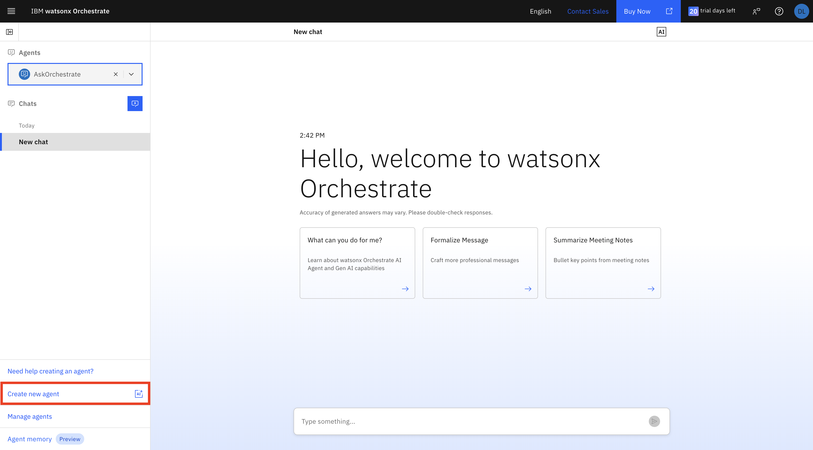

2. Select **Create from scratch**, then enter the following information:

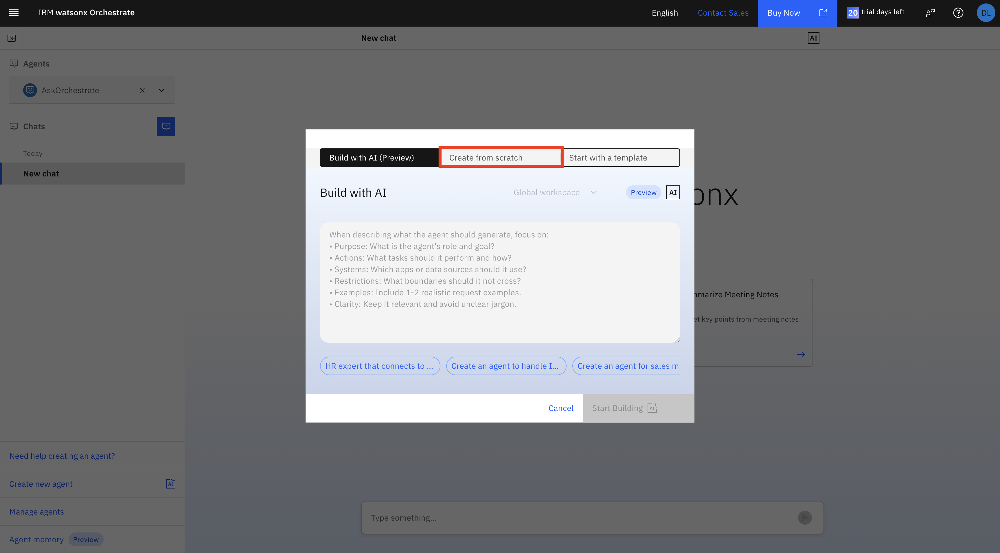

**Name:**
```
Policy Agent
```

**Description:**
```
The Policy Agent specializes in interpreting and explaining Vassar College institutional policies. It translates complex policy language into clear, student-friendly explanations and provides accurate information about academic policies, student conduct guidelines, and administrative procedures. Use this agent for any questions about rules, regulations, policies, or official guidelines.
```

3. Click **Create**.

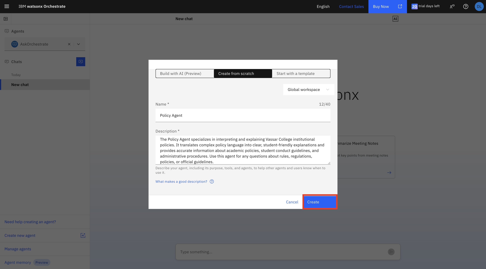

> **💡 Trust Checkpoint - Transparency**: The detailed description helps the orchestrator agent make transparent routing decisions. Students will be able to see why their query was sent to the Policy Agent.

### Step 2: Configure the Model

1. Select the **GPT-OSS 120B** model from the dropdown. This model provides strong reasoning capabilities for policy interpretation.


### Step 3: Add Knowledge Source

The Policy Agent needs access to institutional policy documents. We'll configure it to use a knowledge base containing Vassar policies.

1. Scroll down to the **Knowledge** section and click on **Add Source Knowledge**:

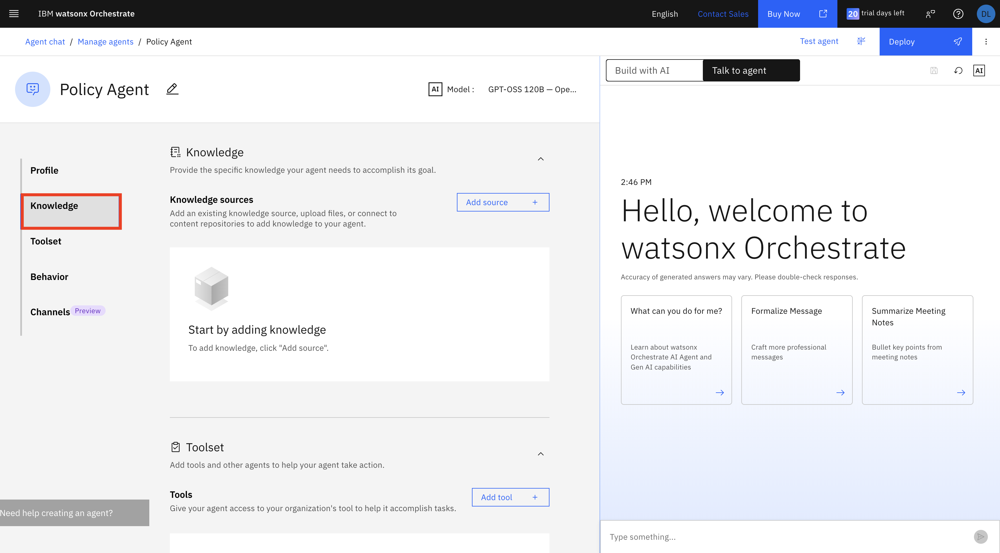

2. Select **New Knowledge** then select **Elasticsearch**:

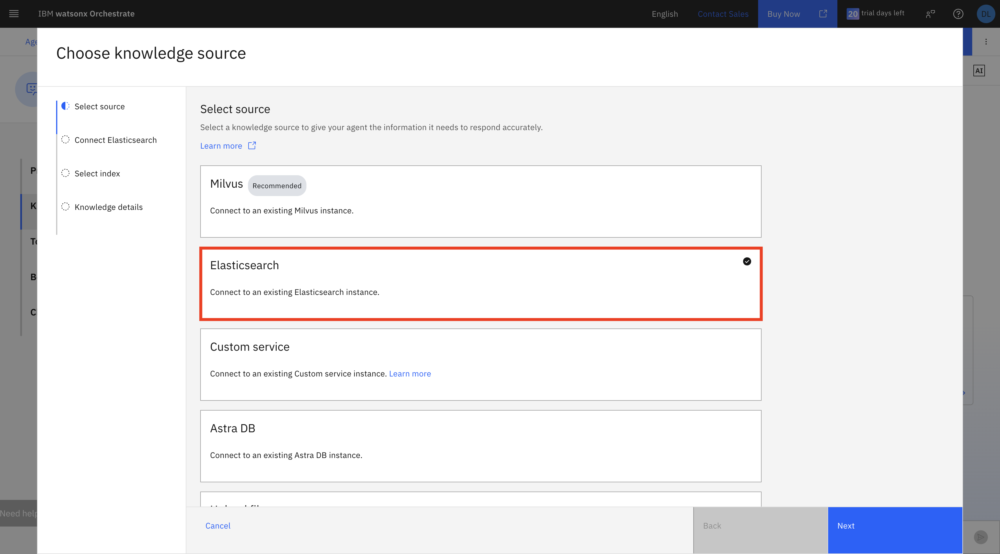

3. Click **Next**, enter the provided Elasticsearch connection info below, then click **Next** once more.

Elasticsearch url
```
https://6a67c1ae-6607-4c15-9fd7-0224a531ad7d.c5kmhkid0ujpmrucb800.databases.appdomain.cloud
```

Elasticsearch Port
```
30632
```

Username
```
ibm_cloud_7e81fbe3_631d_4716_a40d_bc5af0ed34dd
```

Password
```
j6pm54ZFe5l6pQZMsD3QAdqIUAIgVezd
```

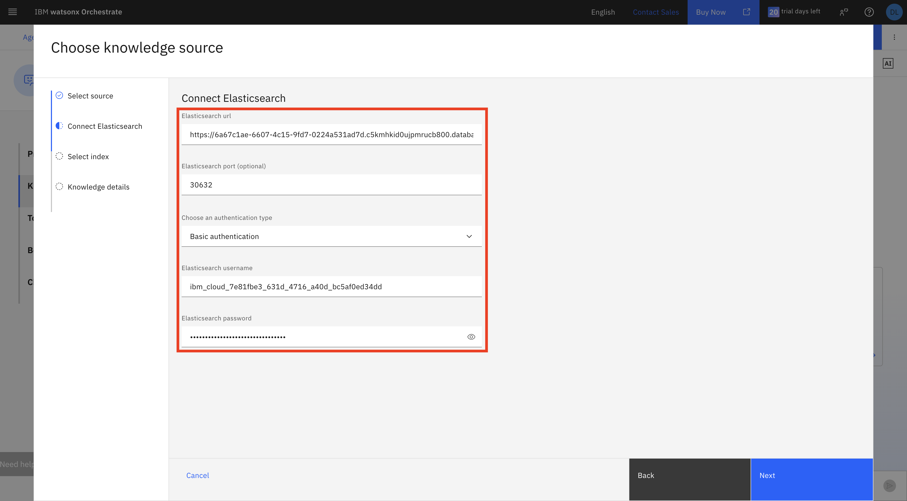

4. Define the **Elasticsearch index** and **field mappings** as :

Elasticsearch Index
```
search-vassar-policy-library
```

Title
```
title
```

Body
```
body_content
```

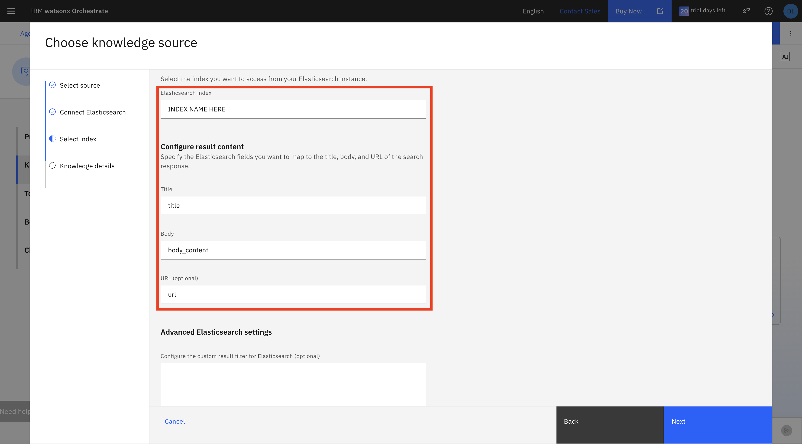

5. After uploading, provide a name and description for the knowledge base:

**Name:**
```
Vassar Policy Knowledge Base
```

**Description:**
```
This knowledge base contains official Vassar College policies including academic integrity, student conduct, grade appeals, course registration, and administrative procedures. Use this knowledge to answer questions about Vassar College policies. These may include institutional rules, regulations, and official guidelines.
```

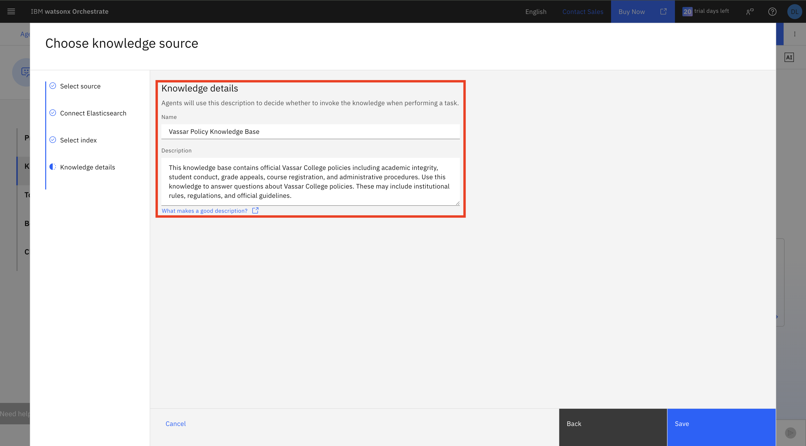

6. Click **Save**.

> **💡 Trust Checkpoint - Accuracy**: By grounding responses in official policy documents, we ensure the agent provides accurate, authoritative information rather than generating potentially incorrect answers.

### Step 4: Configure Agent Behavior

Now we'll define how the Policy Agent should behave when answering student queries.

1. In the **Behavior** field, enter the following:

```
Persona:
- You are a helpful policy advisor for Vassar College students
- Your purpose is to interpret and explain institutional policies in clear, accessible language
- You translate complex policy language into student-friendly explanations
- You are patient, supportive, and non-judgmental

Context:
- Always use the Vassar Policy Knowledge Base to answer questions
- Cite the specific policy document when providing information
- If a policy has exceptions or special cases, mention them
- If you're unsure or the policy isn't in your knowledge base, say so clearly

Response Guidelines:
- Start with a clear, direct answer to the student's question
- Provide the relevant policy excerpt or summary
- Explain what it means in practical terms for the student
- Include any important deadlines, procedures, or next steps
- Cite the source policy document
- If appropriate, suggest who the student should contact for specific cases

Trust Principles:
- Be transparent about the source of your information
- Acknowledge limitations in your knowledge
- Don't make judgments about student situations
- Encourage students to consult with advisors for complex cases
- Maintain student privacy - don't ask for personal details
```

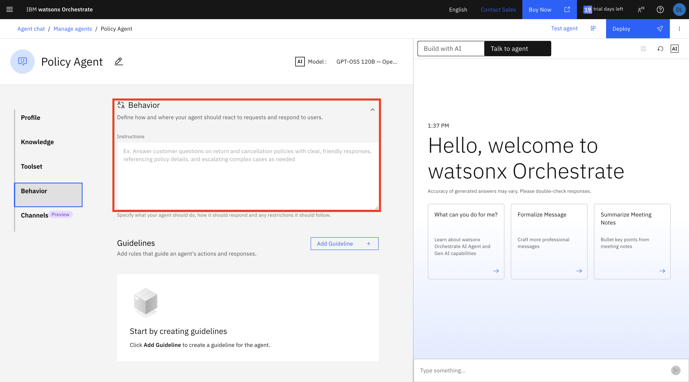

> **💡 Trust Checkpoint - Explainability**: These instructions ensure the agent provides transparent reasoning and cites sources, making it clear how conclusions were reached.

### Step 5: Configure Agent Visibility

1. Scroll to the bottom of the page and **uncheck** the **Home page** checkbox. This ensures the Policy Agent is only accessible through the main Student Assistant orchestrator, not directly from the home screen.

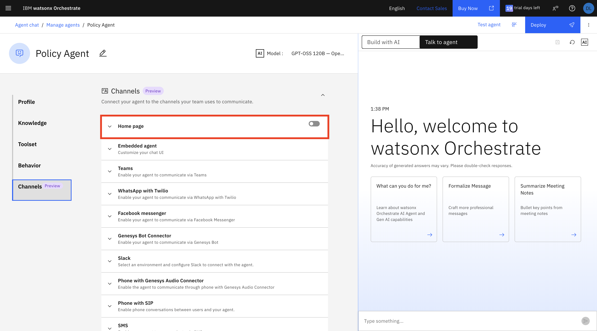

### Step 6: Test the Policy Agent

Before deploying, let's test the agent to ensure it's working correctly.

1. In the **Preview** window on the right, try these test queries:

**Test Query 1:**
```
What is Vassar's academic integrity policy?
```

Expected behavior: The agent should provide a clear explanation of the policy, cite the source document, and explain what it means for students.

**Test Query 2:**
```
Does attending a Vassar event mean I automatically consent to being filmed?
```

Expected behavior: The agent should provide a clear explanation as to whether or not organizers are required to obtain your consent for filming or photography of a campus event.


**Test Query 3:**
```
How do I register my bicycle?
```

Expected behavior: The agent should list out the steps necessary to register a bicycle on Vassar's campus.


**Test Query 4:**
```
What protections do I have when I file a discriminaition or harassment complaint?
```

Expected behavior: The agent should provide a summary of the protections and safeguards present for anyone who files a complaint against discrimination or harassment.

> **💡 Trust Checkpoint - Robustness**: Testing various query types ensures the agent handles different scenarios appropriately and provides consistent, helpful responses.

### Step 7: Deploy the Policy Agent

1. Once you're satisfied with the test results, click the **Deploy** button in the top right corner. On the deployment summary screen, review the configuration and click **Deploy**:

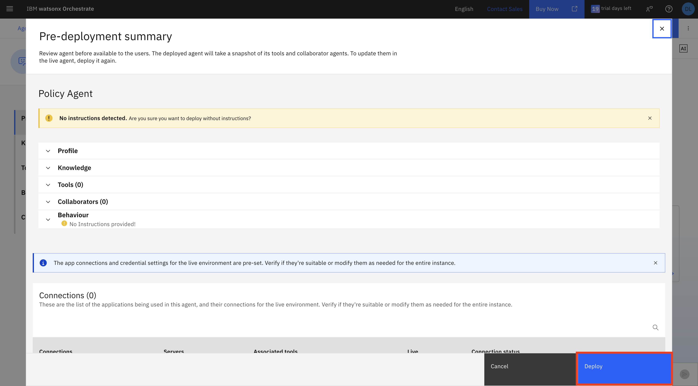

2. **Activate agent monitoring** when prompted. This enables tracking of agent performance and quality metrics:

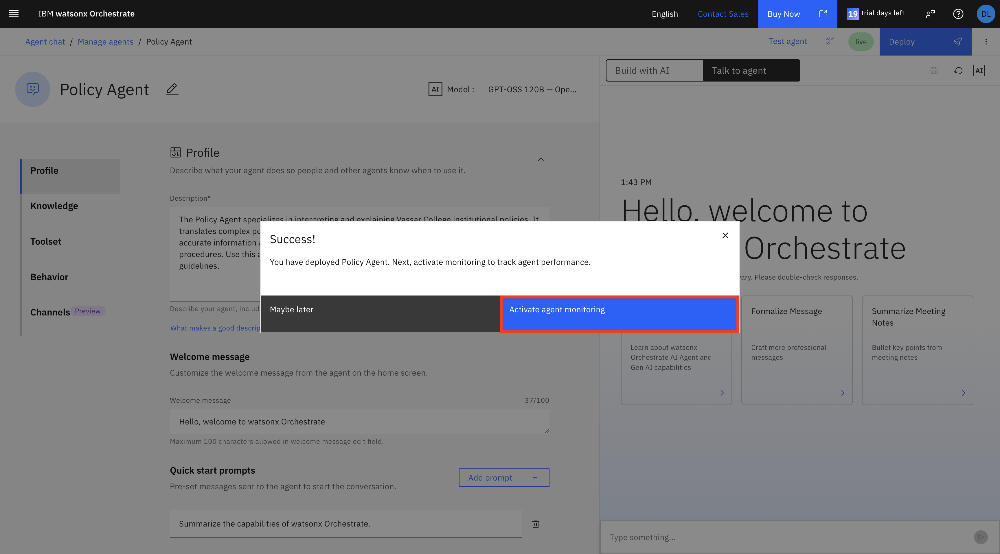

4. Wait for the deployment to complete. You should see a green "Live" indicator next to the Deploy button. Once you see the Live indicator, return to the **Manage agents** page by clicking the link at the top left:

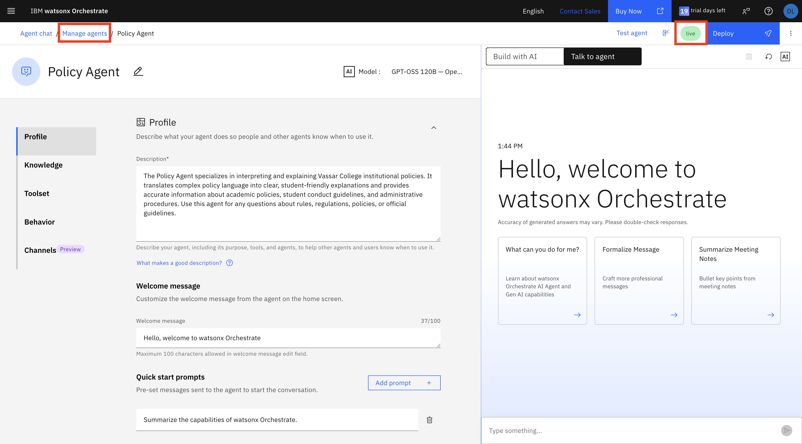

Congratulations! You've created and deployed the Policy Agent. ✅

---

## 🔗 Resources Agent

The Resources Agent helps students find and access campus platforms and services. It provides direct links to resources like VPN, JobX, CIS service status, and other campus systems.

### Step 1: Create the Resources Agent

1. From the **Manage agents** page, click **Create agent**:

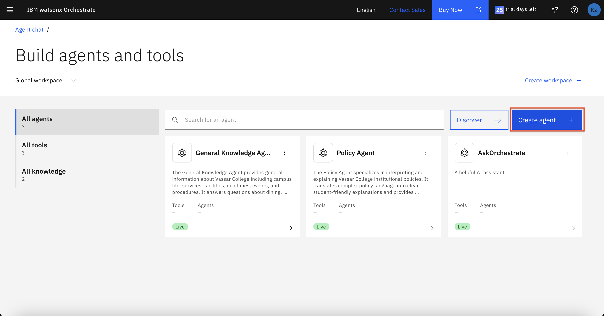

2. Select **Create from scratch** and enter the following fields. Then click **Create**:

**Name:**
```
Resources Agent
```

**Description:**
```
The Resources Agent helps students find and access Vassar College campus platforms and services. It acts as a referral agent and provides direct links, access instructions, and information about resources like VPN, JobX, CIS service status, library systems, and other campus platforms. Use this agent when students need to access or learn about campus technology resources and services that the General Knowledge Agent and Policy Agent are unable to directly help with.
```

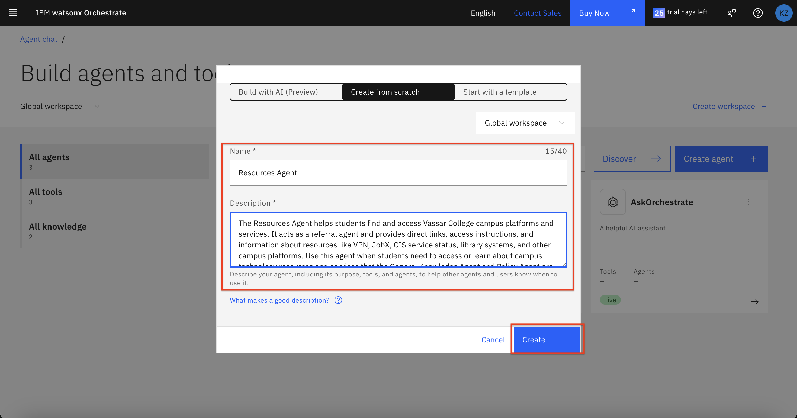


3. Select the **GPT-OSS 120B** model from the dropdown if it is not already selected.


### Step 2: Get Familiar with Adding Custom Tools

For this lab, we'll simulate the redirect tool by adding a Links Glossary directly to the agent's behavior instructions, but in a production environment, this would be a real API or database lookup. The following steps will get you familiar with how you *would* add custom tools to your agent.

1. Scroll down to the **Toolset** section and click **Add Tool**:

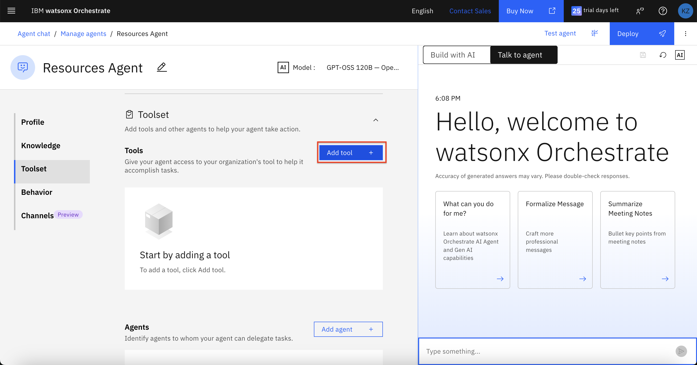

2. From this page, you have the option to create a new tool from scratch using the **Agentic workflow** feature, or add a tool from a catalog of existing tools, from a local instance of a tool, from an MCP server, or from an OpenAPI file.

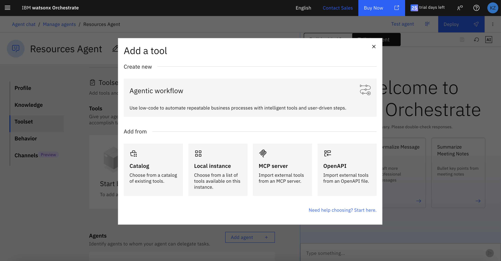

3. For this lab, we'll simulate the redirect tool by adding the information directly to the agent's behavior instructions. In a production environment, this would be a real API or database lookup.

Exit out of the tool creation page. 


### Step 3: Configure Agent Behavior

Now, we will update the agen'ts behavior instructions. As mentioned before, this is where we will provide the agent with a Links Glossary to instruct it how to redirect students when they ask a question related to any of the descriptions within the glossary. 

1. Scroll down to the **Behavior** section of the agent builder page. In the **Instructions** field, enter:

```
Use the following Links Glossary to redirect students when they ask a question related to any of the following descriptions. 

Vassar College Links Glossary
A comprehensive reference guide for Vassar College campus resources and services.

Student Employment
JobX Job Registration System
URL: http://www.vassar.edu/jobx
Description: Student employment portal for finding and applying to on-campus jobs and work-study positions. Students can browse available positions, submit applications, and manage their campus employment through this system.

IT Services & Support
CIS Service Status Page
URL: https://servicestatus.vassar.edu
Description: Real-time status dashboard for campus IT services, system outages, and maintenance schedules. Check here first when experiencing network problems or service disruptions.

Vassar VPN Setup
URL: https://go.vassar.edu/vpn
Access: Requires Vassar credentials (Can't Access off-campus without setup)
Description: VPN setup instructions and configuration guides for remote access to campus network resources. Required for accessing many campus services from off-campus locations.

Campus Services
Vassar Card Office
URL: https://card.vassar.edu
Access: Requires Vassar login (Can't Access without credentials)
Description: Manage your Vassar ID card, check meal plan balance, add VC Dollars, and manage dining dollars. Also used for reporting lost or stolen cards.

Academic & Research Resources
Vassar Innovation Lab
URL: https://pages.vassar.edu/innovationlab
Description: Maker space for creative projects, prototyping, 3D printing, and building. Open to students for hands-on learning and innovation projects.

Laybourne Visualization Laboratory (Sci Vis Lab)
URL: https://pages.vassar.edu/scivis
Description: Scientific visualization facility providing data visualization tools, high-performance computing resources, and research support for computational and data-intensive projects.

Techademia (Academic Computing Services Blog)
URL: https://pages.vassar.edu/techademia/
Description: Technology tips, tutorials, software guides, and tech news from Academic Computing Services. Helpful resource for learning about campus technology and software.

Fellowships & Funding
Putnam Fellowship
URL: http://pages.vassar.edu/putnamfellowship/
Description: Information about the Putnam Fellowship program, including application procedures, eligibility requirements, and fellowship opportunities for academic projects and research.

Policies & Procedures
Vassar College Policy Library
URL: https://www.vassar.edu/policy-library
Description: Official repository of college policies, procedures, rules, and regulations. Comprehensive resource for understanding campus policies across all areas of college life.
```

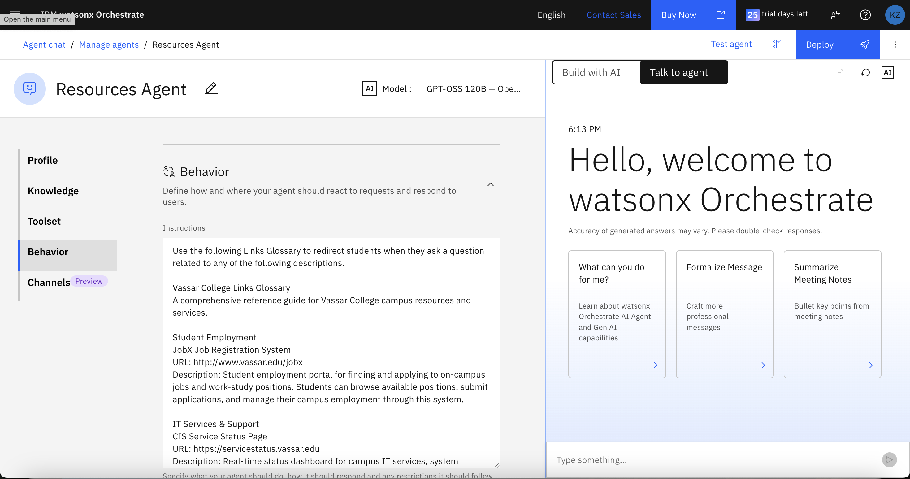


### Step 4: Configure Agent Visibility

1. **Uncheck** the **Home page** checkbox at the bottom of the page:

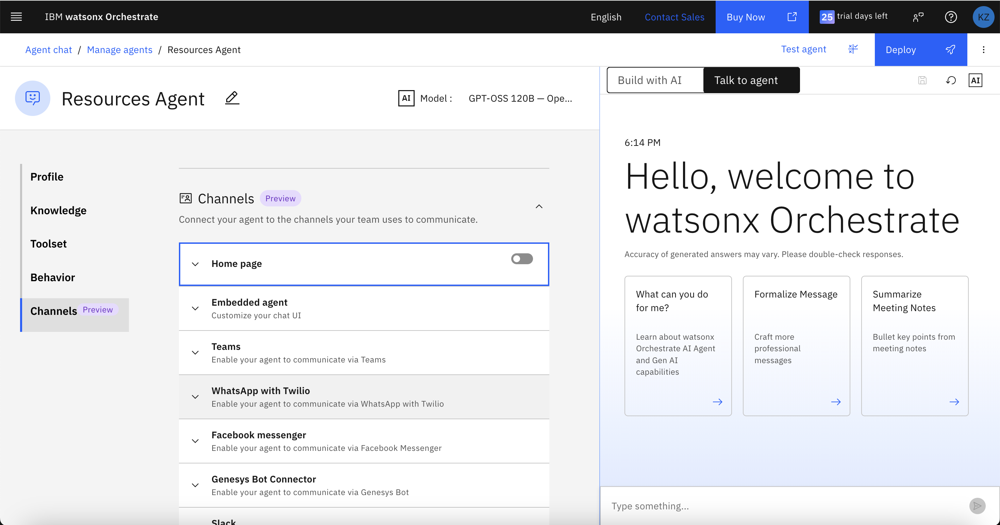

### Step 5: Test the Resources Agent

Test the agent with these queries:

**Test Query 1:**
```
How do I set up my VPN?
```

Expected behavior: Provides VPN URL, explains what it's for, and gives access instructions.

**Test Query 2:**
```
Where can I find on-campus jobs?
```

Expected behavior: Provides JobX portal URL and explains how to use it.

**Test Query 3:**
```
How do I check if campus IT services are working?
```

Expected behavior: Provides CIS service status URL and explains what information is available there.

### Step 6: Deploy the Resources Agent

1. Click **Deploy** in the top right corner:

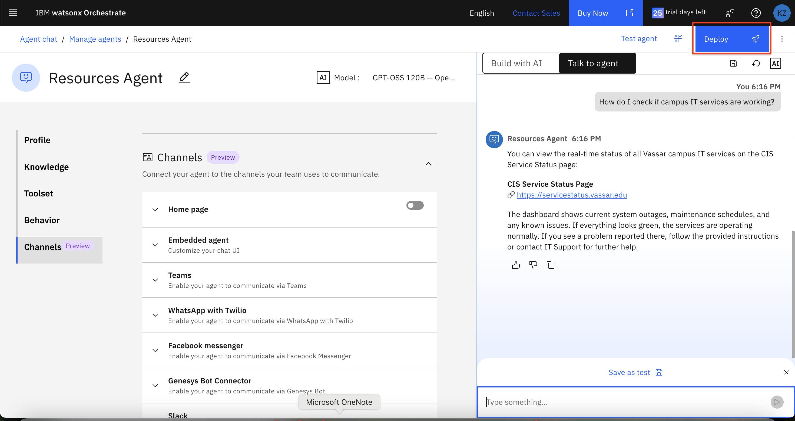

2. Review and click **Deploy** on the confirmation screen:


3. **Activate agent monitoring**:

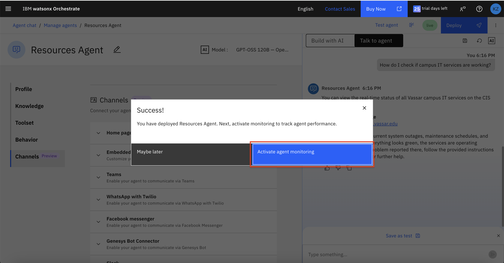

4. Wait for the "Live" indicator, then return to **Manage agents**:

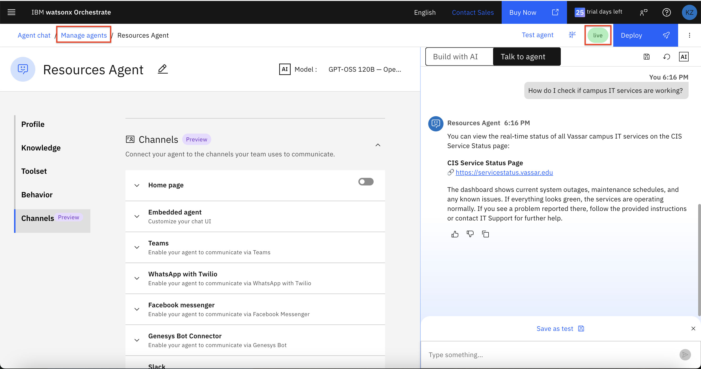

Excellent! The Resources Agent is now deployed. You should now see both your Policy and Resources agents listed in your **Manage agents** page, each with a green "Live" indicator.

---
## 📋 Finance Agent
This agent will help students check available balance on their vcard. There is nothing to do here at this time as we will be building this agent in Part II of the lab.

---

## 🎯 Student Assistant Agent (Orchestrator)

The Student Assistant Agent acts as the intelligent router for the entire system. It analyzes student queries and delegates them to the most appropriate specialized agent, ensuring students get accurate answers regardless of which agent handles their question.

### Step 1: Create the Student Assistant Agent

1. From the **Manage agents** page, once again click **Create agent**:

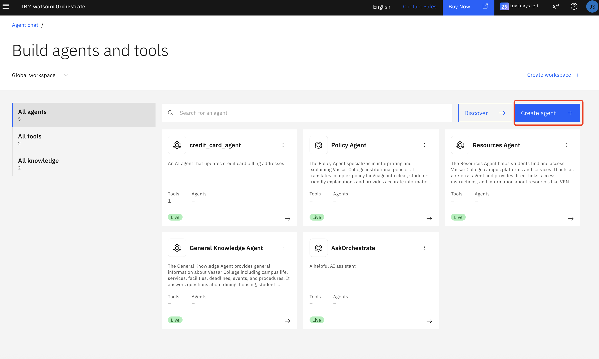

2. Select **Create from scratch** and enter:

**Name:**
```
Student Assistant
```

**Description:**
```
The Student Assistant is the main interface for students seeking help with Vassar College information. It intelligently routes questions to specialized agents: the Policy Agent for institutional policies, the Resources Agent for campus platform access, and the General Knowledge Agent for general institutional information. This agent ensures students receive accurate, helpful responses regardless of their question type.
```

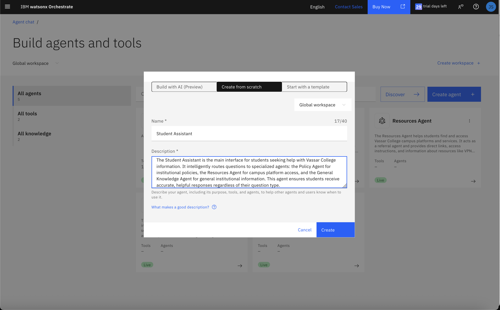

3. Click **Create**.


### Step 2: Add Collaborator Agents

Now we'll connect the three specialized agents you created in Part I as collaborators to the Student Assistant.

1. Scroll down to the **Toolset** section, then to the **Agents** subsection:

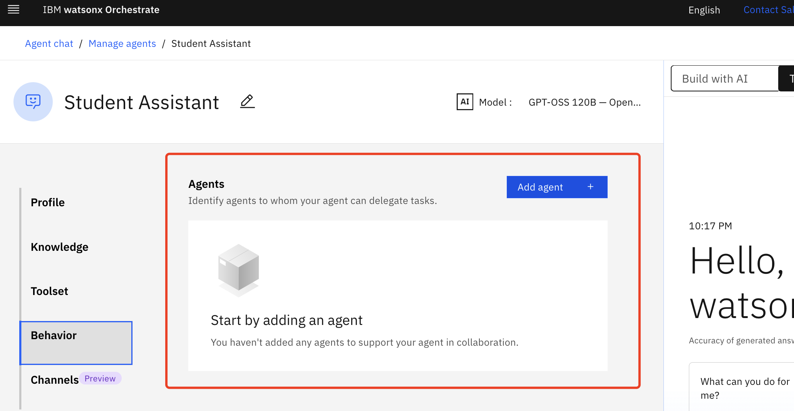

2. Click **Add agent**:

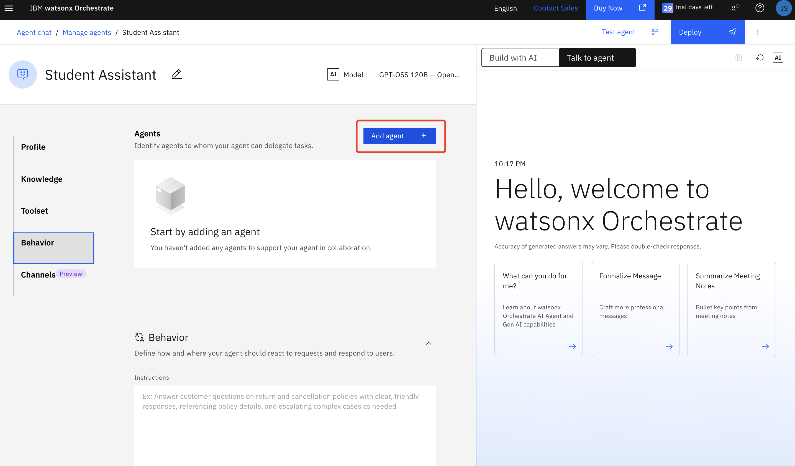

3. Select **Add from Local Instance** (since all agents are in the same watsonx Orchestrate instance):

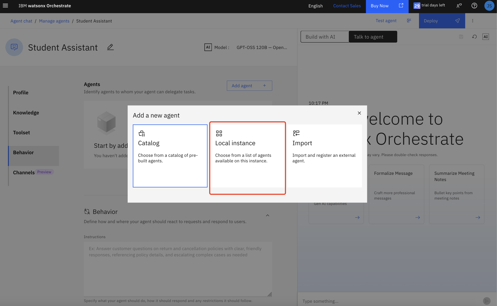

4. You should see all the agents you've created. Select all three specialized agents:
   - ☑️ Policy Agent
   - ☑️ Resources Agent
   - ☑️ Finance Agent

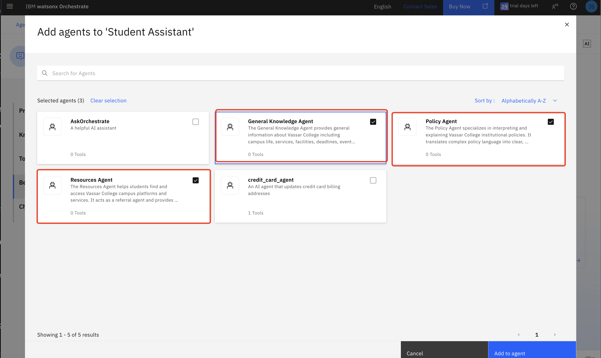

5. Click **Add to agent**.

You should now see all three agents listed in the Agents section:

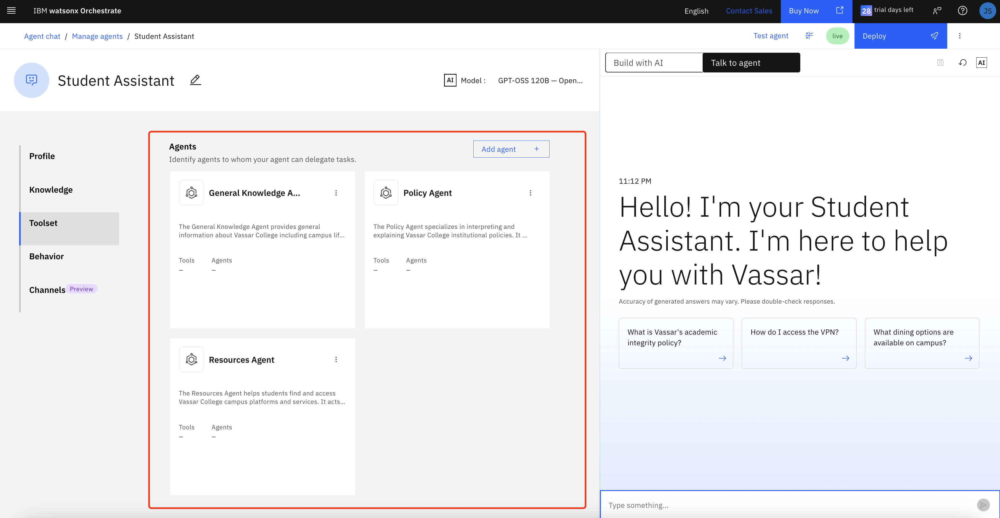

> **💡 Trust Checkpoint - Accountability**: By using specialized agents, we create clear accountability for different types of information, making it easier to audit and improve system performance.

### Step 4: Configure Agent Behavior


1. Because this agent will be the primary interaction point for our users it is a good idea to create some useful starter prompts and a friendly greeting message. To do this, update the **Welcome message** and **Quick start prompts**:

*Welcome Message*
```
Hello! I'm your Student Assistant, powered by watsonx Orchestrate. I'm here to help you with Vassar College policies, campus resources, and general information. Ask me anything!
```

*Starter Prompts*

```
What is Vassar's academic integrity policy?
```

```
How do I access the VPN?
```

```
What dining options are available on campus?
```

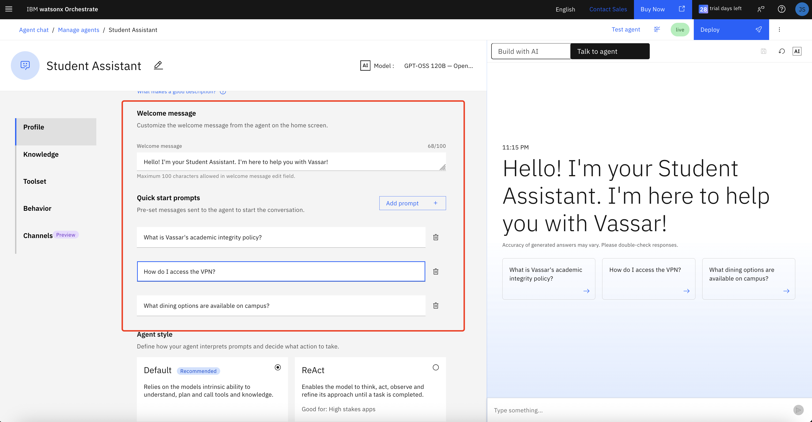


2. Now we'll define how the Student Assistant should route queries to the specialized agents. In the **Behavior** field, enter:

```
Routing Logic:
Use the following guidelines to route queries to the appropriate agent:

1. **Policy Agent** 
 Description: An agent designed to translate complex policy language into clear, student-friendly explanations and provide accurate information about academic policies, student conduct guidelines, and administrative procedures. 
 Route to this agent for: Questions about rules, regulations, policies, or official guidelines.

2. **Resources Agent** 
Description: An agent designed to help students find and access Vassar College campus platforms and services. It acts as a referral agent and provides direct links, access instructions, and information about resources like VPN, JobX, CIS service status, library systems, and other campus platforms. 
Route to this agent for: Inquiries about access to campus technology resources and services.


Response Guidelines:
- If a question could fit multiple categories, choose the most specific match
```

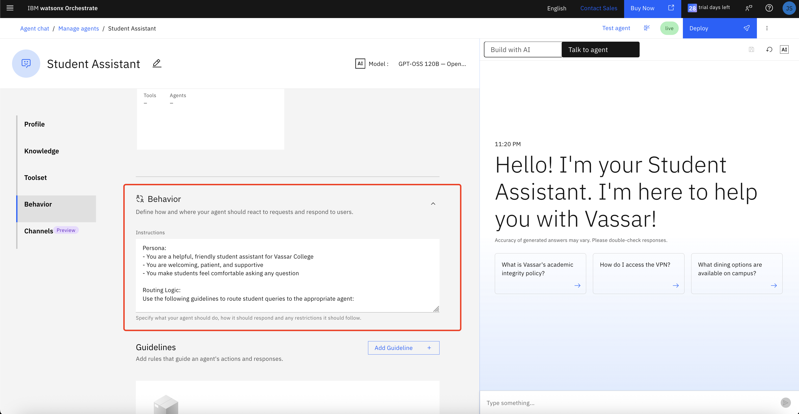

> **💡 Trust Checkpoint - Explainability**: Clear routing logic ensures consistent, predictable behavior that students can understand and trust.

### Step 5: Configure Agent Visibility

Unlike the specialized agents, we **DO** want the Student Assistant to be visible on the home page since this is the agent students will interact with directly.

1. Scroll to the bottom and **ensure the Home page checkbox is CHECKED**:

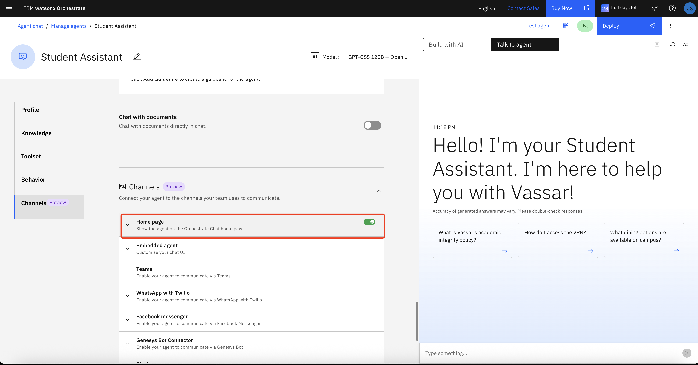

### Step 6: Deploy the Agent

1. Click **Deploy** in the top right corner:


2. Review and click **Deploy** on the confirmation screen:


3. **Activate agent monitoring**:


4. Wait for the "Live" indicator. This time we will navigate to the **Agent chat** once the deployment is complete.

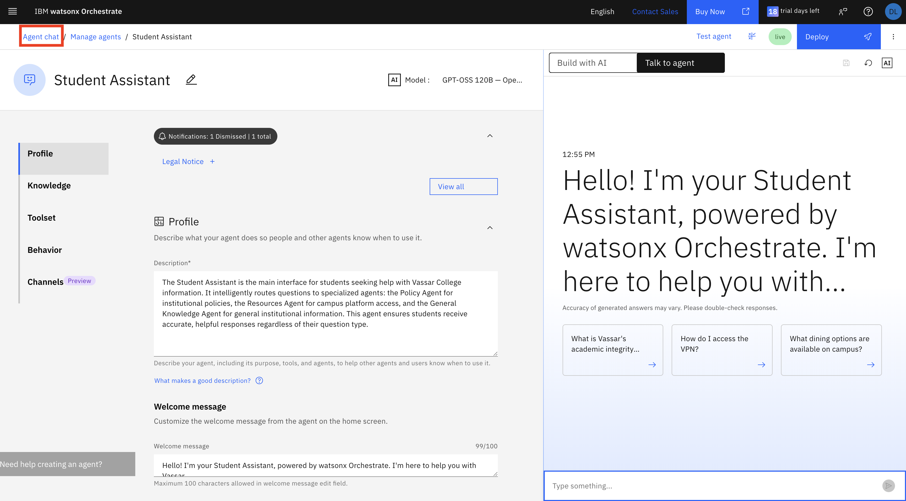

---

## Testing the Complete System

Now that all agents are deployed, let's test the complete Student Assistant system from the main chat interface.

**Access the Chat Interface**

If you've just completed creating the 'student assistant' then you should already be in the right place. The screen should look like the one below:

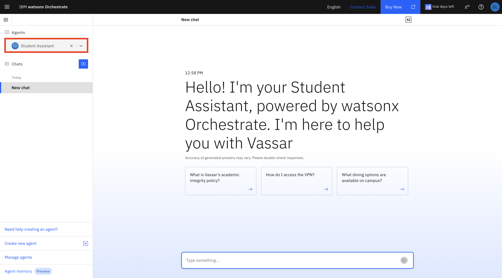

*Ensure the selected agent is the **Student Assistant** as shown in the screenshot.*

**Testing the Orchestrator Agent**

Try a variety of queries to test the complete system. These can be queries from previous sections or brand new queries. Here are some examples we previously tried that can be used to test our Orchestrator's routing:

```
What is the academic integrity policy?
```

```
How do I check if campus IT services are working?
```

```
Where can I find information about campus jobs?
```

**Understanding Agent Reasoning**

One of the most powerful features of the Student Assistant is the ability to see how it makes decisions. This transparency is crucial for trust and continuous improvement and helps us understand, at a glance, if our agent is functioning as expected.

**Viewing Reasoning in Chat**

1. After the Student Assistant responds to a query, look for the **Show reasoning** dropdown and click to expand:

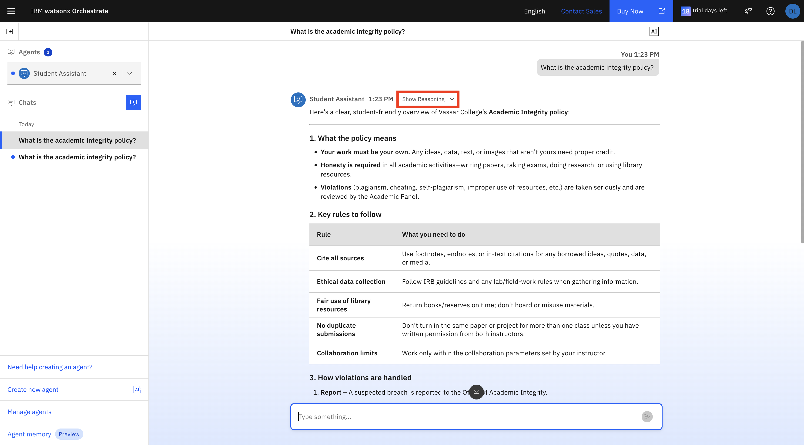

2. Expand each step to see the actions taken by the agent that led to the final answer recieved by the user.

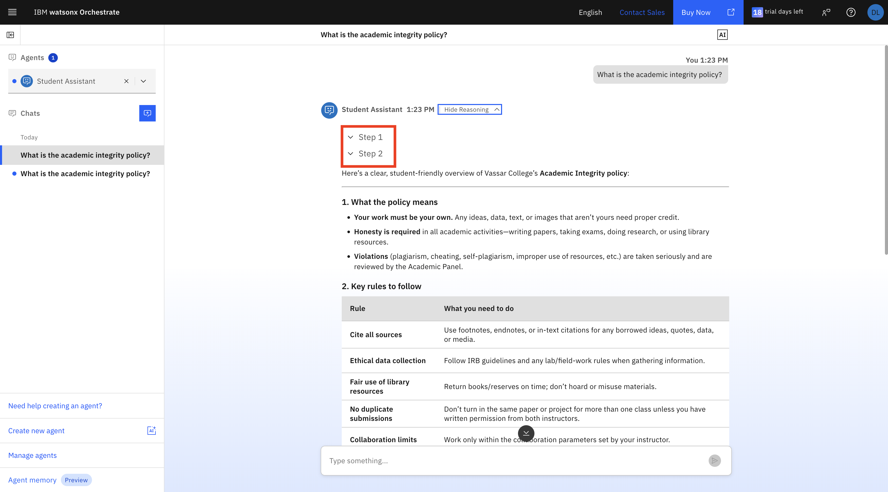

*Be sure to note what collaborators were invoked, what tools were used, and what knowledge was fetched.*

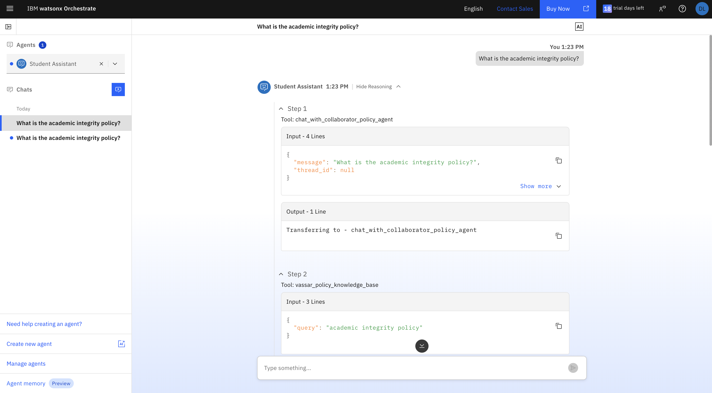

**Testing Edge Cases**

Try queries that might be challenging for the system and note the responses. Be sure to look at the reasoning to see how our agent attempts to address these questions.

**Ambiguous Queries:**
```
I need help with registration
```
(Could mean course registration process, registration policies, or registration system access)

**Out of Scope Queries:**
```
What's the weather going to be like tomorrow?
```
(Should gracefully decline and redirect to appropriate resources)


> **💡 Trust Checkpoint - Robustness**: The system should handle edge cases gracefully, acknowledging limitations and providing helpful alternatives.

---

## Summary of Part I

Congratulations! You have successfully created and deployed three agents:

1. **✅ Policy Agent** - Interprets and explains institutional policies
2. **✅ Resources Agent** - Provides access to campus platforms and services
3. **✅ Orchestrator Agent** - Provides a centralized interaction point to multiple specialized sub agents


**Please *[click here](./hands-on-lab-part-II.md)* to proceed to Part II - Building the Orchestrator.**

Alternatively, you can return to the [Lab Overview](./hands-on-lab-overview.md) to review the overall structure.