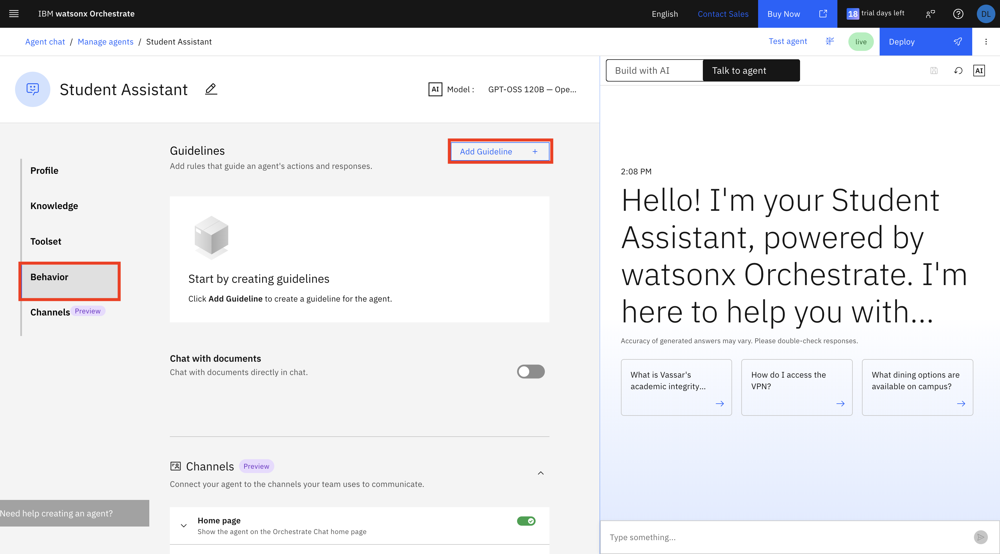
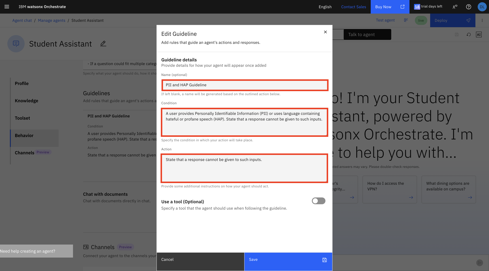

# Part II: Governing Agents

In this section, you will dive deeper into testing the agentic system created in Part I and learn how to apply various governance techniques to ensure trustworthy agent performance.

## Table of Contents
- [Monitoring](#monitoring)
- [Evaluations](#evaluations)
- [LLM-as-a-Judge](#llm-as-a-judge)
- [Sensitive Information Masking](#sensitive-information-masking)

---

## Monitoring

Description

### Implementation

[Agent Monitoring Instructions](./agent-monitoring.md)

---

## Evaluations

Agent evaluation through test cases is a key practice for building **responsible and ethical AI systems**. In the watsonx Orchestrate UI, evaluating agents with recorded and generated use cases helps ensure agents behave as intended across real‑world scenarios, including edge cases that may surface bias, unsafe outputs, or unintended actions. This approach enables early detection of risks related to reliability, fairness, and transparency, while providing measurable evidence of agent behavior over time. By grounding agent development in repeatable evaluations, teams can promote accountable AI adoption, reduce potential harm, and confidently deploy agents that align with organizational and ethical standards.


### Implementation: 

[Agent Evaluation Instructions](./agent_evaluation.md)

---

## LLM-as-a-Judge

**What is it?**
LLM-as-a-Judge is a technique where a language model is used to evaluate and score the outputs of another LLM or autonomous agent. Rather than relying solely on human review or rigid rule-based checks, a "judge" model assesses responses against defined criteria — such as accuracy, relevance, tone, safety, or adherence to instructions — and returns a structured verdict (e.g., a score, pass/fail, or reasoning).  <br>

In agentic pipelines, this approach is especially valuable: as agents take multi-step actions or generate complex outputs, the judge model acts as a quality gate, catching hallucinations, policy violations, or off-task behavior before results reach end users or trigger downstream actions.  <br> 

The key advantages of this technique are scalability and flexibility. Similar to the advantages of LLM's in general, you can encode nuanced, context-aware criteria in natural language rather than brittle code. The tradeoff is the risk that the judge model can share the same blind spots as the model being evaluated, so it's typically paired with other governance approaches such as human-in-the-loop review. Nevertheless, this approach is a key piece of a well structured governance system.

### Implementation
For our example we will add a guideline to the `student assistant agent` so first navigate to the agent builder and select this agent.

1. In the platform we are working with LLM-as-a-judge is implemented through what we call "Guidelines". Scroll down to the behavior section to see where we can create one. Once here click **Add Guideline**:



2. For our example we will define a guideline that aims to curb the input of any PII (Personally Identifiable Information) or HAP (Hate Abuse Profanity). To do this enter the following Name, Condition, and Action:

*Name*
```
PII and HAP Guideline
```

*Condition*
```
A user provides Personally Identifiable Information (PII) or uses language containing hateful or profane speech (HAP). State that a response cannot be given to such inputs.
```

*Action*
```
State that a response cannot be given to such inputs.
```



3. Test the created guideline. Try entering inputs you imagine might trigger such a guardrail. Some examples are listed below:

*PII Example*
```
I want to change my credit card on file to an Amex with the card number 1234 567891 23456
```
*You should see this input refused*

---

## Sensitive Information Masking

In this section, you will build a **Financial Helper Agent** for Vassar College students. The agent helps students check their VCard balance and provides information about reloading Arlington Bucks (campus currency) through the secure VCash portal. The agent is designed to handle sensitive financial information and must ensure that all personal and financial data is securely managed and masked appropriately. To implement the PII or sensitive information masking, checkout the lab below:

### Implementation: 

[Financial Helper Agent Lab with PII Masking](./sensitivie-information-masking-lab.md)

---

**Return to [Lab Overview](./hands-on-lab-overview.md)**