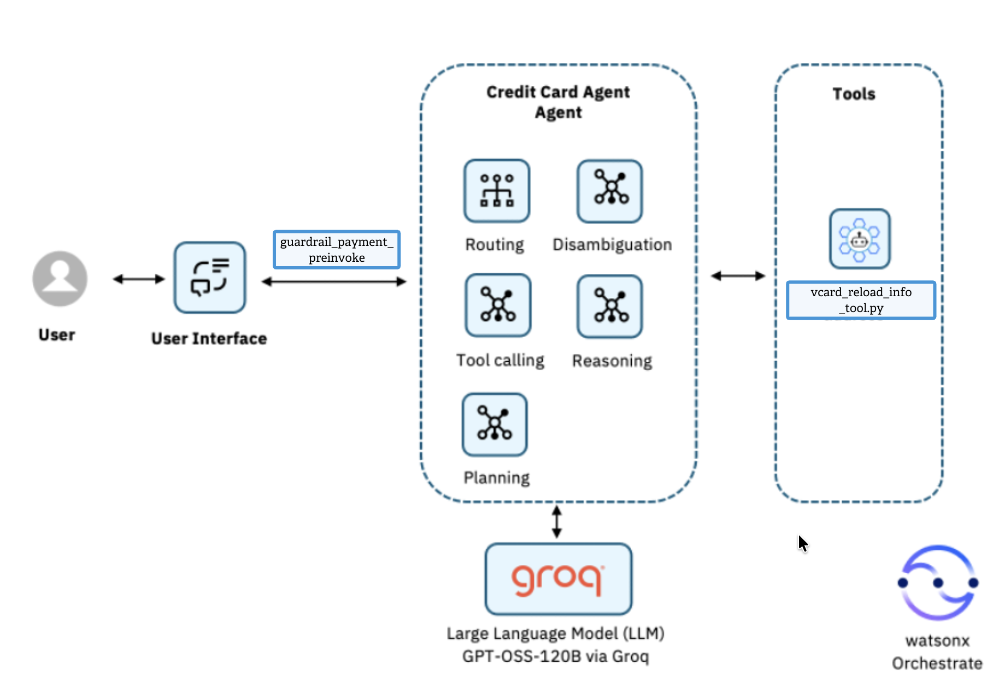
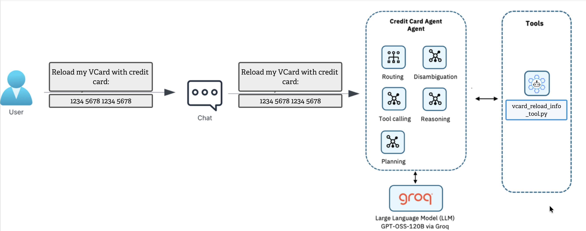
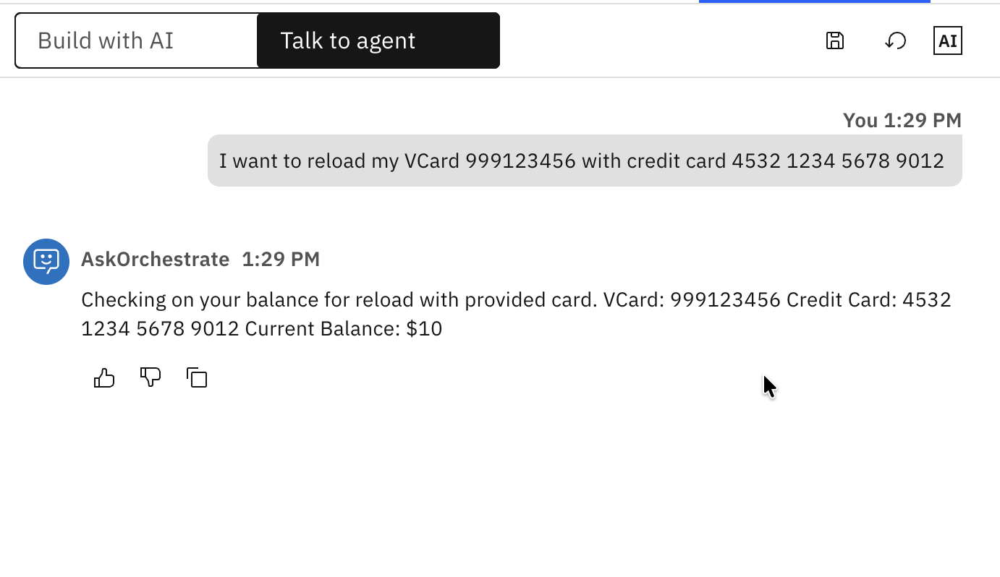
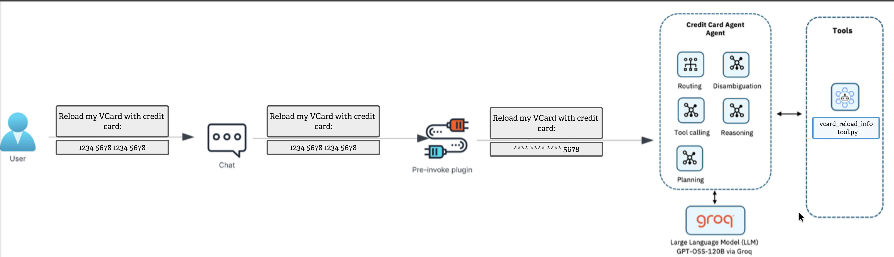
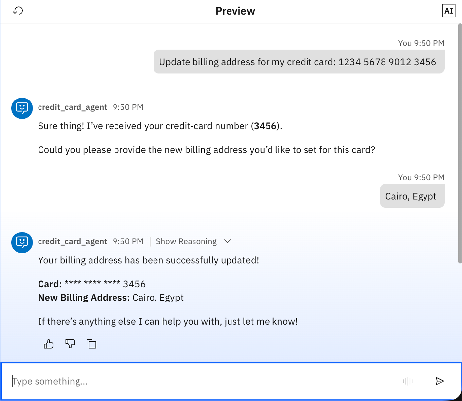
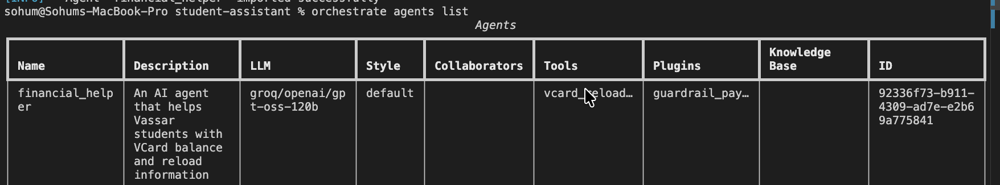
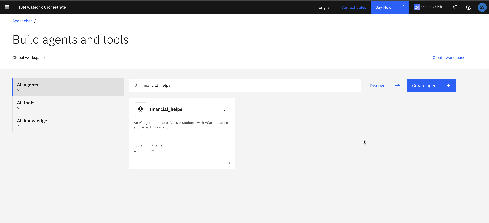
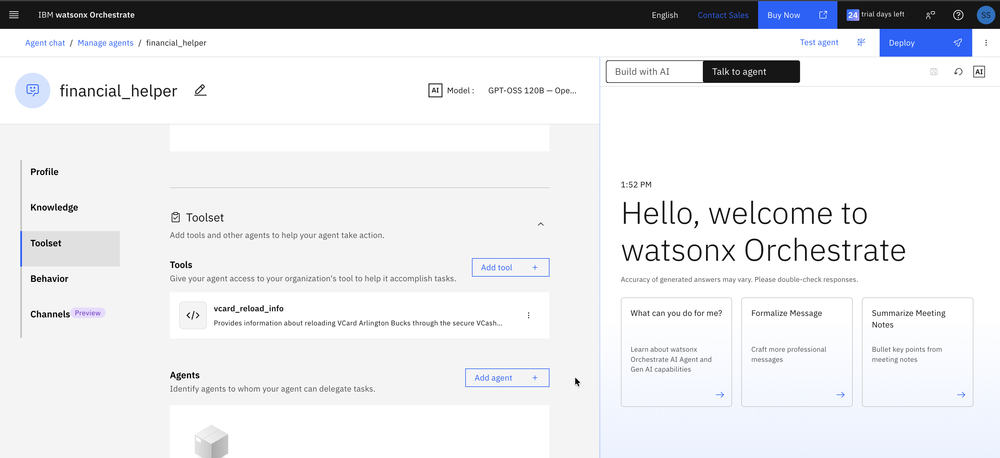
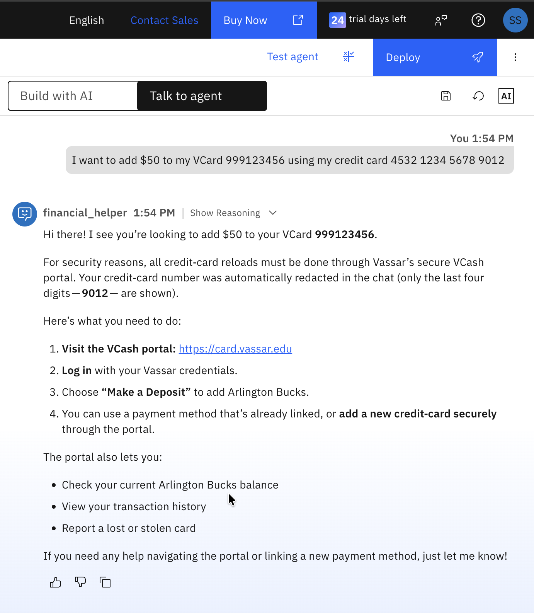
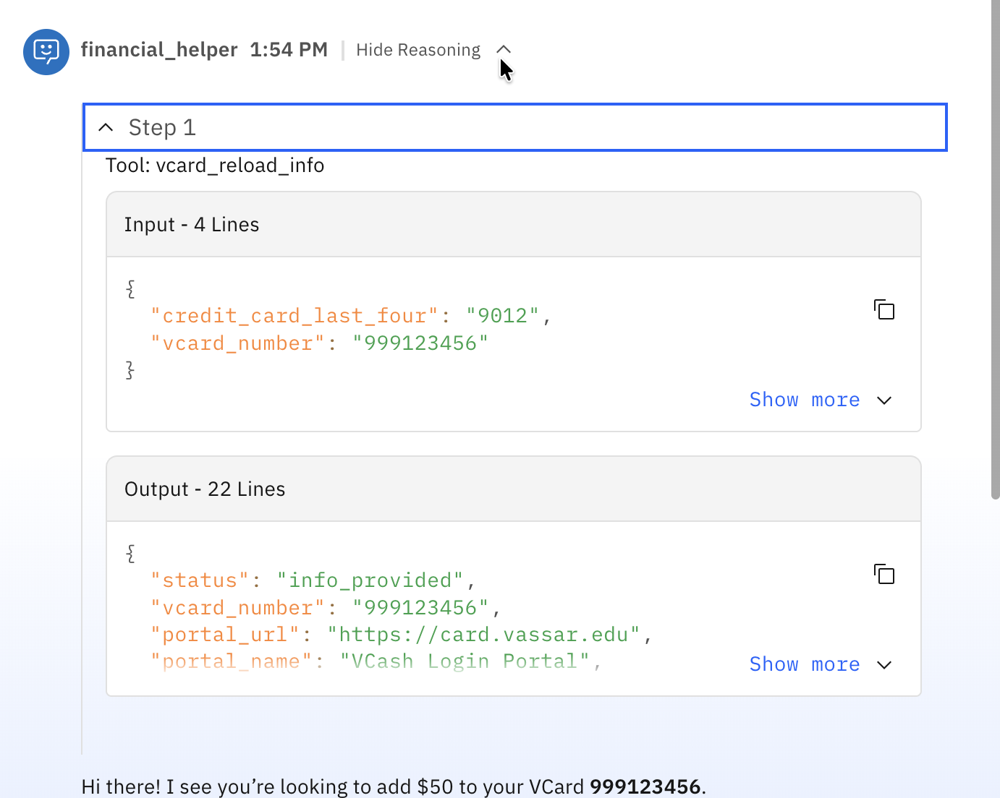

# Implement agent guardrails with watsonx Orchestrate plugins

**A hands-on guide for implementing pre-invoke plugins that redact sensitive data before AI agents process them**

---

In this tutorial, learn how to implement agent guardrails on watsonx Orchestrate using pre-invoke plugins. These plugins can automatically protect sensitive data by intercepting and redacting it before AI agents process user messages.

A developer uses watsonx Orchestrate plugins to extend and control AI agent behavior through Python-based middleware functions. Unlike tools that agents actively call to perform tasks, plugins automatically intercept data flow at key points in the agent lifecycle. watsonx Orchestrate supports two plugin types: pre-invoke plugins (run before agents process messages), and post-invoke plugins (run after agent completion).

This tutorial showcases the use of pre-invoke plugins for security guardrails in a realistic campus scenario: protecting credit card information when students try to reload their Vassar College VCard (campus card) with Arlington Bucks. This approach ensures PCI DSS compliance and safe audit trails without requiring changes to agent logic or tool implementations.

## Architecture of the AI agent system

In this tutorial, you will build a **Financial Helper Agent** for Vassar College students. The agent helps students check their VCard balance and provides information about reloading Arlington Bucks (campus currency) through the secure VCash portal.

You will implement the `guardrail_payment_preinvoke` pre-invoke watsonx Orchestrate plugin. This plugin intercepts user messages before they reach the agent, automatically redacting credit card numbers to protect sensitive payment information (PII). The plugin sits between the User Interface and the Financial Helper Agent, ensuring that full credit card numbers never reach the agent's reasoning LLM or the `vcard_reload_info` tool.

**Key Distinction - VCard vs Credit Card:**
- **VCard numbers (format: 999XXXXXX)** are institutional identifiers, NOT personally identifiable information (PII). These are preserved in chat.
- **Credit card numbers (16 digits)** ARE PII and must be redacted before reaching the agent.

In this campus scenario, students may mistakenly try to provide their credit card information directly in chat when asking about VCard reloads. The backend systems only need the last four digits of the credit card to identify if it's already linked to the student's account. Since the student is already authenticated, their identity and VCard are known by the system. If the student accidentally provides the full credit card number in natural language, exposing that to the LLM is unnecessary and risky. The watsonx Orchestrate pre‑invoke plugin therefore acts as an essential guardrail: It ensures the agent never sees the full credit card number, while still allowing the tool to check if the card (by last 4 digits) is already linked. This approach protects sensitive PCI‑regulated data, reduces the LLM's exposure footprint, and maintains correct business functionality without compromising the user experience.



### Before implementing the pre-invoke plugin

Before implementing the pre-invoke plugin, when a student types: "I want to reload my VCard 999123456 with credit card 4532 1234 5678 9012", the agent receives the full credit card details and passes them to the tools as shown in the below architecture.



And this is how it looks in watsonx Orchestrate - notice the full credit card number is visible:



**Security Risk:** The full credit card number (4532 1234 5678 9012) is exposed to the LLM and stored in logs.

### After implementing the pre-invoke plugin

After implementing the pre-invoke plugin, when the same student query is processed, all sensitive credit card data is redacted before it reaches the agent, while the VCard number (999123456) remains visible since it's an institutional identifier, not PII.



And check how it looks on watsonx Orchestrate - the credit card is redacted but VCard is preserved:



**Security Improvement:** The credit card is redacted to "**** **** **** 9012" while VCard "999123456" remains visible for identification.

## Prerequisites

This tutorial assumes you have a running local environment of watsonx Orchestrate Agent Development Kit (ADK). Check out the *[getting started with ADK](../../Orchestrate_ADK_Installation_Guide.md)* tutorial if you don't have an active instance. This tutorial has been tested on watsonx Orchestrate ADK version 2.3.

An instance of watsonx Orchestrate.

**Please *[click here](./assets/plugin-lab-materials)* to collect lab materials.**

## Steps

These are the steps you are going to follow in this tutorial:

1. Create the tool
2. Create pre-invoke plugin
3. Create the agent
4. Test the agent

### Step 1. Create the tool

In this step, you are going to create a tool that provides VCard reload information and directs students to the secure VCash portal.

Review the sample tool code (`vcard_reload_info_tool.py`) and download it locally from the plugin-lab-materials folder.

**Key aspects of the `vcard_reload_info` tool:**

```python
@tool(
    name="vcard_reload_info",
    description="Provides information about reloading VCard Arlington Bucks through the secure VCash portal.",
    permission=ToolPermission.ADMIN
)
def vcard_reload_info(vcard_number: str, credit_card_last_four: str = None) -> str:
    """
    Provides VCard reload information and secure portal access details.
    
    :param vcard_number: The VCard number (format: 999XXXXXX)
    :param credit_card_last_four: Last 4 digits of credit card if provided (optional)
    :return: Information about secure reload process as JSON string
    """
    # Validate VCard number format (must be 9 digits starting with 999)
    if not vcard_number or not re.match(r'^999\d{6}$', vcard_number):
        return json.dumps({
            "error": "Invalid VCard number format. VCard numbers should be 9 digits starting with 999"
        })
    
    # Check if provided card matches the example linked card (9876)
    if credit_card_last_four and re.sub(r'\D', '', credit_card_last_four) == "9876":
        card_status_message = "The card ending in 9876 appears to be already linked to your VCard account."
    else:
        card_status_message = "You can link a new payment method through the secure portal."
    
    # Return portal information and security guidance
    result = {
        "portal_url": "https://card.vassar.edu",
        "message": "For your security, VCard reloads must be completed through the secure VCash portal.",
        "card_status": card_status_message,
        "security_note": "Never share full credit card details in chat."
    }
    return json.dumps(result, indent=2)
```

**Important:** This tool does NOT process actual financial transactions. It provides information about the secure portal where students can safely reload their VCard. The tool validates the VCard number format (999XXXXXX) and checks if a credit card (by last 4 digits) is already linked.

Import the tool in watsonx Orchestrate:

```bash
orchestrate tools import -k python -f vcard_reload_info_tool.py
```

You should see output like the following to confirm the import:
```bash
[INFO] - Tool 'vcard_reload_info_tool' imported successfully.
```

### Step 2. Create the pre-invoke plugin

In this step, you are going to create a pre-invoke plugin that intercepts user messages before the agent processes them, and acts as a security guardrail to automatically redact credit card numbers while preserving VCard numbers.

Review the pre-invoke plugin code (`guardrail_payment_preinvoke.py`) and download it locally from the plugin-lab-materials folder.

**Key aspects of the `guardrail_payment_preinvoke` plugin:**

```python
@tool(
    description="Pre-invoke plugin that redacts credit card numbers while preserving VCard numbers (999XXXXXX format).",
    kind=PythonToolKind.AGENTPREINVOKE
)
def guardrail_payment_preinvoke(plugin_context: PluginContext, agent_pre_invoke_payload: AgentPreInvokePayload) -> AgentPreInvokeResult:
    """
    Redacts credit card numbers in user messages while preserving VCard numbers.
    
    Examples:
    - Credit Card: 4532 1234 5678 9012 → **** **** **** 9012
    - Credit Card: 4532-1234-5678-9012 → **** **** **** 9012
    - VCard: 999123456 → 999123456 (preserved - institutional ID, not PII)
    """
    
    def redact_credit_cards(text: str) -> str:
        # Pattern for credit cards (16 digits with optional spaces/dashes)
        # Uses negative lookahead (?!999\d{6}\b) to exclude VCard numbers
        pattern = r'(?!999\d{6}\b)(\d{4})[\s-]?(\d{4})[\s-]?(\d{4})[\s-]?(\d{4})'
        
        # Replace with asterisks, keeping only the last 4 digits visible
        redacted = re.sub(pattern, r'**** **** **** \4', text)
        return redacted
    
    # Extract user input and redact credit cards
    user_input = agent_pre_invoke_payload.messages[-1].content.text
    modified_text = redact_credit_cards(user_input)
    
    # Update payload with redacted text
    modified_payload = agent_pre_invoke_payload
    modified_payload.messages[-1].content.text = modified_text
    
    return AgentPreInvokeResult(modified_payload=modified_payload, continue_processing=True)
```

**Key code components:**

- **kind=PythonToolKind.AGENTPREINVOKE**: Registers the function as a pre-invoke plugin that runs automatically before the agent processes any user message.
- **Negative lookahead `(?!999\d{6}\b)`**: This regex pattern explicitly excludes VCard numbers (999XXXXXX) from being matched, ensuring they are preserved.
- **Flexible credit card pattern**: Handles multiple formats (spaces, dashes, or no separator) for credit card numbers.
- **Redaction logic**: Replaces all but the last 4 digits with asterisks while keeping VCard numbers completely visible.
- **AgentPreInvokeResult**: Returns the modified payload with redacted credit cards and preserved VCard numbers.

Import the plugin in watsonx Orchestrate:

```bash
orchestrate tools import -k python -f guardrail_payment_preinvoke.py
```

You should see
```bash
[INFO] - Tool 'guardrail_payment_preinvoke' imported successfully.
```

### Step 3. Create the agent via YAML configuration

In this step, you are going to create the **Financial Helper Agent** that uses the tool and plugin you created in the previous steps.

Review the `financial_helper.yaml` configuration file and download it locally from the plugin-lab-materials folder.

**Why YAML deployment?** Currently, watsonx Orchestrate plugins can only be configured through YAML agent definitions, not through the web UI. This makes YAML deployment the essential method for agents that require pre-invoke or post-invoke plugins.

**Key aspects of the `financial_helper.yaml` configuration:**

```yaml
spec_version: v1
name: financial_helper
description: An AI agent that helps Vassar students with VCard balance and reload information
llm: groq/openai/gpt-oss-120b
instructions: |
  You are a helpful Vassar College financial assistant for VCard services.
  
  When a student asks about reloading their VCard:
  1. Acknowledge their VCard number (format: 999XXXXXX - institutional ID, not sensitive)
  2. Explain that credit card reloads must be done through the secure VCash portal
  3. Use the vcard_reload_info tool to provide portal information
  4. Direct them to https://card.vassar.edu
  5. If they mention a credit card, reassure them that full numbers are automatically redacted
  
  Never process credit card information directly in chat.
  Be friendly, helpful, and security-conscious.
tools:
  - vcard_reload_info
plugins:
  agent_pre_invoke:
      - plugin_name: guardrail_payment_preinvoke
```

**Critical YAML sections:**

- **`tools:`** - Lists the tools available to the agent (vcard_reload_info)
- **`plugins:`** - Configures the pre-invoke plugin that will automatically run before every agent invocation
- **`agent_pre_invoke:`** - Specifies which pre-invoke plugin(s) to use (guardrail_payment_preinvoke)
- **`instructions:`** - Defines agent behavior, including how to handle VCard numbers vs credit cards

Most importantly, the agent is configured with the `guardrail_payment_preinvoke` plugin in its pre-invoke configuration, which automatically calls this plugin before any request reaches the agent. This ensures that the agent and tool only ever see the last four digits of any credit card number provided by users, while VCard numbers remain fully visible.

**Import the agent via command line:**

```bash
orchestrate agents import -f financial_helper.yaml
```
You should see
```bash
[INFO] - Agent 'financial_helper' imported successfully.
```

**Verify the agent was imported correctly with the tool and plugin:**

```bash
orchestrate agents list
```



You should see `financial_helper` in the list with the tool and plugin properly configured.

### Step 4. Test the watsonx Orchestrate agent

In this step, you are going to test the agent with the tool and pre-invoke plugin that you just created. You will log in to watsonx Orchestrate and confirm that credit card details are redacted while VCard numbers are preserved.

**Access the agent:**

Log in to watsonx Orchestrate. Go to **Manage Agents** and search for the agent named "financial_helper".



**Review the agent configuration:**

Confirm that the `vcard_reload_info` tool is added to the agent and review the agent behavior instructions.



**Test the agent with a realistic student query:**

Type the following query that includes both a VCard number and a credit card number:

```
I want to add $50 to my VCard 999123456 using my credit card 4532 1234 5678 9012
```

**Expected behavior:**
1. The pre-invoke plugin automatically redacts the credit card to "**** **** **** 9012"
2. The VCard number "999123456" remains visible (it's an institutional ID, not PII)
3. The agent acknowledges the VCard number
4. The agent provides the secure portal link (https://card.vassar.edu)
5. The agent explains that credit card reloads must be done through the portal
6. If the card ends in 9012, the agent may note it's not the linked card (9876)



Notice that the agent's response shows the VCard number clearly but never displays the full credit card number.

**Verify the guardrail worked:**

Click on **Show Reasoning** to see the agent's internal processing. Observe that:
- The tool only received the redacted credit card details (**** **** **** 9012)
- The VCard number (999123456) was passed through completely
- The agent never had access to the full credit card number



**Test with the linked card:**

Try another query with the card that's already linked:

```
Can I reload my VCard 999123456 with card 4532 1234 5678 9876?
```

The agent should recognize that the card ending in 9876 is already linked to the account and provide appropriate guidance.

## Summary and next steps

This tutorial guided you through implementing agent guardrails using watsonx Orchestrate plugins in a realistic campus scenario. You began by creating the `vcard_reload_info` tool that provides secure portal information for VCard reloads, followed by implementing the `guardrail_payment_preinvoke` pre-invoke plugin that automatically redacts credit card numbers while preserving VCard institutional identifiers. You then created the Financial Helper Agent via YAML configuration (the only method that supports plugin integration) and configured it to use both the tool and the pre-invoke plugin. Finally, you tested the complete experience in the watsonx Orchestrate chat interface, validating that:

✅ Full credit card numbers are intercepted and redacted at the entry point
✅ Only the last four digits of credit cards reach the agent and tools
✅ VCard numbers (999XXXXXX) are preserved as institutional identifiers, not PII
✅ Students are directed to the secure VCash portal for actual transactions
✅ The system maintains PCI DSS compliance while providing helpful guidance

**Key Learnings:**

1. **Institutional ID vs PII**: VCard numbers are institutional identifiers (not sensitive), while credit cards are PII (must be protected)
2. **YAML deployment**: Currently the only way to configure plugins for agents in watsonx Orchestrate
3. **Regex patterns**: Use negative lookahead to exclude specific patterns (like VCard numbers) from redaction
4. **Security by design**: Guardrails protect data without requiring changes to agent logic or tool implementations

**The value of pre-invoke plugins** in watsonx Orchestrate lies in their ability to intercept and modify user messages before the agent processes them, enabling transparent, automatic controls without requiring changes to agent logic or tool implementations. They allow you to implement:
- Data validation
- Content filtering
- Input sanitization
- Security guardrails (like credit card redaction)
- Message enrichment
- Institutional ID preservation

**Next steps:**

You can also explore watsonx Orchestrate **post-invoke plugins** that run after the agent completes processing, allowing you to:
- Format responses consistently
- Add disclaimers or compliance messages
- Inject security notices
- Sanitize output before it reaches users
- Add educational content about secure practices

This enables you to shape the final user experience consistently across all agent interactions while maintaining security and compliance standards.

For more watsonx Orchestrate tutorials and use cases, check out the [Student Assistant lab series](./hands-on-lab-overview.md) which demonstrates building multi-agent systems for institutional support.
