# Use case: Student Assistant

## Table of Contents

- [Use case: Student Assistant](#use-case-student-assistant)
  - [Table of Contents](#table-of-contents)
  - [Introduction](#introduction)
    - [Pre-requisites](#pre-requisites)
  - [watsonx Orchestrate](#watsonx-orchestrate)
    - [The watsonx Orchestrate console](#the-watsonx-orchestrate-console)
    - [AI Agent Configuration](#ai-agent-configuration)
  - [Agents](#agents)
    - [The Student Clubs Agent](#the-student-clubs-agent)
    - [The Housing Agent](#the-housing-agent)
    - [The Athletics Agent](#the-athletics-agent)
    - [The Manager Agent](#the-manager-agent)
  - [Summary](#summary)

## Introduction
This use case describes a scenario where a user leverages an AI agent via chat / natural language interface, to help with the execution of tasks that require the selection of the right agent to satisfy each request. Agents can be configured in the system to address specific needs of the organization. Based on the descriptions given, these agents will be selected if they satisfy the task at hand. Each agent, in turn, is connected with a Large Language Model (LLM) that supports function calling, so that it can leverage one or more tools, again based on each tool's description. All this goes to say, descriptions are important here and directly impact what gets done when.

In our scenario, we will build agents for Student Clubs, Housing, and University Athletics and connect them all to a "manager agent". This agent will take requests from the end user and then select the appropriate agent for excecution before returning the answer. The flow of interaction we are simulating is one where an assistant helps a student navigate the vast number of clubs and organizations at their university, explore potential housing options, and stay in the loop with everything going on with athletics.

There is an argument to be made that a truly agentic solution would show a high degree of autonomy. To address a particular problem, or ask, an agentic solution will make a plan, execute this plan, check its effectiveness towards a good outcome, and possibly revise the plan as needed, all in an automated fashion and without human intervention. Another name for this might be "no human in the loop". Our flow described above lends itself more to a "human in the loop" approahc where we sacrifice some of the agentic system's autonomy for greater user control.

<div style="border: 2px solid black; padding: 10px;">
Even though we will take you through a complete and working example, you should also consider making changes that fit your desired use case and only take this description as a reference point that guides you along your implementation.
</div>

### Pre-requisites

- Check with your instructor to make sure **all systems** are up and running before you continue.

## watsonx Orchestrate

As shown in the [Solution Architecture](./images/student-assistant-architecture.png), we will build and deploy the majority of the agents for the solution internally in watsonx Orchestrate.

To get to the watsonx Orchestrate console, go the [Resources list on the IBM Cloud homepage](https://cloud.ibm.com/resources).

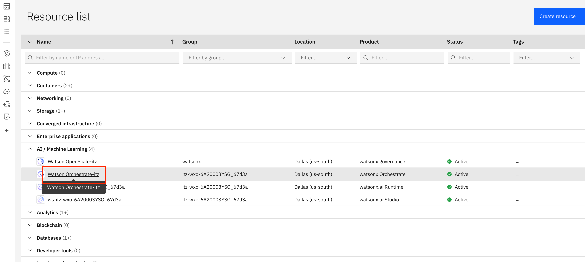

Expand the `AI / Machine Learning` section and select the resource that has `watsonx Orchestrate` in the Product column, as shown above. Next, click on the `Launch watsonx Orchestrate` button.

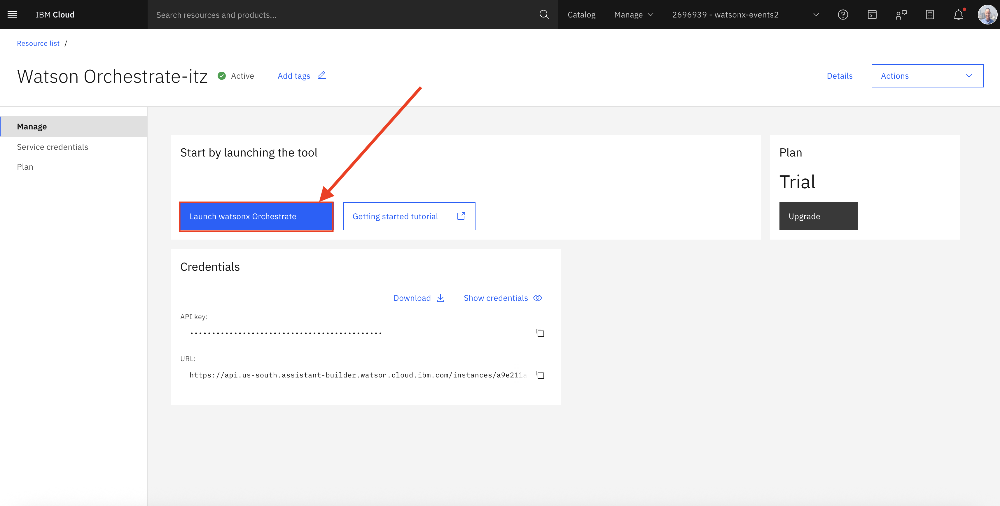

This opens the watsonx Orchestrate console.

### The watsonx Orchestrate console

> When opening the console for the very first time, you may be greeted by a pop-up window offering that you create your first agent. Click on `Skip for now`.

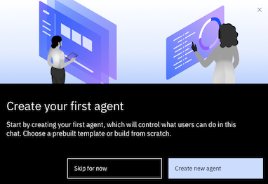

In the console, it shows that no agents have been deployed yet. Thus, if you interact with watsonx Orchestrate at this point, not much will happen, since the system has no agents available to route any request to.

However, you can already interact with the Large Language Model (LLM) that works behind the scenes, and ask general questions, like "How are you today?" or "What is the capital of France?". 

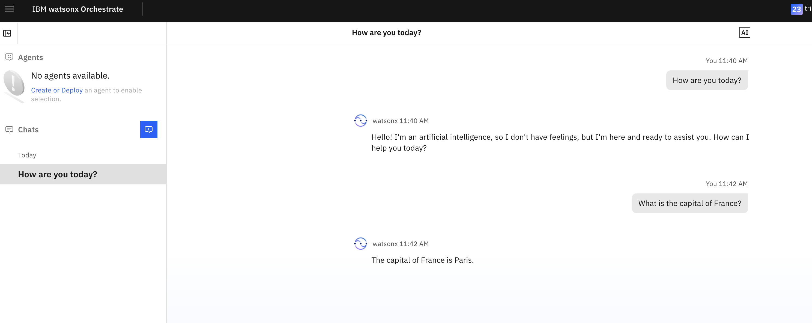

Go ahead and chat with watsonx Orchestrate to explore what type of answers it gives to your questions.

### AI Agent Configuration
We are now ready to build the first agent. In the watsonx Orchestrate console, click on either `Create or Deploy` or `Create new agent` (either will goet you to he same place).

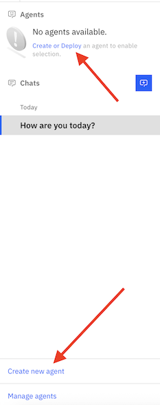

## Agents

### The Student Clubs Agent

#### 1. Creating the Agent

Our first agent will help answer student questions about clubs at the university.

When prompted, select "Create from Scratch," name the agent "Student Clubs Agent" and add the following description of the agent. This description is important because it will help the manager agent know when this agent should be used.

*Description ⬇️*

```
This agent can help recommend clubs and organizations to suit a student who isn't sure what they are looking for or wants to explore more broadly what is available at Bluemont University.
```

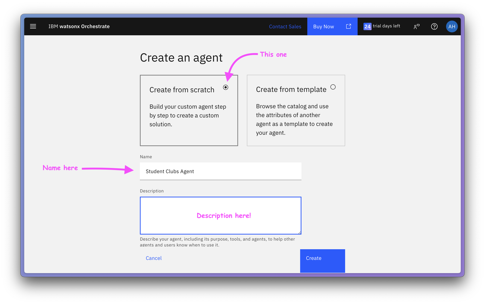

Under "Agent Style," select "ReAct"

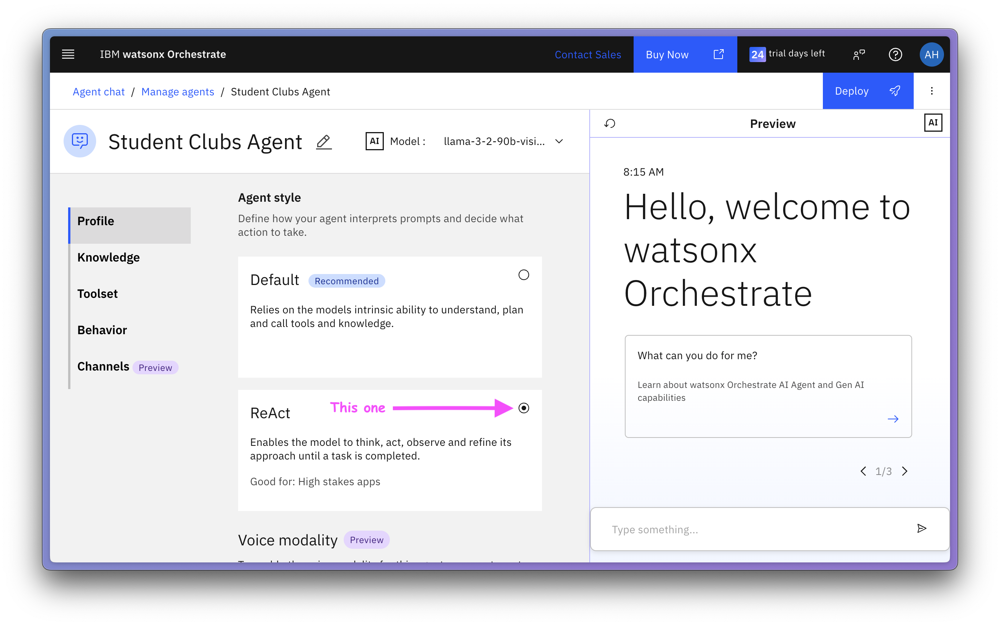

#### 2. Adding Knowledge

Now we will add all the information about clubs and organizations at Bluemont University that the agent will use.

Download **university_clubs.csv** from the [box folder here](https://ibm.box.com/s/e2wsys2yis0ucr458trr1y9b0davz1bf) (ask your instructor if you do not have access). Scroll down to the "Knowledge" section in the interface and add the following description, then under "Documents" upload the **university_clubs.csv** that you downloaded.

*Description ⬇️*

```
This is the information about all currently active student clubs and organizations at Bluemont University. Use it to answer specific questions about student organizations and make recommendations.
```

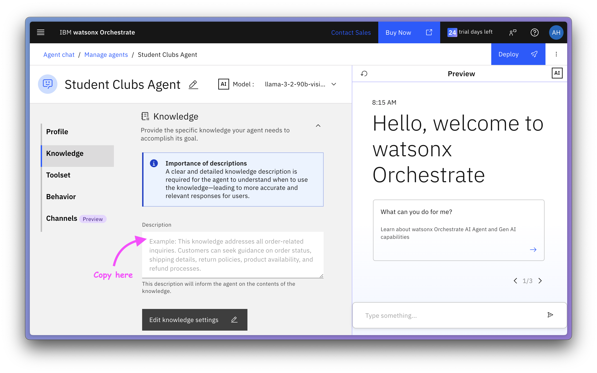

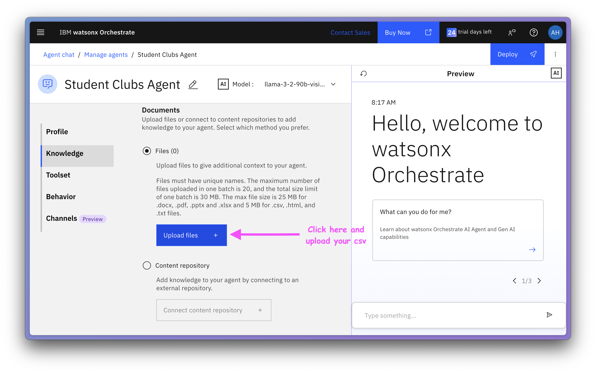

#### 3. Behavior

The behavior description tells the agent how to respond in various situations, and when to use any tools or external agents if you have added them.

Now scroll down to the "Behavior" section of the interface. In the text box under behavior, add the following text:

```
Answer specific questions about student clubs and organizations using your knowledge base.

If the student has broader questions about things to do or how they can get involved, or is looking for help finding clubs, ask them follow-up questions about their interests. Use this information to recommend their top 10 clubs from on your knowledge base, provide a list of the clubs with an abbreviated description and the club web page if available.
```

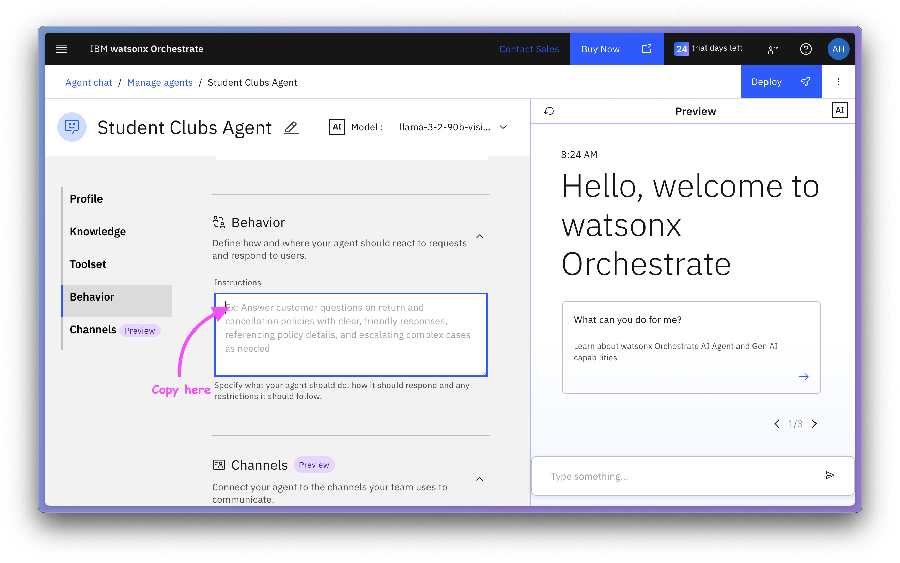

#### 4. Testing the Agent

Now move to the preview on the right hand side and start testing the agent.

Starting by asking the agent: `Is there a chess club?` (Hopefully it gives you some version of no)

According to our instructions, it should have just used it's knowledge base to answer this question. Let's try asking it some more general questions that should cause it to ask follow-up questions. Say: `I need help finding clubs to join`

Answer any follow up questions with something like:

```
I'm a physics major and I want to find clubs that are related to that, but I also like board games and I'm trying to meet people outside my major.
```

How good are the recommendations? Are they well-formatted? Are there actually ten?

Try adjusting the instructions to see if you can get better recommendations.

#### 5. Deploy

Before we can deploy our agent there is one more thing to do. Scroll all the way to the bottom and make sure the `Show agent` slider is turned off. It should be colored grey as shown below.

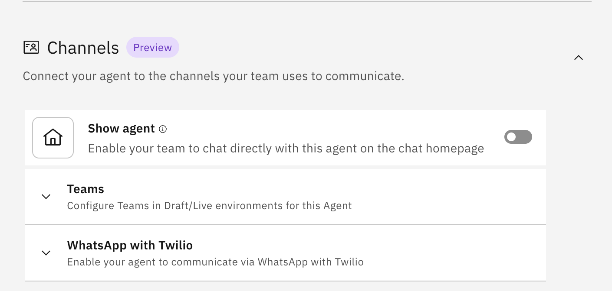

Finally, we'll deploy this agent so it's available to be used. When you are ready, click the `Deploy` button in the upper right hand corner of the screen.

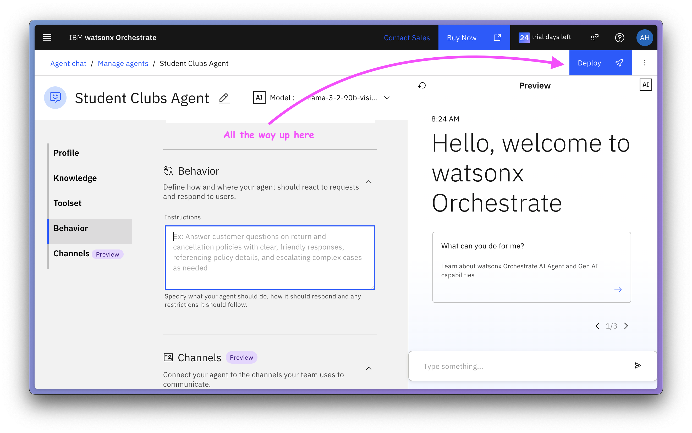

### The Housing Agent

#### 1. Creating the Agent

To create our second agent we will carry out the same initial steps we followed for the Club Agent. Start by clicking the `Create Agent` button. If you don't see this button navigate to the `Agent Builder` screen by clicking into the hamburger menu in the upper left, selecting `Build`, and selecting `Agent Builder`.

Select Create from scratch and enter the new agent’s name, `Housing Agent`.

*Enter the Housing Agent's Description ⬇️*
```
This agent is designed to provide information on apartments and housing in the user's area using its knowledge base. It presents the information in a clear and structured format, ensuring systematic organization of key housing data, making it easy to understand and use.
```

Finally click the `Create` button.

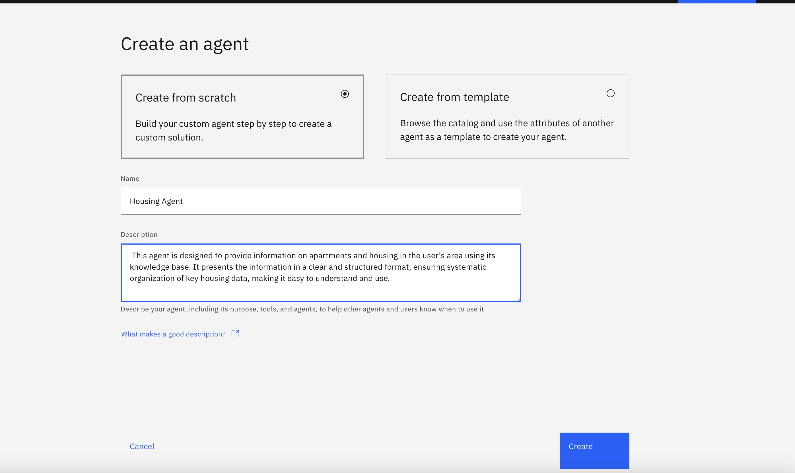

#### 2. Adding Knowledge

After the agent has been created, navigate to the *Agent Configuration* page.

Scroll down to the *Knowledge* section and enter the provided description of the agent's knowledge.

*Description ⬇️*

```
This knowledge base contains information on available apartments. This information includes the apartment's name, the price range for the apartment, the distance to Bluemont University,  contact information and description of the apartment including number of bedrooms, leasing terms, utilities, and amenities. 
```

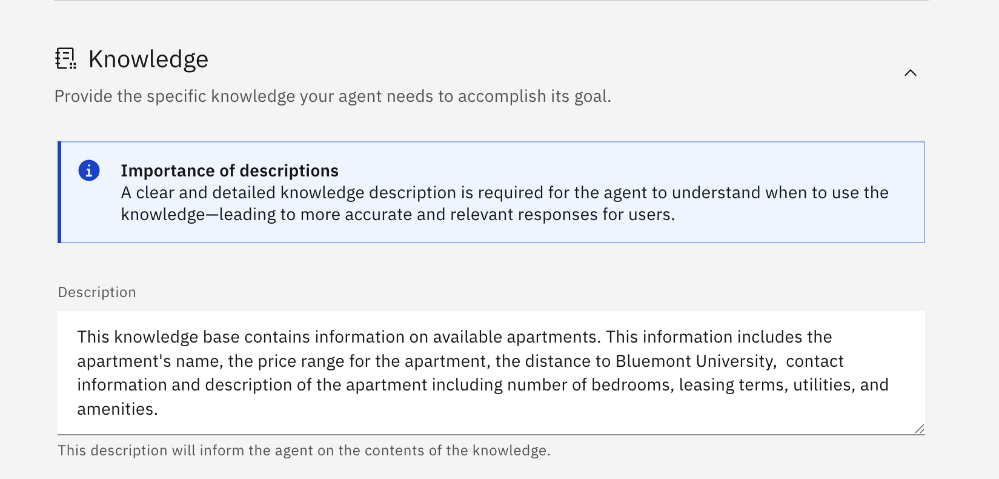

Next, download **bluemont_housing.csv** from the [box folder here](https://ibm.box.com/s/e2wsys2yis0ucr458trr1y9b0davz1bf). This file contains the housing data that will be used by this agent. In the *Documents* section, click the Upload file button and upload the **bluemont_housing** file here.

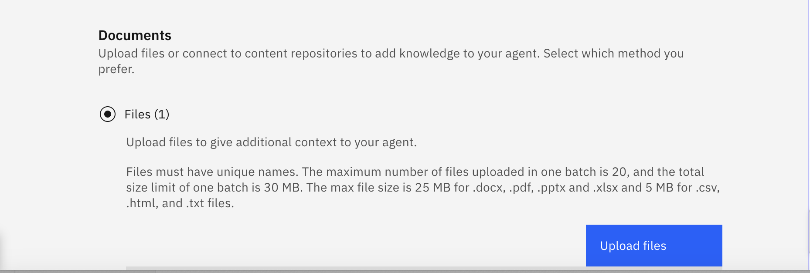

#### 3. Behavior

Now that our agent has access to a source of knowledge to ground its answers, lets give the agents instructions on how to interact with user inputs. Scroll down to the *Behavior* section and add the description provided below.

*Instructions ⬇️*

```
Your primary task is to provide answers to user inquiries using your knowledge base. All responses must only be based on your knowledge base! When asked questions about apartments or housing, only use the information in your knowledge base to answer the question. Avoid using any other information at all to provide your answer. When possible and if  the question requires it,  give your answer in the form of a well-formatted table. When asked about the price/price range of an apartment, you need to give it exactly, do not say at all "I'm afraid I don't understand. Please rephrase your question." When asked to compare apartments, you are required to and must create a side by side table without directly being told to do so in the question/prompt,  and identify both differences and similarities, so that it is made clear to the user.
```

#### 4. Adding a Tool

Our agent is now able to answer simple questions about the data we provided it in the knowledge section. Now its time to give our agent a tool to help its users take action on the information provided to them. We will be implementing an email generation tool that allows our agent to create well-formatted emails on behalf of the user. In a production version we might have this tool send the email as well but for now we will just have it show us the draft.

First, navigate to and click the `Add Tool` button in the *Toolset* section of the agent.

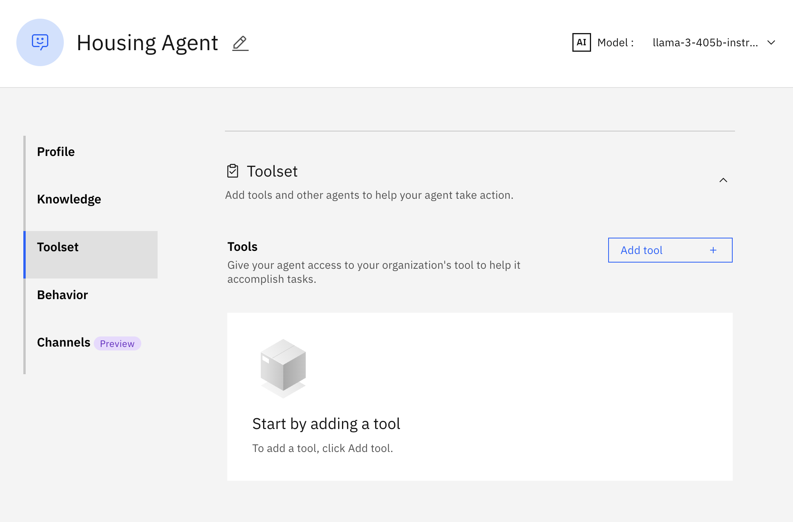

Select the `Import` option and then `Import from file` from the next set of options.

Adding an external tool is simple in watsonx Orchestrate and works much like extensions in watsonx Assistant. All we will need is an OpenAPI spec which can be found in the [box folder here](https://ibm.box.com/s/e2wsys2yis0ucr458trr1y9b0davz1bf). Download then drag and drop the **openapi.json** file to the small rectangular box or upload it by clicking inside the box and navigating to the downloaded file.

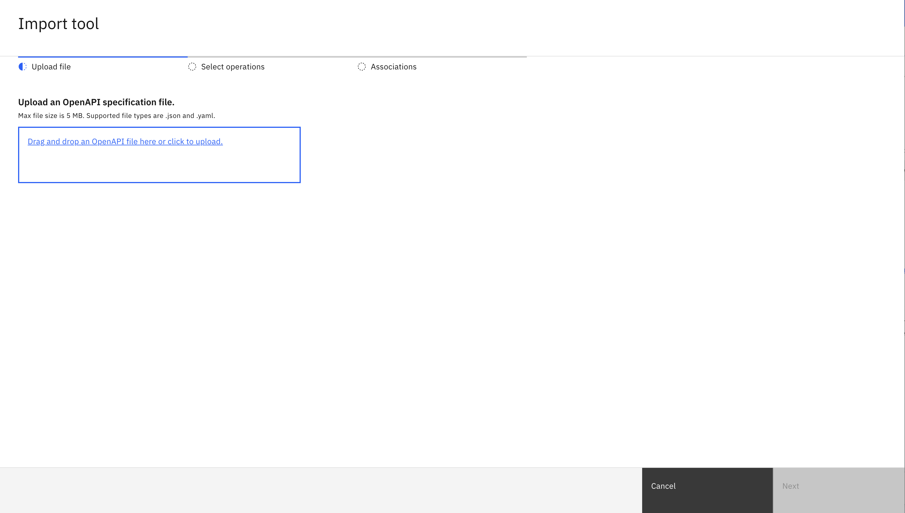

Once you see a green check mark with a message of `Validation Successful` you should see the `Next` button in the bottom right of the popup box turn blue. Click the `Next` button.

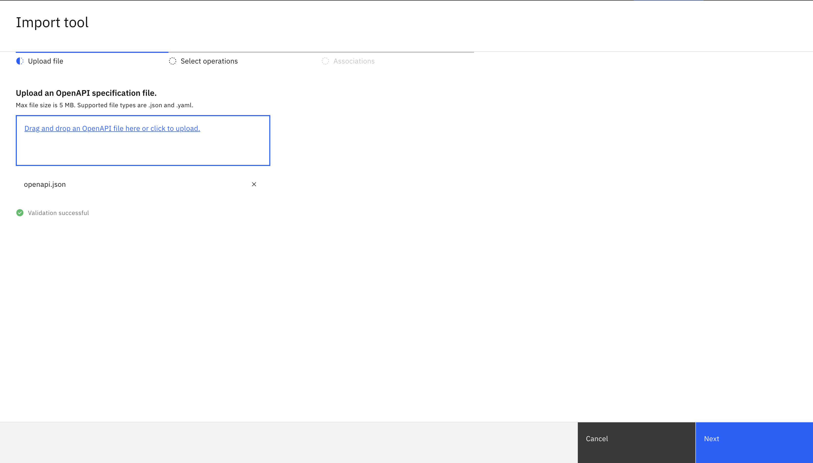

You will see a list of all available tools defined in the file we just uploaded. There should only be one in this case, `Generate Email`. Check the box on the left side of this tool's row and click `Done`.

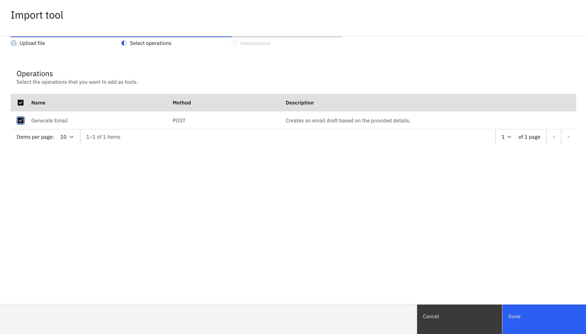

You should now see the `Generate Email` tool populated under `Tools` from within our agent's *Toolset* section.

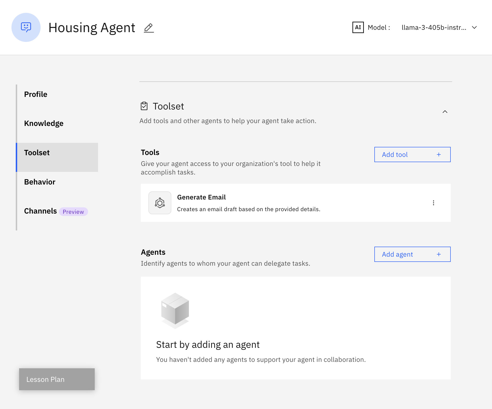

#### 5. Model Selection

We are almost there. At this point your agent is ready to go, but what if we wanted to change the LLM (large language model) being used to power our agent? 

Near the upper middle of the screen, just before the chat window, you should see something like `AI Model: llama-3-2-90b-visi...` displayed along with a drop down menu. This tells us that the currently selected model is llama-3-2-90b-vision-instruct, a well-balanced and flexible multi-modal model. Because this agent won't make use of any multi-modal capabilities lets try out the larger llama-3-405b-instruct model.

To do this we simply click into the drop down menu and select the `llama-3-405b-instruct` option so that it becomes highlighted and has a small check next to it.

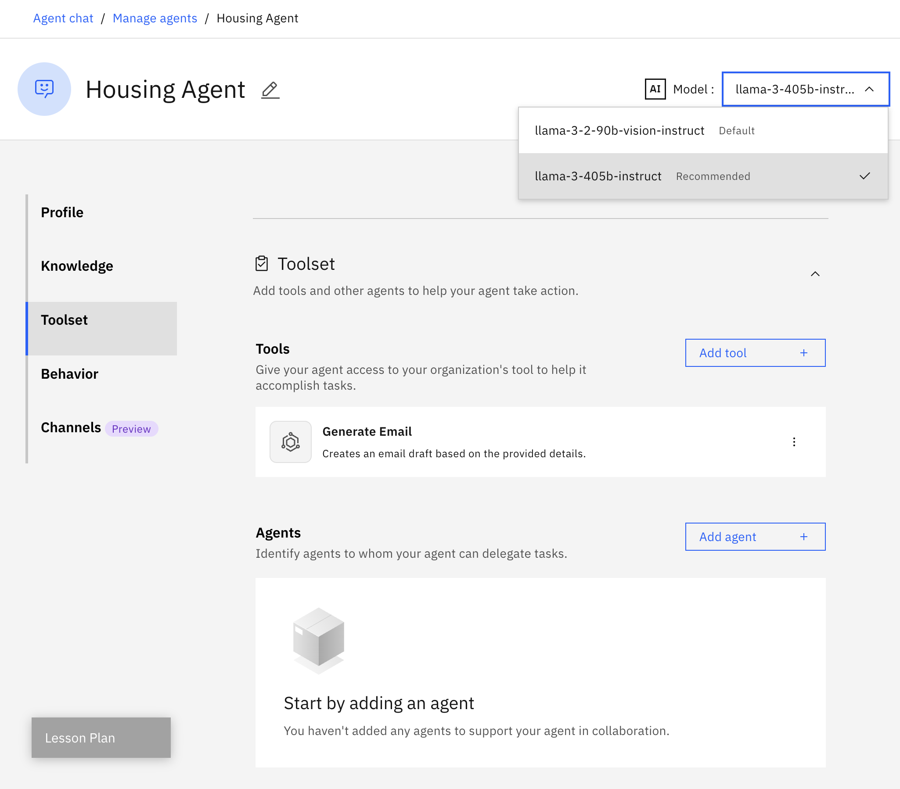

#### 6. Testing the Agent

Once you've added knowledge, uploaded our tool, entered the instructions, and selected your model of choice, there is only one thing left to do before testing. Scroll all the way to the bottom and make sure the `Show agent` slider is turned off. It should be colored grey as shown below.

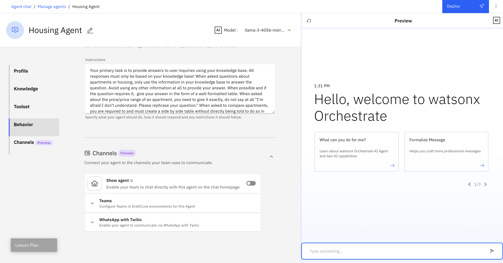

Once you've done this, click the `Deploy` button in the upper right hand corner of the screen and we should be ready to test our finished Housing Agent!

Here are some example queries to get started with:
```
What are all the apartments available for rent?
```
```
What apartments allow pets?
```

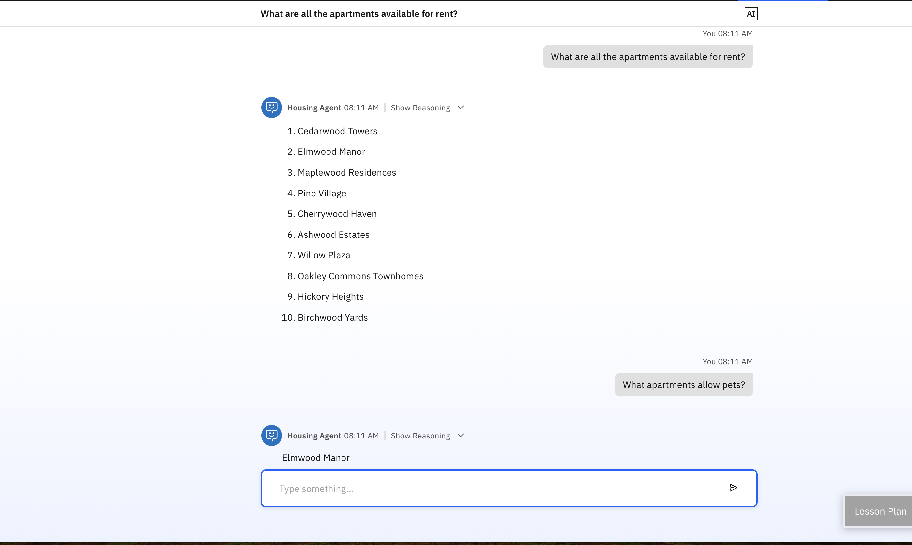

The data we provided our agent with in the *Knowledge* Section contains information about the following fields: *Name, Address, Price Range, Description, Distance to Bluemont(miles), and Contact Info*

If you'd like, try asking more questions involving these fields.

To test out our tool you can try asking something like this:
```
Help me write an email inquiring about Willow Plaza.
```

We can also try iterrating on the agent's outputs with follow ups like:
```
Revise this email to ask if pets are allowed
```
  
Once you are done testing click on the `Manage agents` button to return to the agents overview page. You should now see two agents listed, and both should have the "Live" indicator.

### The Athletics Agent

Almost there! For this agent, the goal is to retrieve up-to-date information about university athletics events from an API. We will delegate the work to an agent that was developed using Python code and the LangGraph framework. This agent has been pre-deployed in watsonx.ai by your instructors. The creation of this agent is not subject of this lab but feel free to as your instructors for more details on this agent.

For today you will simply be registering the already created agent. This is representitive of how we would connect any custom external agents to work in tandem with the agents we've created in watsonx Orchestrate.  

For this agent you will be given the details for the agent by your instructor, who has pre-deployed the agent for you. You can also find these credentials in the **athletics-creds.boxnote** within the [box folder here](https://ibm.box.com/s/e2wsys2yis0ucr458trr1y9b0davz1bf). Have these credentials ready as we will be registering this agent next as part of the `Manager Agent` creation process.

### The Manager Agent

#### 1. Creating the Agent

We are finally ready to create our last agent of the day. This agent acts as an orchestrator for the agents we've already created and will be the agent the end user directly interacts with.

Click on `Create agent` once more.

Like the other agents you created already, this one will be created from scratch. The name is "Manager Agent". The description differs from the previous agents, indicating that this one is an 'orchestrating', 'supervising', or 'routing' agent.

*Description ⬇️*

```
The Manager Agent is in charge of routing user requests to the most relevant agent working under it.
```

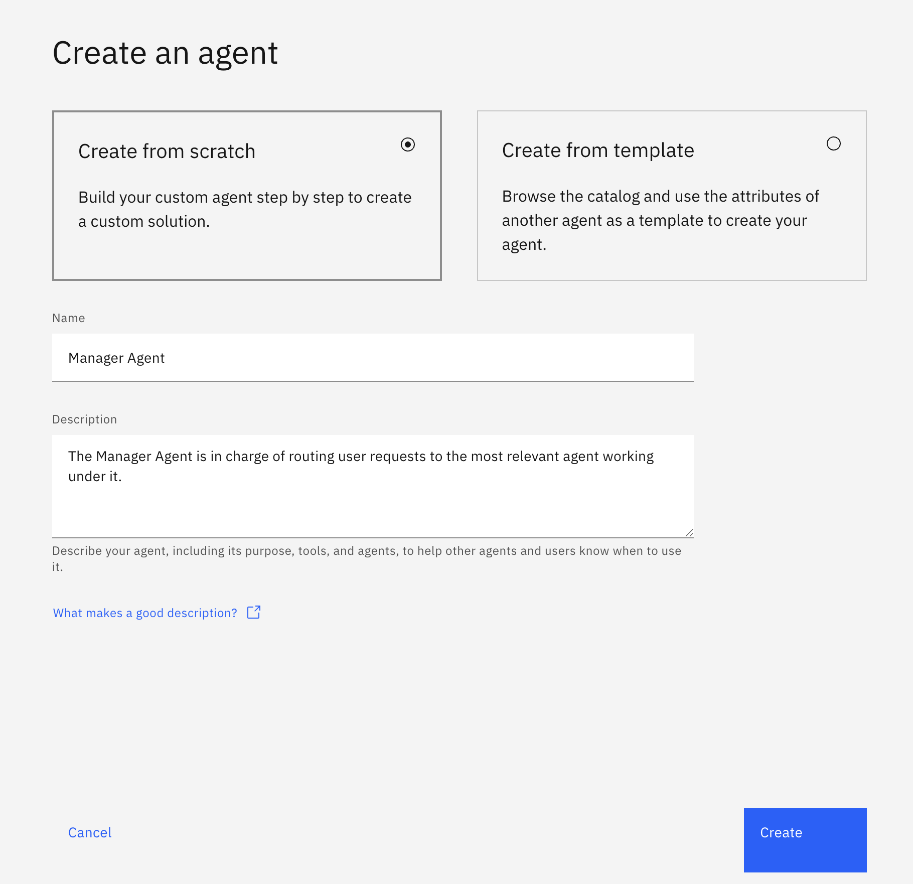

After you have entered the information, click on `Create`.

#### 2. Internal Collaborator Agents

We had mentioned above that an agent can collaborate with other agents to fulfill a certain task. You enter those collaborator agents in the `Agents` section under *Toolset* in the agent definition window.

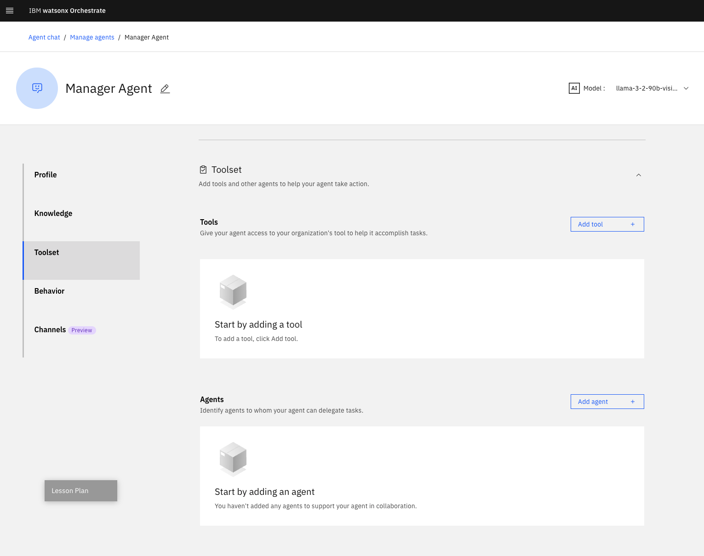

Click on the `Add agent` button. Since we want to add the agents you created above as collaborators to this agent, select the `Add from local instance` option.

Here you see both agents listed that you have created. We want all of them to be used by the Manager Agent, so check each of them and click on `Add to agent`.

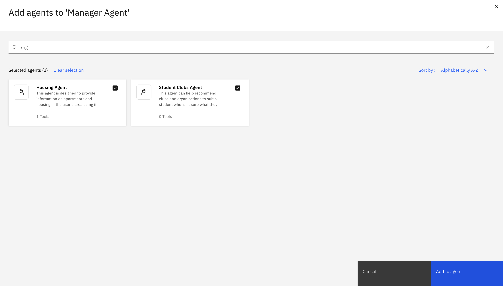
>Note that it is possible that you will see more than the two agents covered in this lab (you may have created agents from a different lab, or created some of your own), so make sure you are selecting the correct two agents.

Once you've added the two local agents your *Toolset* section should look like this ⬇️

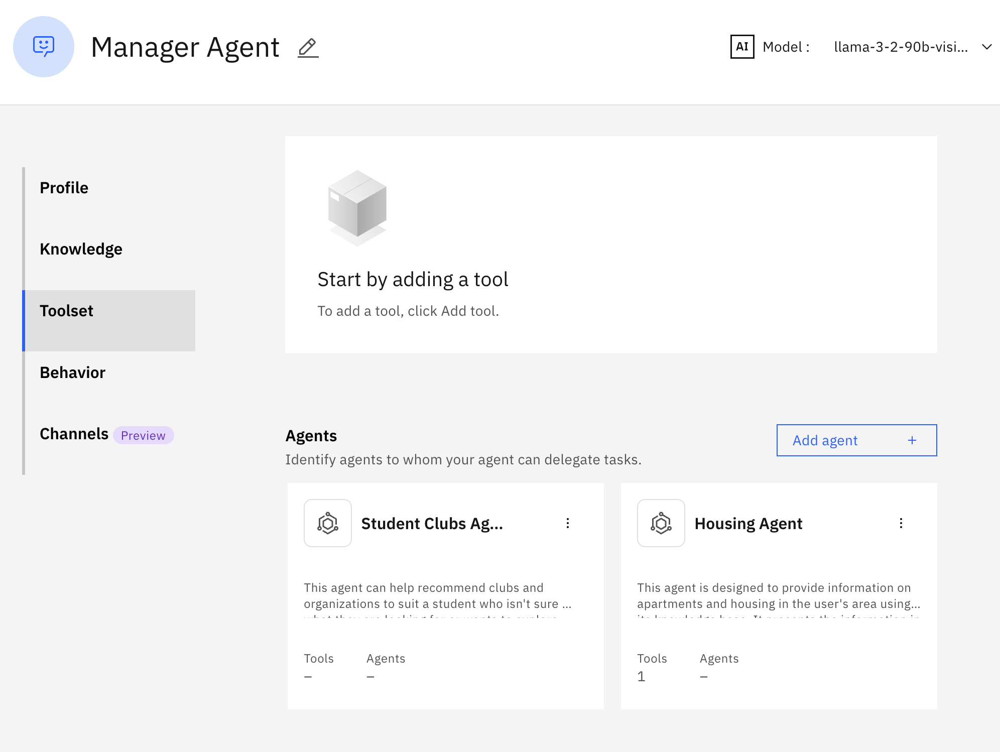

#### 3. External Collaborator Agents

As promised, it is time to add our Athletics Agent. As we did with the internal agents, click on `Add agent` once more. This time however, select the `Import` option. This will allow us to import our custom agent from watsonx.ai.

On the next screen, select the `External agent` option and click on `Next`.

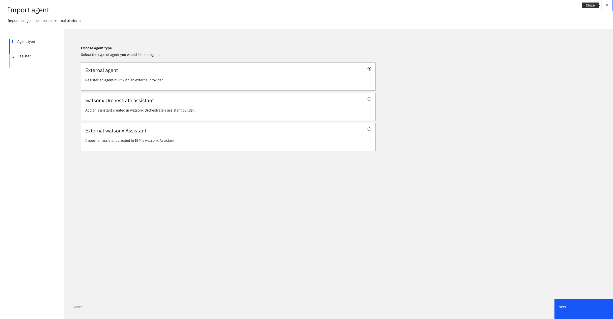

On the following screen, enter details about the imported agent:
- Agent details
  - Provider: `watsonx.ai`
  - Authentication type: leave as `API key`
  - API key: enter the key provided to you by your instructor
  - Service instance URL: enter the value provided to you by your instructor
- Define new agent
  - Display name: `AthleticsAgent` (the name cannot contain a space)
  - Description of agent capabilities ⬇️
    ```
    An agent capable of answering athletics and athletics event related questions.
    ```

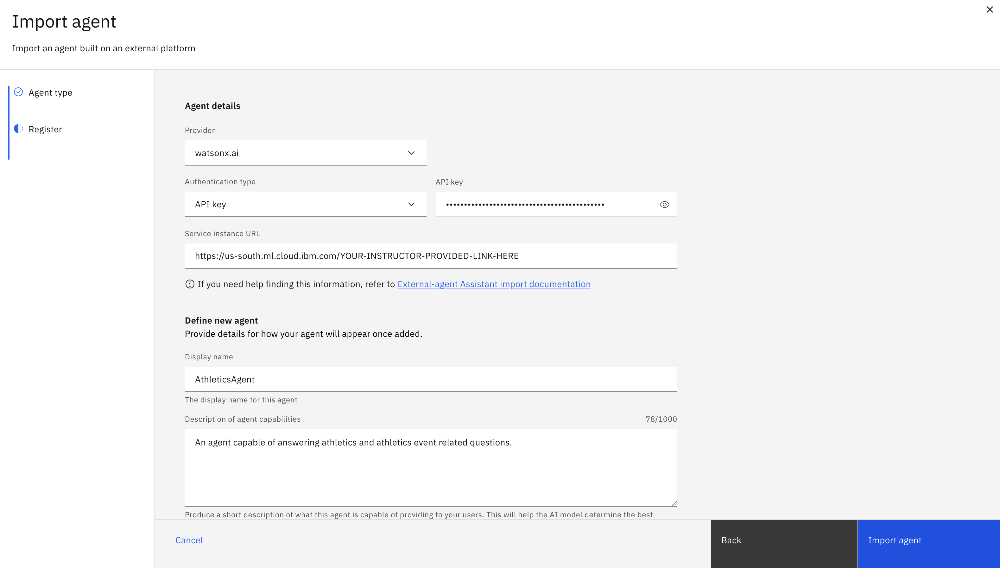

Now click on `Import agent`. You should now see all three agents listed in the Toolset section of your Manager Agent like so:

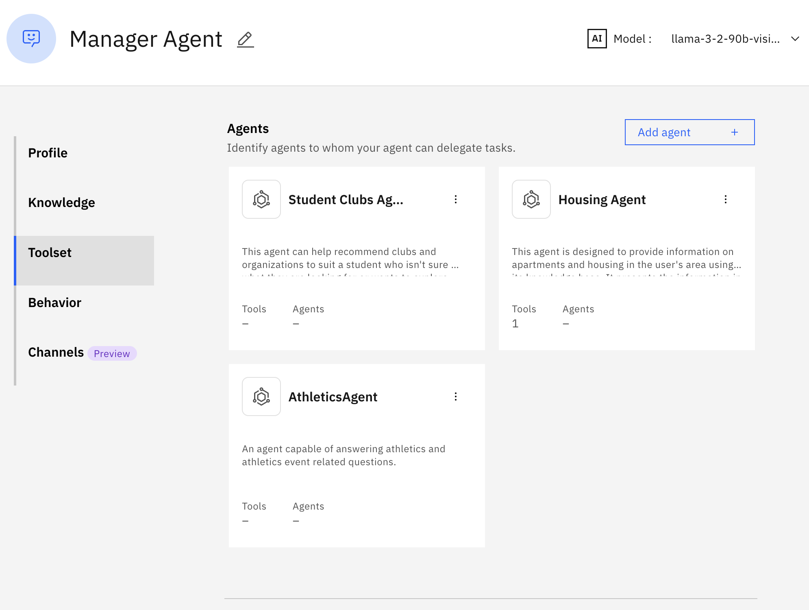

#### 4. Behavior

Finally, we give this agent instructions about how to use the collaborator agents we defined earlier. Enter the folllowing text in the `Instructions` field under Behavior.

*Instructions ⬇️*

```
Reasoning:
- Use the Club Agent for tasks related to clubs and club activities.
- Use the Housing Agent for tasks related to housing.
- Use the Athletics Agent to find information about upcoming athletics events.
```

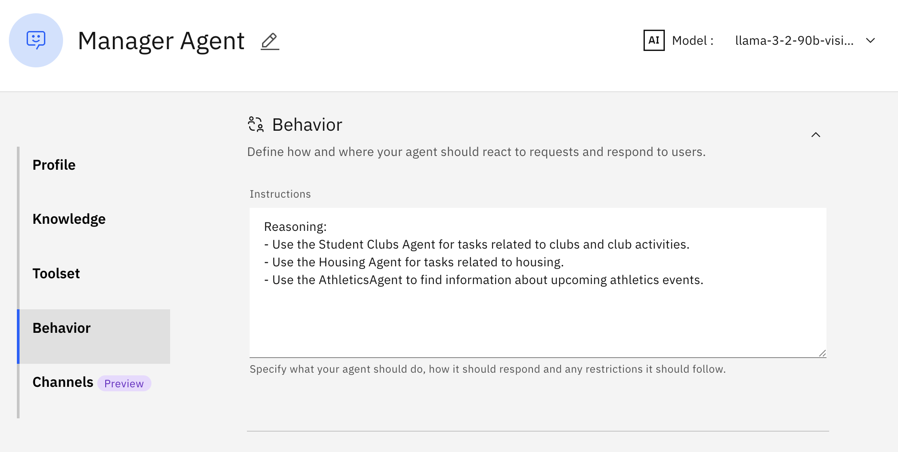

Before we test this agent, scroll all the way to the bottom and make sure that this time the `Show agent` slider is set to on! Unlike before it should be green. This makes the Manger agent available for use in the main chat window.

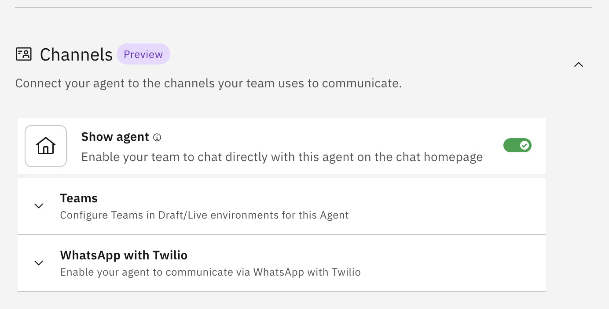

#### 5. Model Selection

As we did before with the *Housing Agent*, let's change the model powering our Manger Agent. To do this, locate the drop down menu near the upper middle of the screen and click into it. Select the `llama-3-405b-instruct` option so that it becomes highlighted and has a small check next to it.

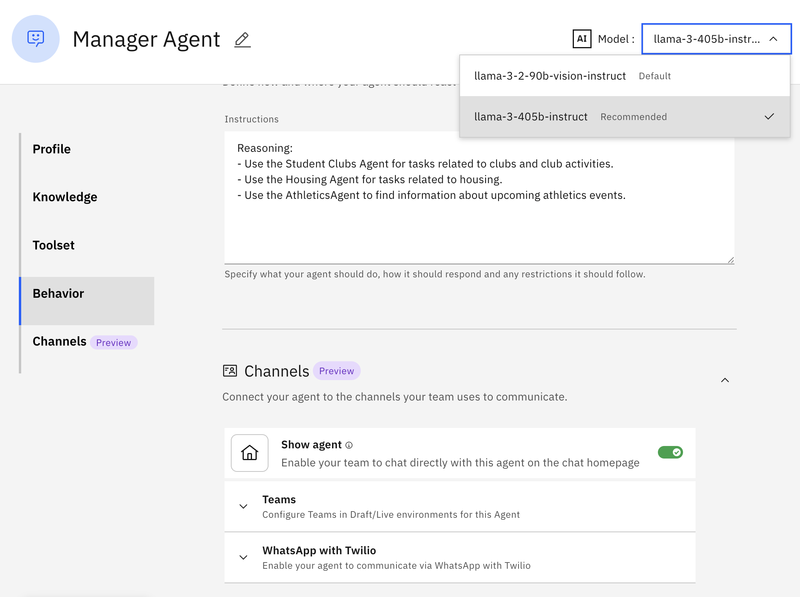

#### 6. Testing the Athletics Agent

Lets navigate to watsonx Orchestrate's unified chat interface. To do this click the hamburger menu in the upper left hand corner of the screen then click the `Chat` button. From here we can talk to any agent we have turned on `Show Agent` for as we did for our Manager Agent. Ensure the agent selected in the upper left is the `Manager Agent` we just finished creating. Your screen should look like this:

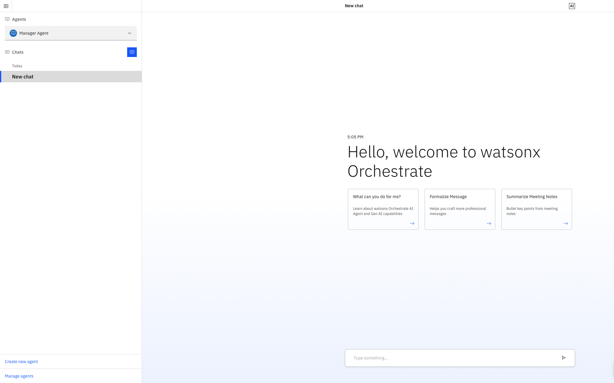

It's time to test out our finished multiagent system. First, since we haven't touched it before, let's start with out new external Athletics agent. We can trigger it by asking about upcoming athletics events.

Enter the following into the Preview text input:
```
What are some upcoming athletics events?
```

Note that the agent was "reasoning", in other words, determining how to answer this request. It decided that routing the request to the AthleticsAgent was the best option. You can expand the `Show reasoning` section in the Preview and see which steps the agent took. It should list one step, which you can expand as well.

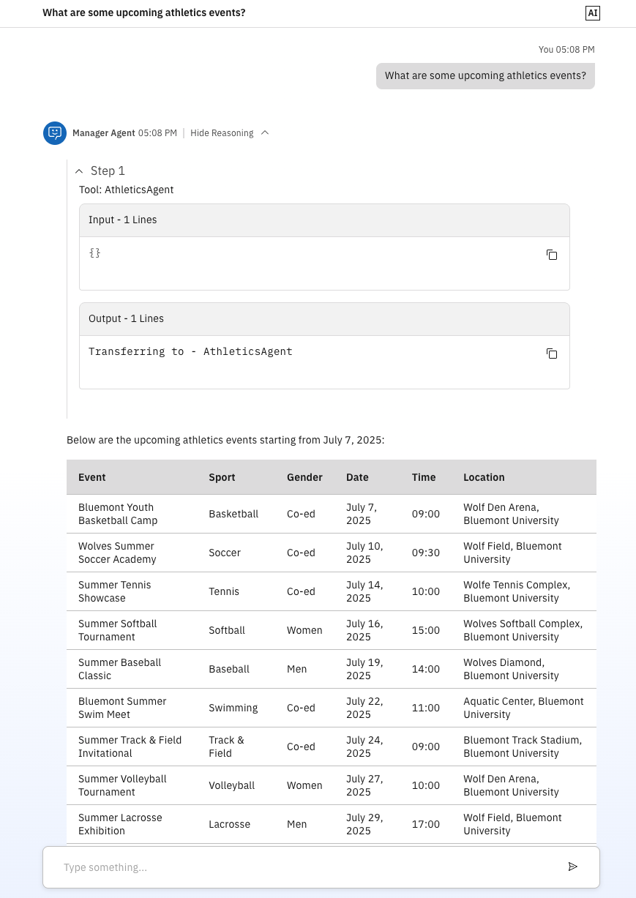

The AthleticsAgent is capable of making dynamic requests to Bluemont University's athletics database and can answer provide more complex answers to queries that require filtering based on sport, gender, date and location. You can test this out with queries like:

```
When is the next Baseball game?
```

or

```
Are there any soccer games in August?
```

#### 7. Testing your Completed System

Once you've played around with the Athletics Agent some, feel free to try switching context to some of your other agents.

You can test the routing to the other agents using some of the same or similar prompts as what you used earlier to test them individually:
- "What are all the apartments available for rent?"
- "What clubs might be good for ..."
- "Please create an email inquiring about ..."

We encourage you to explore the behavior of the solution further, by asking more "loaded" questions, which test the ability of the Manager to switch contexts or even involve more than one agent to answer.

The goal here is to see how an agent is able to act as a single entry point for a broad range of questions and tasks while using its autonomy to determine how to address each request. Wether involving multiple agents, calling tools, or asking clarifying questions.

Congratulations! You have create a complete agentic AI solution, without writing a single line of code!

#### 8. [Optional] Tweak your System

After playing with your agents and getting a feel for how the system functions we encourage you to make tweaks to the implementations of some or all of your agents.

Some ideas you might want to try:
- Switch the model on an agent
- Change an agent from Default to ReAct
- Change the instructions of an agent

You might also want to try creating your own agent. If this interests you we encourage you to give it a try. Consider the following:
- What knowledge might it use?
- What would be a good description of the agent?
- What instructions does it need to behave the way you'd like it to?

As you play around don't hesitate to ask your instructors for help.

## Summary

In this lab, we went through the use case of a student assistant at a university, which uses an agentic solution to handle a variety of student needs. We started by creating a number of agents for tasks like club discovery and housing information. For one aspect, we imported an external agent running in watsonx.ai. Finally, all of it came together in the orchestrating agent that serves as the main frontend.

After we had all the agents configured to be used by the AI Chat, we can interact with the solution through the main chat interface, and the system will execute and delegate to the appropriate agent.

Note that the intention of this exercise is to provide you with a starting point. Some parts of this solution are simulated, and would have to be fully implemented for a real solution.

Hopefully it triggered some ideas for you about how to leverage AI agents within your university.
